###   NumPy和Pandas的区别

---

> NumPy是Python的数值计算扩展，专门用来处理矩阵，运算效率比列表高；
>
> Scipy是基于NumPy的科学计算包，包括统计、线性代数等工具；
>
> Pandas是基于NumPy的数据分析工具，能更更方便的操作大型数据集。


#### 1 NumPy

​		numpy的数据结构——**ndarray**（n维数组对象）；

##### 1.1 创建数组

​		创建数组使用numpy的`array`函数，

> 通过numpy，系统自带的列表list可以转换为numpy中的数组；
>
> 嵌套列表会被转换为一个多维数组（即，矩阵）。

​		==**注意**==：array数组内部的元素必须为==相同类型==，比如数值或字符串。（可以使用dtype查询其类型）

​		**numpy的属性**：

  - `ndim`：维度

  - `shape`：行数和列数

  - `size`：元素个数

    

    **关键字**：	

- `array`：创建数组

- `dtype`：指定数据类型 

- `zeros`：创建数据全为0

- `ones`：创建数据全为1

- `empty`：创建数据接近0

- `arrange`：按指定范围创建数据（是python内置函数range的数组版）

- `linspace`：创建线段

  **numpy的一些数组创建函数**：

  <center>
  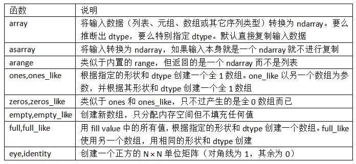
  <br>
  <div style="color:orange; border-bottom: 1px solid #d9d9d9;
  display: inline-block;
  color: #999;
  padding: 2px;">数组创建函数</div>
  </center>

  示例：

  ```python
  a=np.array([2,3,4],dtype=np.float)
  
  #用arange创建连续数据
  a = np.arange(10,20,2) # 10-19 的数据，2步长
  """
  array([10, 12, 14, 16, 18])
  """
  
  #使用reshape改变数据形状
  a = np.arange(12).reshape((3,4))    # 3行4列，0到11
  """
  array([[ 0,  1,  2,  3],
         [ 4,  5,  6,  7],
         [ 8,  9, 10, 11]])
  """
  
  #用linspace创建线段型数据
  a = np.linspace(1,10,20)    # 开始端1，结束端10，且分割成20个数据，生成线段
  """
  array([  1.        ,   1.47368421,   1.94736842,   2.42105263,
           2.89473684,   3.36842105,   3.84210526,   4.31578947,
           4.78947368,   5.26315789,   5.73684211,   6.21052632,
           6.68421053,   7.15789474,   7.63157895,   8.10526316,
           8.57894737,   9.05263158,   9.52631579,  10.        ])
  """
  ```
  
---


##### 1.2 数据类型

​		dtype（数据类型）

​		通常只需要知道所处理的数据大致是浮点数、复数、整数、布尔值、字符串，还是普通的Python对象。

​		`astype`：将一个数组从一个dtype转换成另一个dtype；

----

##### 1.3 数组运算

		>数组的计算非常方便，不用大量的循环即可批量运算。
		>
		>
		>大小相等的数组之间的任何算术运算都会将运算应用到元素级。
		>
		>数组与标量的算术运算会将标量值传播到各个元素。
		>
		>大小相同的数组之间的比较会生成布尔值数组。
		>
		>不同大小的数组之间的运算叫做**广播**。

```ptyhon
c=a-b
c=a+b
c=a*b
c=b**2
c=10*np.sin(a)  #sin函数
print(b<3)  #在脚本中对print函数进行修改可以进行逻辑判断，返回一个bool类型的矩阵
```

​		**对于多维数组的运算**：

​		Numpy中的矩阵乘法分为两种：

  - 对应元素相乘；

  - 标准的矩阵乘法运算，即对应行乘对应列得到相应元素；

    ```
    #第一种表示方法
    c_dot=np.dot(a,b)
    
    #第二种表示方法
    c_dot=a.dot(b)
    
    ```

#numpy.linalg中有一组标准的矩阵分解运算以及诸如求逆和行列式之类的东西。
    ```
    
    ```
    
    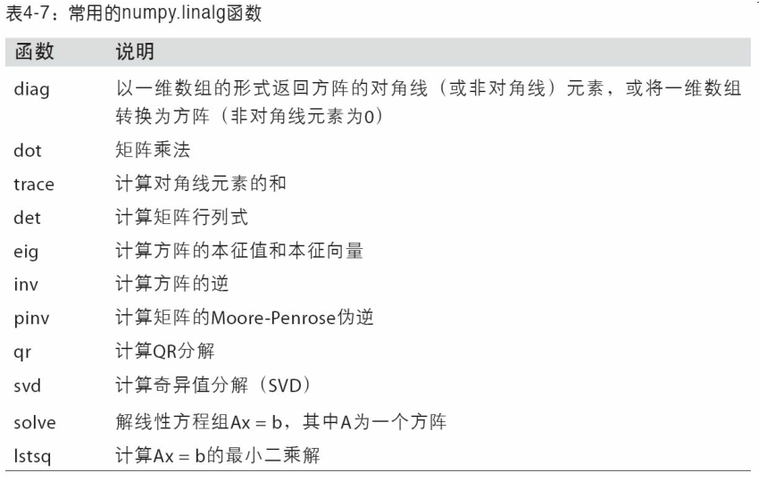
    
    - `sum()`
    - `min()`
    - `max()`
    - `argmin()`：求最小元素的索引；
    - `argmax()`：求最大元素的索引；
    - `mean()`：均值=`average`
    - `median()`：中位数；
    - `cumsum()`：累加函数，生成的每一项矩阵元素均是从原矩阵首项累加到对应项的元素之后；
    - `diff()`：累差运算，每一行中后一项与前一项之差；
- `nonzero()`：将所有非零元素的行与列坐标分隔开，重构成两个分别关于行和列的矩阵；
  
    - `sort()`：排序，多维数组可以在任何一个轴上进行排序，只需要将轴编号传给sort即可；顶级方法np.sort()返回的是数组的已排序副本，而就地排序则会修改数组本身。
- `transppose()`：转置，即**np.transpose(A)=A.T**，返回的是源数据的视图（不会进行任何复制操作）。可以用于计算矩阵的内积。
    - `clip(Array,Array_min,Array_max)`：后面的最大最小值让函数判断矩阵中元素是否有比最小值小的或者比最大值大的元素，并将这些指定的元素转换为最小值或者最大值。
    
    
    
    ​	**通用函数：快速的元素级数组函数**
    
    ​	`ufunc`是一种对ndarray中的数据执行元素级运算的函数。
    
    
    
    如果需要对行或列进行查找运算，就需要在上述代码中为`axis`进行赋值，
    
    - `axis=0`：以**列**作为查找单元；
    - `axis=1`：以**行**作为查找单元；

---

##### 1.4 数组转置和轴对换

​		转置是重塑的一种特殊形式，它返回的是源数据的视图（不会进行任何复制操作）。

  - `transpose`方法；

  - `T`属性;

    对高维数组，transpose需要得到一个由轴编号组成的元组才能对这些轴进行转置：

    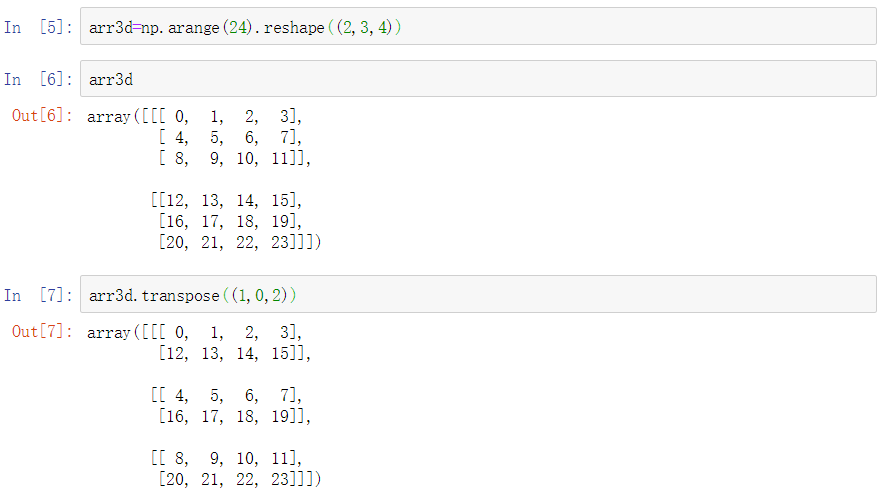

​		这里，第一个轴被换成了第二个，第二个轴被换成了第一个，最后一个轴不变。

​		ndarray还有一个`swapaxes`方法，需要接受一对轴编号：

​		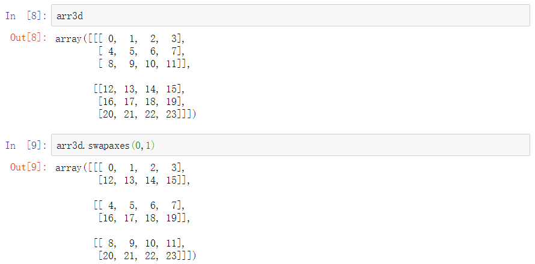

​		从上面可以看出，两种方法的输出结果是相同的。

​			

​		**轴**

​		即维度；

		>对于**二维数组**，0轴——数组的行，1轴——数组的列；
		>
		>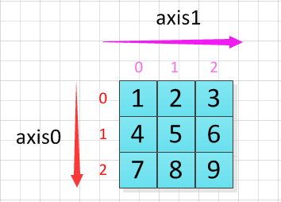
	
		>对于**三维数组**，轴就有点复杂了；
		>
		>```
		>arr3d=np.arange(24).reshape((2,2,4))
		>
		>#输出结果
		>array([[[ 0,  1,  2,  3],
		>        [ 4,  5,  6,  7]],
		>
		>       [[ 8,  9, 10, 11],
		>        [12, 13, 14, 15]]])
		>```
		>
		>上面创建的三维数组（2，2，4）,有3条轴，编号分别为0，1，2。
		>
		>最好的观察办法就是先将三维数组降维成一个二维数组，这样就可以获得原数组的0轴、1轴。
		>
		>把最内层数组作为一个整体来看待，即有：
		>
		>```
		>A = [0, 1, 2, 3]
		>B = [4, 5, 6, 7]
		>C = [ 8,  9, 10, 11]
		>D = [12, 13, 14, 15]
		>arr = [[A, B],
		>       [C, D]]
		>```
		>
		>通过这种变换，将原数组从形式上转化成了一个二位数组，但是注意这里的**A、B、C、D均为一维数组，对它们进行操作时，要按照向量而非标量的运算法则进行。**降维后的轴方向如下图：
		>
		>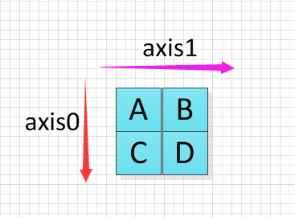
		>
		>可以通过对0、1轴方向求和验证。
		>
		>那么关于2轴的方向：由于A、B、C、D均为一维数组，因此轴2即为最内层一维数组的列方向，如下图所示：
		>
		>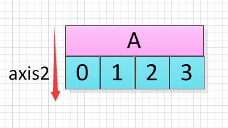
		>
		>同样，可以对轴2求和验证。
		>
		>So，**多维数组，numpy的对轴的编号是先行后列，由外向内！即（2，2，4）=（行，列，层）**。三维示意图如下：
		>
		>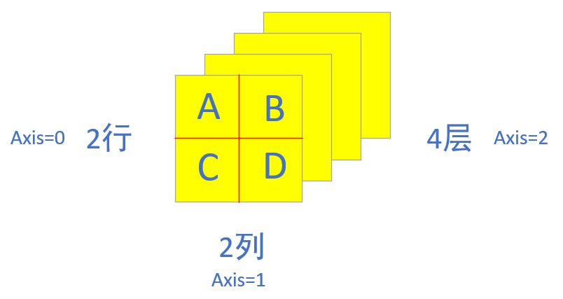
		>
		>进行（1，0，2）转换，结果示意图：
		>
		>```python
		>#轴变换之前数组视图
		>array([[[ 0,  1,  2,  3],
		>        [ 4,  5,  6,  7]],
		>
		>       [[ 8,  9, 10, 11],
		>        [12, 13, 14, 15]]])
		>        
		>#进行（1，0，2）轴变换之后数组视图
		>array([[[ 0,  1,  2,  3],
		>        [ 8,  9, 10, 11]],
		>
		>       [[ 4,  5,  6,  7],
		>        [12, 13, 14, 15]]])
		>```
		>
		>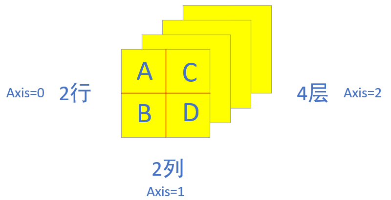
		>
		>进行（2，1，0）转换，结果示意图：
		>
		>```python
		>#轴变换之前数组视图
		>array([[[ 0,  1,  2,  3],
		>        [ 4,  5,  6,  7]],
		>
		>       [[ 8,  9, 10, 11],
		>        [12, 13, 14, 15]]])
		>              
		>#进行（2，1，0）轴变换之后数组视图
		>array([[[ 0,  8],
		>        [ 4, 12]],
		>
		>       [[ 1,  9],
		>        [ 5, 13]],
		>
		>       [[ 2, 10],
		>        [ 6, 14]],
		>
		>       [[ 3, 11],
		>        [ 7, 15]]])
		>```
		>
		>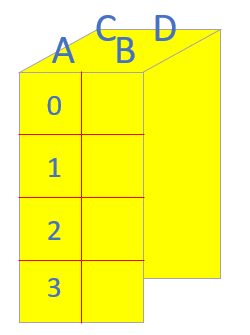
		>
		>**理解的过程中注意一点：轴变换的过程中，原点的字母A是不会离开远点的，哪几个轴变换动哪几个轴，没有涉及变换的轴，不需要改变。**
		>
		>例如进行（2，1，0）变换时，只有0轴和2轴变换，所以1轴不变，即A、B相对位置不改变；0轴和2轴对换，以A为例，需要将原先在2轴排列的一维数组搬到0轴上，原先0轴上排列的A、C，搬到2轴上。完成。
		>
		>参考博客地址：[Numpy数组解惑][https://flat2010.github.io/2017/05/31/Numpy数组解惑]


​		transpose（）函数接受的是一个由`轴编号`组成的有序元组，表示变换后的新组的轴编号顺序。

----

##### 1.5 索引

​		**一维索引**

​		与元素列表或者数组中的表示方法类似；

​		==**注意**==：

		- array[5:8]在这里不包括8这个位置，即不包括结尾。
		- 跟列表最重要的区别在于，数组切片是原始数组的视图，数据不会被复制，视图上的任何修改都会直接反映到源数组上。【但是，某些情况下，你需要得到的是ndarray切片的一份副本而非视图，就需要明确地进行复制操作，例如`arr[5:8].copy()`。】


​		**二维索引**

​		可以利用`:`对一定范围内的元素进行切片操作；

​		

​		**切片索引**

​		切片是沿着一个轴向选取元素的；可以一次传入多个切片：

```
arr2d[:2,1:] #这样切片只能得到相同维数的数组视图，通过将整数和切片混合，可以得到低纬度的切片
```

​		

​		**布尔型索引**

​		`numpy.random.randn`：生成一些正态分布的随机数据；

​		要选择不等于某个值时，可以使用不等于符号（！=），也可以通过`~`对条件进行否定。


​		**花式索引**

​		指利用整数数组进行索引；

​		花式索引跟切片不一样，它总是将数据复制到新数组中。


​		**关于迭代输出的问题**：

```python
import numpy as np
A = np.arange(3,15).reshape((3,4))
         
print(A.flatten())   
# array([3, 4, 5, 6, 7, 8, 9, 10, 11, 12, 13, 14])

for item in A.flat:
    print(item)
    
# 3
# 4
……
# 14
```

​		这一脚本中的`flatten`是一个展开性质的函数，将多维的矩阵进行展开成1行的数列。而`flat`是一个迭代器，本身是一个object属性。

---

##### 1.6 array合并

​		对一个`array`的合并，可以按行、列等多种方式进行合并。

​		`np.vstack(A,B)`——可实现数组A、B的合并；`vertical stack`本身属于一种**上下合并**，即对括号中的两个整体进行对应操作。

​		`np.hstack(A,B)`——实现**左右合并**；

​		

​		`np.nexaxis()`：转置操作；

​		当A为一个序列时，可能无法实现A的转置，因为A不具备矩阵的属性，需要借助其他函数实现转置。

```python
print(A[np.newaxis,:])
# [[1 1 1]]

print(A[np.newaxis,:].shape)
# (1,3)

print(A[:,np.newaxis])
"""
[[1]
[1]
[1]]
"""

print(A[:,np.newaxis].shape)
# (3,1)
```


​		`np.concatenate((A,B,B,A),axis=1)`——针对多个矩阵或序列进行合并。其中`axis`参数很好的控制了矩阵的纵向或是横向打印，相比较`vstack`和`hstack`函数显得更加方便。

----

##### 1.7 唯一化以及其他的集合逻辑

​		针对一维ndarray的基本集合运算，最常用的可能就是`np.unique`，用于找出数组中的唯一值并返回已排序的结果。

​		另一个函数`np.inld`用于测试一个数组中的值在另一个数组中的成员资格，返回一个布尔型数组。

---

##### 1.8 数组的文件输入输出

​		`np.save`和`np.load`是读写磁盘数组数据的两个主要函数

---

##### 1.9 array分割

​		**纵向分割**：

```python
A = np.arange(12).reshape((3, 4))
print(A)
"""
array([[ 0,  1,  2,  3],
    [ 4,  5,  6,  7],
    [ 8,  9, 10, 11]])
"""


print(np.split(A, 2, axis=1))   #A是要分割的矩阵，2是2等分，axis是沿轴1分割
"""
[array([[0, 1],
        [4, 5],
        [8, 9]]), array([[ 2,  3],
        [ 6,  7],
        [10, 11]])]
"""
#不支持不等分，会出错
```

​		**横向分割**：

```python
print(np.split(A, 3, axis=0))  #3是3等分

# [array([[0, 1, 2, 3]]), array([[4, 5, 6, 7]]), array([[ 8,  9, 10, 11]])]
```

​		**不等量的分割**：解决办法为`np.array_split()`

```python
print(np.array_split(A, 3, axis=1))
"""
[array([[0, 1],
        [4, 5],
        [8, 9]]), 
 array([[ 2],
        [ 6],
        [10]]), 
 array([[ 3],
        [ 7],
        [11]])]
"""
```

​		**其他分割方式**：

```python
print(np.vsplit(A, 3)) #等于 print(np.split(A, 3, axis=0))

# [array([[0, 1, 2, 3]]), array([[4, 5, 6, 7]]), array([[ 8,  9, 10, 11]])]


print(np.hsplit(A, 2)) #等于 print(np.split(A, 2, axis=1))
"""
[array([[0, 1],
       [4, 5],
       [8, 9]]), array([[ 2,  3],
        [ 6,  7],
        [10, 11]])]
"""
```

----

##### 1.10 copy&deep copy

​		**=的赋值方式会带有关联性**

```python
import numpy as np

a = np.arange(4)
# array([0, 1, 2, 3])

b = a
c = a
d = b
```

​		改变`a`的第一个值，`b`、`c`、`d`的第一个值也会同时改变。

```python
a[0] = 11
print(a)
# array([11,  1,  2,  3])
```

​		确认`b`、`c`、`d`是否与`a`相同。

```python
b is a  # True
c is a  # True
d is a  # True
```

​		**copy()的赋值方式没有关联性**

```python
b = a.copy()    # deep copy
print(b)        # array([11, 22, 33,  3])
a[3] = 44
print(a)        # array([11, 22, 33, 44])
print(b)        # array([11, 22, 33,  3])
```

​		此时`a`与`b`已经没有关联。

------

##### 1.11 random模块

​		**python `random()`函数**

​		`random()`方法返回随机生成的一个实数，它在[0,1)范围内。

​		==**注意**==：`random()`是不能直接访问的，需要到如random模块，通过random静态对象调用该方法。即，`random.random()`。

​		上面的这个随机生成函数是没有参数的。


​		`random()`函数中常见的函数如下：

​		`random.seed(a=None,vesion=2) `：初始化随机数生成器；

​		`random.randrange(stop)`/`random.randrange(start,stop[,step])`：返回一个随机选择的元素；

​		`random.randint(a,b)`：返回随机整数N，左右闭区间；

​		`random.choice(seq)`：从非空序列seq返回一个随机元素；如下：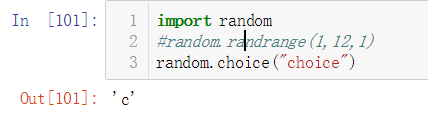

​		`random.choices(population,weights=None,*,cum_weights=None,k=1)`：从population中选择替换，返回大小为k的元素列表。如果指定了weight序列，则根据相对权重进行选择。如果给出cum_weights序列，则根据累积权重进行选择。如果提供了权重序列，则它必须与population序列长度相同。

​		`random.shuffle(x[,random])`：将序列x随机打乱位置；

​		`random.sample(population,k)`：返回从总体序列或集合中选择的唯一元素的k长度列表。用于无重复的随机抽样。

​		`random.random()`：返回0.0到1.0范围内的一个随机浮点数；

​		`random.uniform(a,b)`：返回一个随机浮点数；

​		`random.normalvariate(mu,sigma)`：正态分布，mu-平均值，sigma-标准差；

​		


​		**numpy.random模块**：

​		numpy.random模块对Python内置的random进行了补充，增加了一些用于高效生成多种概率分布的样本值的函数。


​		`np.random.normal(size=(4,4))`：生成标准正态分布的4x4样本数组；

​		`np.random.seed(1234)`：确定随机数生成种子；


​		`np.random.RandomState`：创建一个与其他隔离的随机数生成器；

​		`permutation`：返回一个序列的随机排列或返回一个随机排列的范围；

​		`shuffle`：对一个序列就地随机排列；

​		`rand`：产生均匀分布的样本值；

​		`randint`：从给定的上下限范围内随机选取整数；

​		`randn`：产生正态分布（平均值为0，标准差为1）的样本值，类似于Matlab接口；

​		`binomial`：产生二项分布的样本值；

​		`normal`：产生正态分布的样本值；

​		`beta`：产生Beta分布的样本值；

​		`uniform`：产生在[0，1）中均匀分布的样本值。


------------------------


#### 2 Pandas

​		如果用python的列表和字典来作比较，那么可以说numpy是列表形式的，没有数值标签，而pandas就是字典形式。pandas是基于numpy构建的，让numpy为中心的应用变得更加简单。

​		pandas的两个数据结构：**Series**和**DataFrame**。

##### 2.1 Series

​		`Series`的字符串表现形式为：索引在左边，值在右边。由于我们我没有为数据指定索引。于是会自动创建一个0到N-1(N为长度）的整数型索引。

​		Series可以看出说一个定长的有序字典，因为它是索引值到数据值的一个映射。

---

##### 2.2 DataFrame

​		一个表格型的数据结构，包含一组有序的列，每列可以是不同的值类型（数值，字符串，布尔值等）。`DataFrame`既有行索引也有列索引，它可以被看做由`Series`组成的大字典。

```python
df2 = pd.DataFrame({'A' : 1.,
                    'B' : pd.Timestamp('20130102'),
                    'C' : pd.Series(1,index=list(range(4)),dtype='float32'),
                    'D' : np.array([3] * 4,dtype='int32'),
                    'E' : pd.Categorical(["test","train","test","train"]),
                    'F' : 'foo'})
                    
print(df2)

"""
     A          B    C  D      E    F
0  1.0 2013-01-02  1.0  3   test  foo
1  1.0 2013-01-02  1.0  3  train  foo
2  1.0 2013-01-02  1.0  3   test  foo
3  1.0 2013-01-02  1.0  3  train  foo
"""
```

​		这种方法能对每一列的数据进行特殊对待. 如果想要查看数据中的类型, 我们可以用 `dtype`这个属性:

```python
print(df2.dtypes)

"""
df2.dtypes
A           float64
B    datetime64[ns]
C           float32
D             int32
E          category
F            object
dtype: object
"""
```

​		查看该结构的一些属性：

  - `index`：列的序号；

  - `columns`：数据的名称；

  - `values`：df2的值；

  - `describe()`：数据的总结；

  - `transpose`：翻转数据；

    如果想对数据的 `index` 进行排序并输出:

    ```python
    print(df2.sort_index(axis=1, ascending=False))
    
    """
         F      E  D    C          B    A
    0  foo   test  3  1.0 2013-01-02  1.0
    1  foo  train  3  1.0 2013-01-02  1.0
    2  foo   test  3  1.0 2013-01-02  1.0
    3  foo  train  3  1.0 2013-01-02  1.0
    """
    ```

    如果是对数据 值 排序输出:

    ```python
    print(df2.sort_values(by='B'))
    
    """
         A          B    C  D      E    F
    0  1.0 2013-01-02  1.0  3   test  foo
    1  1.0 2013-01-02  1.0  3  train  foo
    2  1.0 2013-01-02  1.0  3   test  foo
    3  1.0 2013-01-02  1.0  3  train  foo
    """
    ```

---

##### 2.3 创建DataFrame

​	 1. 最常用的一种是直接传入一个由等长列表或Numpy数组组成的字典。

  		2. 嵌套字典，外层字典的键作为列，内层键作为行索引。

​		

		- 如果指定了列序列，则DataFrame的列就会按照指定顺序进行排列。
		- 通过类似字典标记的方式或属性的方式，可以将DataFrame的列获取为一个Series。
		- 行也可以通过位置或名称的方式进行获取，比如用`loc`属性。
		- 列可以通过赋值的方式进行修改。
		- 将列表或数组赋值给某个列时，其长度必须跟DataFrame的长度相匹配。
		- 对于特别大的DataFrame，`head`方法会选取前五行。
		- 为不存在的列赋值会创建出一个新列。关键字`del`用于删除列。
		- DataFrame可以进行转置（交换行和列）。

---

##### 2.4 索引

​		索引的概念有点像SQL的主键，能够通过索引选取一个数据或者一组数据。


​		pandas的索引对象负责管理轴标签和其他元数据。构建Series或DataFrame时，所用到的任何数组或其他序列的标签都会被转换成一个Index。【index函数可以显示Series的索引】

​		Series的索引可以通过赋值的方式**就地修改**；【但是，index对象是不可变的】

​		index的功能类似一个固定大小的集合，pandas的Index可以包含重复的标签。


​		【**重新索引**】：`reindex`——其作用是创建一个**新对象**，它的数据符合新的索引。

​		对于时间序列这样的有序数据，重新索引时可能需要做一些**插值处理**。`method`可以达到此目的，例如使用ffill可以实现前向值填充。	

```python
obj3.reindex(range(6),method='ffill')
```

​		`reindex`：可以修改行索引和列。只传递一个序列，会重新索引结果的行。列可以用columns关键字重新索引。

​		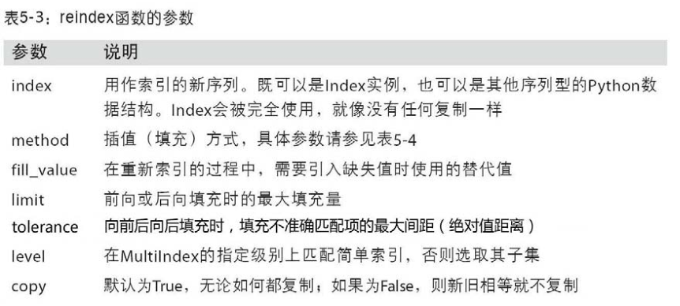


----

##### 2.5 pandas选择数据

###### 2.5.1 简单的筛选

​		**注意**：当使用标签字符串进行选取时，会包括首尾两个标签。这点与使用数字序列选取时不同，如下图所示：

​		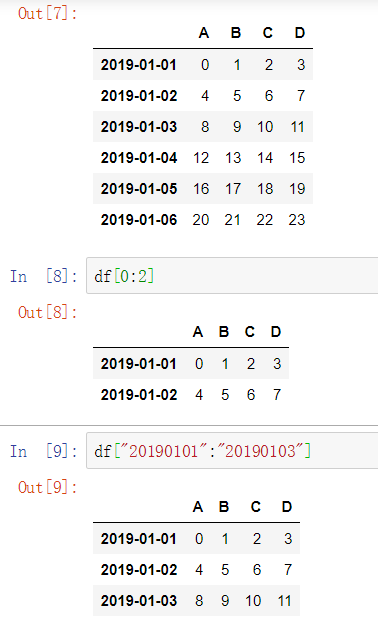

###### 2.5.2 根据标签loc

​		用于选取指定行。

###### 2.5.3 根据序列iloc

​		采用**位置**进行选择，在不同情况下所需要的数据例如选某一个，连续选或跨行选等操作。

###### 2.5.4 混合选择ix

​		我们可以采用混合选择 `ix`, 其中选择’A’和’C’的两列，并选择前三行的数据。

```python
print(df.ix[:3,['A','C']])
"""
            A   C
2013-01-01  0   2
2013-01-02  4   6
2013-01-03  8  10
"""
```

###### 2.5.5 通过判断筛选

​		采用**判断指令**进行选择，可以**约束某项条件**然后选择出当前所有数据。

```python
print(df[df.A>8])
"""
             A   B   C   D
2013-01-04  12  13  14  15
2013-01-05  16  17  18  19
2013-01-06  20  21  22  23
"""
```

###### 2.5.6 丢弃指定轴上的项

​		丢弃某条轴上的一个或多个项，只要有一个索引数组或列表即可。

​		`drop`方法返回的是一个在指定轴上删除了指定值的新对象。

​		

​		**注意****：对于DataFrame，可以删除任意轴上的索引值。

​	 1. 用标签序列调用drop会从行标签（axis0）删除值；

  		2. 传递axis=1或axis=‘columns’可以删除列的值。

---

##### 2.6 pandas设置值

​		根据需求，用pandas进行更改数据里的值，或者加上一些空的、有数据值的列。

		1. **根据位置设置**`loc`和`iloc`，利用索引或标签确定需要修改值的位置。
  		2. **根据条件设置**，例如，对于`A`大于4的位置. 更改`B`在相应位置上的数为0。
                		3. **按行或列设置**，对整列做批处理。
            		4. **添加数据**

----

##### 2.7 处理丢失数据

​		导入或处理数据，会产生一些空的或是NaN数据，如何删除或者填补这些NaN数据。

  - `pd.dropna`：直接去掉有`NaN`的行或列；

    ```python
    df.dropna(
        axis=0,     # 0: 对行进行操作; 1: 对列进行操作
        how='any'   # 'any': 只要存在 NaN 就 drop 掉; 'all': 必须全部是 NaN 才 drop 
        ) 
    ```

- `pd.fillna()`：将NaN值用其他值代替，比如用0；

  ```python
  df.fillna(value=0)
  ```

- `pd.isnull()`：判断是否有缺失数据NaN，为True表示缺失数据；

  检测在数据中是否存在 `NaN`, 如果存在就返回 `True`:

  ```python
  np.any(df.isnull()) == True  
  ```

---

###### 2.8 数据对齐

​		对不同索引的对象进行算术运算，在将对象相加时，如果存在不同的索引对，则结果的索引就是该索引对的并集。

---

##### 2.8 pandas导入导出

​		读取csv；将资料存取为`pickle`。

```python
#读取csv
data = pd.read_csv('student.csv')

data.to_pickle('student.pickle')
```

---

##### 2.9 pandas合并

###### 2.9.1 concat

​		pandas处理多组数据的时候往往会用到数据的合并处理，使用`concat`是一种基本的合并方式。而且`concat`中有很多参数可以调整，合并成想要的数据形式。

		- `axis(合并方向)`：axis=0是预设值；纵向合并；
		- `ignore_index`：（重置index)
		- `join=合并方式`：outer是预设值；‘inner’，相同的列合并在一起，其他的会被抛弃；
		- `join_axes`：依照axes合并；
		- `append`：添加数据；只要纵向合并，没有横向合并。

```python
import pandas as pd
import numpy as np

#定义资料集
df1 = pd.DataFrame(np.ones((3,4))*0, columns=['a','b','c','d'])
df2 = pd.DataFrame(np.ones((3,4))*1, columns=['a','b','c','d'])
df3 = pd.DataFrame(np.ones((3,4))*1, columns=['a','b','c','d'])
s1 = pd.Series([1,2,3,4], index=['a','b','c','d'])

#将df2合并到df1的下面，以及重置index，并打印出结果
res = df1.append(df2, ignore_index=True)
print(res)
#     a    b    c    d
# 0  0.0  0.0  0.0  0.0
# 1  0.0  0.0  0.0  0.0
# 2  0.0  0.0  0.0  0.0
# 3  1.0  1.0  1.0  1.0
# 4  1.0  1.0  1.0  1.0
# 5  1.0  1.0  1.0  1.0

#合并多个df，将df2与df3合并至df1的下面，以及重置index，并打印出结果
res = df1.append([df2, df3], ignore_index=True)
print(res)
#     a    b    c    d
# 0  0.0  0.0  0.0  0.0
# 1  0.0  0.0  0.0  0.0
# 2  0.0  0.0  0.0  0.0
# 3  1.0  1.0  1.0  1.0
# 4  1.0  1.0  1.0  1.0
# 5  1.0  1.0  1.0  1.0
# 6  1.0  1.0  1.0  1.0
# 7  1.0  1.0  1.0  1.0
# 8  1.0  1.0  1.0  1.0

#合并series，将s1合并至df1，以及重置index，并打印出结果
res = df1.append(s1, ignore_index=True)
print(res)
#     a    b    c    d
# 0  0.0  0.0  0.0  0.0
# 1  0.0  0.0  0.0  0.0
# 2  0.0  0.0  0.0  0.0
# 3  1.0  2.0  3.0  4.0
```


###### 2.9.2 merge

​		**主要用于两组key column的数据，统一索引的数据。**

  - 依据一组key合并

    ```python
    import pandas as pd
    
    #定义资料集并打印出
    left = pd.DataFrame({'key': ['K0', 'K1', 'K2', 'K3'],
                                 'A': ['A0', 'A1', 'A2', 'A3'],
                                 'B': ['B0', 'B1', 'B2', 'B3']})
    right = pd.DataFrame({'key': ['K0', 'K1', 'K2', 'K3'],
                                  'C': ['C0', 'C1', 'C2', 'C3'],
                                  'D': ['D0', 'D1', 'D2', 'D3']})
    
    print(left)
    #    A   B key
    # 0  A0  B0  K0
    # 1  A1  B1  K1
    # 2  A2  B2  K2
    # 3  A3  B3  K3
    
    print(right)
    #    C   D key
    # 0  C0  D0  K0
    # 1  C1  D1  K1
    # 2  C2  D2  K2
    # 3  C3  D3  K3
    
    #依据key column合并，并打印出
    res = pd.merge(left, right, on='key')
    
    print(res)
         A   B key   C   D
    # 0  A0  B0  K0  C0  D0
    # 1  A1  B1  K1  C1  D1
    # 2  A2  B2  K2  C2  D2
    # 3  A3  B3  K3  C3  D3
    ```

- 依据两组key合并

  合并时有4种方法`how = ['left', 'right', 'outer', 'inner']`，预设值`how='inner'`。

  ```python
  import pandas as pd
  
  #定义资料集并打印出
  left = pd.DataFrame({'key1': ['K0', 'K0', 'K1', 'K2'],
                        'key2': ['K0', 'K1', 'K0', 'K1'],
                        'A': ['A0', 'A1', 'A2', 'A3'],
                        'B': ['B0', 'B1', 'B2', 'B3']})
  right = pd.DataFrame({'key1': ['K0', 'K1', 'K1', 'K2'],
                         'key2': ['K0', 'K0', 'K0', 'K0'],
                         'C': ['C0', 'C1', 'C2', 'C3'],
                         'D': ['D0', 'D1', 'D2', 'D3']})
  
  print(left)
  #    A   B key1 key2
  # 0  A0  B0   K0   K0
  # 1  A1  B1   K0   K1
  # 2  A2  B2   K1   K0
  # 3  A3  B3   K2   K1
  
  print(right)
  #    C   D key1 key2
  # 0  C0  D0   K0   K0
  # 1  C1  D1   K1   K0
  # 2  C2  D2   K1   K0
  # 3  C3  D3   K2   K0
  
  #依据key1与key2 columns进行合并，并打印出四种结果['left', 'right', 'outer', 'inner']
  res = pd.merge(left, right, on=['key1', 'key2'], how='inner')
  print(res)
  #    A   B key1 key2   C   D
  # 0  A0  B0   K0   K0  C0  D0
  # 1  A2  B2   K1   K0  C1  D1
  # 2  A2  B2   K1   K0  C2  D2
  
  res = pd.merge(left, right, on=['key1', 'key2'], how='outer')
  print(res)
  #     A    B key1 key2    C    D
  # 0   A0   B0   K0   K0   C0   D0
  # 1   A1   B1   K0   K1  NaN  NaN
  # 2   A2   B2   K1   K0   C1   D1
  # 3   A2   B2   K1   K0   C2   D2
  # 4   A3   B3   K2   K1  NaN  NaN
  # 5  NaN  NaN   K2   K0   C3   D3
  
  res = pd.merge(left, right, on=['key1', 'key2'], how='left')
  print(res)
  #    A   B key1 key2    C    D
  # 0  A0  B0   K0   K0   C0   D0
  # 1  A1  B1   K0   K1  NaN  NaN
  # 2  A2  B2   K1   K0   C1   D1
  # 3  A2  B2   K1   K0   C2   D2
  # 4  A3  B3   K2   K1  NaN  NaN
  
  res = pd.merge(left, right, on=['key1', 'key2'], how='right')
  print(res)
  #     A    B key1 key2   C   D
  # 0   A0   B0   K0   K0  C0  D0
  # 1   A2   B2   K1   K0  C1  D1
  # 2   A2   B2   K1   K0  C2  D2
  # 3  NaN  NaN   K2   K0  C3  D3
  ```

- Indicator会将合并的记录放在新的一列；

- 依据index合并

- 解决overlapping的问题

  ```python
  import pandas as pd
  
  #定义资料集
  boys = pd.DataFrame({'k': ['K0', 'K1', 'K2'], 'age': [1, 2, 3]})
  girls = pd.DataFrame({'k': ['K0', 'K0', 'K3'], 'age': [4, 5, 6]})
  
  #使用suffixes解决overlapping的问题
  res = pd.merge(boys, girls, on='k', suffixes=['_boy', '_girl'], how='inner')
  print(res)
  #    age_boy   k  age_girl
  # 0        1  K0         4
  # 1        1  K0         5
  ```

----

#### 3 NumPy与Pandas的区别

##### 3.1 array与Series的区别

​		Series在jupyter中的样式与array不同，它是竖着的。Series的右边是输入的一组数据，左边是数据的索引，即标签。数据标签是pandas区分于numpy的重要特征。

​		Series的索引值不只是整数，可以是标签（字符串）。


