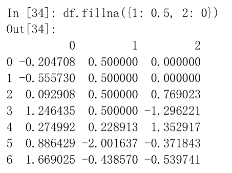

### 7 数据清洗和准备

​		在数据分析和建模的过程中，相当多的时间要用在数据准备上：加载、清理、转换以及重塑。本节主要讨论**处理缺失数据**、**重复数据**、**字符串操作**和**其他分析数据转换的工具**。

#### 7.1 处理缺失数据

​		在pandas中，对于数值数据，pandas使用浮点值NaN表示缺失数据，称为哨兵值，可以通过`A.isnull()`类似的方法检测出来。

		>在pandas中，缺失值NA表示不可用not available。
		>
		>在统计应用中，NA数据可能是不存在的数据或者虽然存在，但是没有观察到。
		>
		>当进行数据清洗以进行分析时，最好直接对缺失数据进行分析，以判断数据采集的问题或缺失数据可能导致的偏差。

​		**注意**：python内置的None值在对象数组中也可以作为NA。即，如果数组中含有None值，将被识别为NA。

​		

​		**关于缺失数据处理的函数**：（NA处理方法）

​		

------------------

##### 7.1.1 滤除缺失数据

​		对于一个**Series**，`dropna`返回一个仅含非空数据和索引值的Series。

```python
from numpy import nan as NA

data=pd.Series([1,NA,3.5,NA,7])
data.dropna()  #等价于data[data.notnull()]
```

​		输出结果：

```PYTHON
0    1.0
2    3.5
4    7.0
dtype: float64
```

​		

​		对于**DataFrame**对象，可能希望丢弃全NA或含有NA的行或列。dropna默认丢弃含有缺失值的行；用这种方式丢弃列，只需传入axis=1即可。

> 传入参数`how=‘all’`将只丢弃全为NA的那些行。

​		另外一个滤除DataFrame行的问题涉及时间序列数据。只想留下一部分观测数据，可以使用`thresh`参数实现此目的。(thresh=2表示删除含有2个NA值的数据)

------

##### 7.1.2 填充缺失数据

​		填补“空洞”，大多数情况下，`fillna`方法是最主要的函数。通过一个常数调用`fillna`就会将缺失值替换为那个常数值。如 A.fillna(0) 。

​		若是通过一个字典调用`fillna`，可以实现对不同的列填充不同的值。如 df.fillna({1:0.5 , 2:0}) 。

​		

​		对`reindexing`有效的那些插值方法也可用于`fillna`：

```
df.fillna(method='ffill') #填充
df.fillna(method='ffill',limit=2) #
```

​		

------------------

#### 7.2 数据转换

​		另一类重要操作是过滤、清理以及其他的转换工作。

##### 7.2.1 移除重复数据

​		DataFrame的`duplicated`方法返回一个布尔型**Series**，表示各行是否是重复行（前面出现过的行）。还有一个与此相关的`drop_duplicates`方法，它会返回一个**DataFrame**，重复的数组会标为False。【这两种方法默认会判断全部列，也可以指定部分列进行重复项判断。例如，只希望根据某一列过滤重复项，只需要传参到上面的方法中。】

> duplicated和drop_duplicates默认保留的是第一个出现的值组合。传入keep=‘last’则保留最后一个。

---

##### 7.2.2 利用函数或映射进行数据转换

​		希望根据数组、Series或DataFrame列中的值来实现转换工作。

​		Series的`map`方法可以**接受一个函数或含有映射关系的字典型对象**，但是如果碰到一些映射的对象中有些值的首字母大写了，而有些则没有，就需要使用`Series`的`str.lower`方法，将各个值转换为小写。

​		例如：

```python
lowercased=data['food'].str.lower()

data['animal']=lowercased.map(meat_to_animal)
```

​		使用map是一种实现**元素级转换**以及**其他数据清理工作**的便捷方式。

---

##### 7.2.3 替换值

使用`fillna`方法填充缺失数据可以看做值替换的一种特殊情况。

`replace`产生一个新的Series（除非传入inplace=True）

```python
data=pd.Series([1,-999,2.,-999,-1000,3.])
data.replace(-999,np.nan)
data.replace([-999,-1000],np.nan)  #一次替换多个值，可以传入一个由待替换值组成的列表以及一个替换值
data.replace([-999,-1000],[np.nan,0])  #让每个值有不同的替换值，传递一个替换列表

#传入的参数也可以是字典
data.replace({-999:np.nan,-1000:0})
```

==**注意**==：`data.replace`方法与`data.str.replace`不同，后者做的是字符串的元素级替换。

---

##### 7.2.4 重命名轴索引

​		将重命名的值赋给index，可以对DataFrame进行就地修改：

```python
data.index=data.index.map(transform)
```

​		如果想要创建数据集的转换版（不是修改原始数据），采用`rename`方法：rename可以集合字典型对象实现对部分轴标签的更新。

```python
data.rename(index=str.title,columns=str.upper)
```

​		rename可以实现复制DataFrame并对其索引和列标签进行赋值。如果希望就地修改某个数据集，传入inplace=True即可：

```
data.name(index={'ohho':'OHHO'},inplace=True)
```

----

##### 7.2.5 离散化和面元划分

​		为了便于分析，**连续数据**常常被**离散化**或拆分为“**面元**”。

​		比如希望划分不同的年龄组：

```python
import numpy as np
import pandas as pd
from numpy import nan as NA

ages=[20,22,25,27,21,23,37,31,61,45,41,32]
```

​		将上面这些数据划分为不同的年龄段，如18~ 25，26~35....

​		需要使用pandas的`cut `函数：

```python
bins=[18,25,35,60,100]  #划分的年龄段
cats=pd.cut(ages,bins) #cut函数的第一个参数是连续数据，第二个参数是划分依据
```

​		输出结果：

```python
[(18, 25], (18, 25], (18, 25], (25, 35], (18, 25], ..., (25, 35], (60, 100], (35, 60], (35, 60], (25, 35]]
Length: 12
Categories (4, interval[int64]): [(18, 25] < (25, 35] < (35, 60] < (60, 100]]
#上面的区间括号的开闭可以通过类似于right=False的方式进行修改，只需要在cut函数中传入这一参数
```

​		返回的是一个特殊的Categories对象，结果展示了pandas.cut划分的面元。codes属性中有年龄数据的标签。

​		

​		`pd.value_counts(cats)`是pandas.cut结果的**面元计数**。

```python
pd.value_counts(cats)

#输出结果
(18, 25]     5
(35, 60]     3
(25, 35]     3
(60, 100]    1
dtype: int64
```

​		

​		**修改面元名称**：

​		传递一个列表或数组到`labels`。

​		例如，labels=group_names；

​		

​		如果向`cut`传入的是**面元的数量**而不是确切的面元边界，则会根据数据的最小值和最大值**计算等长面元**。

```python
pd.cut(data,4,precision=2)
#4-面元数量
#precision=2-限定小数只有两位
```

​		`qcut`是类似于`cut`的函数，可以根据**样本分位数**对数据进行面元划分，得到**大小基本相等的面元**。


​		`cut`和`qcut`函数均是离散化函数，对**分位**和**分组分析**非常重要。

----

##### 7.2.6 检测和过滤异常值

​		过滤或变换异常值（outlier）实质是**数组运算**。

----

##### 7.2.7 排列和随机采样

​		利用`numpy.random.permutation`函数可以实现Series或DataFrame的列的排列工作（permuting，随机重排序）。通过需要排列的轴的长度调用permutation，产生一个表示新顺序的整数数组。

```python
df=pd.DataFrame(np.arange(5*4),reshape((5,4)))
sampler=np.random.permutation(5)  #新顺序的整数数组

#基于iloc的索引操作或take函数中使用该数组
df.take(sampler)
```

​		`sample`方法：可以不用替换的方式选取随机子集。

---

##### 7.2.8 计算指标/哑变量

​		用于统计建模或机器学习的转换方式是：将**分类变量**（categorical variable）转换为“**哑变量**”或“**指标矩阵**”。

		>如果DataFrame的某一列中含有k个不同的值，则可以派生出一个k列矩阵或DataFrame（其值全为1和0）。
		>
		>pandas的`get_dummies`函数可以实现。

```
df=pd.DataFrame({'key':['b','b','a','c','a','b'],
				'datal':range(6)})
pd.get_dummies(df['key'])
```

​		

​		原数据中有3个不同的值，转换后就派生出3列，其值为0或1；

> `get_dummies`的**prefix**参数可以实现在指标DataFrame的列加上一个前缀，便于跟其他数据合并。

```python
dummies=pd.get_dummies(df['key'],prefix='key')
```

​		

```python
df_with_dummy=df[['data1']].join(dummies)
```

​		

------------------

#### 7.3 字符串操作

##### 7.3.1 字符串对象方法

​		以**逗号分隔**的字符串可以用`split`拆分成**数段**；

​		`split`与`strip`一起使用，以去除空白符（包括换行符）：

```python
pieces=[x.strip() for x in val.split(',')]
```

​		利用**加法**，可以将子字符串以**双冒号分隔符**的形式连接起来：

```python
first,second,third=pieces
first+'::'+second+'::'+third
#输出结果
’a::b::guido'
```

​		**更快的方式是**：向字符串“::”的join方法传入一个列表或元组；

```python
'::'.join(pieces)
#输出结果
'a::b::guido'
```

​	

​		**子串定位**

​		检测子串的最佳方式是利用Python的**in关键字**，还可以使用`index`和`find`。

> 注意find和index的区别：如果找不到字符串，index将会引发一个异常（而不是返回-1）。

​		`count`：返回指定**子串的出现次数**；

​		

​		`replace`用于将指定模式替换为另一个模式，传入**空字符串**，作为**删除模式**。

```python
val.replace(',','::')

val.replace(',',' ')
```

​		python内置的字符串方法：

​		

​		

---

##### 7.3.2 正则表达式（regex）

​		python内置的re模块负责对字符串应用正则表达式。

​		re模块的函数可以分为三个大类：**模式匹配**、**替换**、**拆分**。

		>`\s+`：描述一个或多个空白符（制表符、空格、换行符等）的regex。
		>
		>例如：
		>
		>```python
		>re.split('\s+',text) #text是待处理字符串
		>#正则表达式会先被编译，然后再在text上调用其split方法
		>
		>#可以用re.compile自己编译regex以得到一个可重用的regex对象
		>regex=re.compile('\s+')
		>regex.split(text)
		>```

​		使用`findall`方法，得到匹配regex的所有模式。

​		

  - `match`：只匹配字符串的首部；

  - `search`：返回第一个匹配项；

  - `findall`：返回字符串中所有的匹配项；

    ​	


----

##### 7.3.3 pandas的矢量化字符串函数

​		散乱数据，需要做字符串规整化。含有字符串的列有时可能包含缺失数据：

​		

​		Series有能够跳过NA值的面向数组方法，进行字符串操作。通过Series的str属性即可访问这些方法。

​		例如：

```
data.str.contains('gmail')
```

​		

​		

​		实现矢量化的元素获取操作：

  1. `str.get`

  2. 在str属性上使用索引；

     

​	


