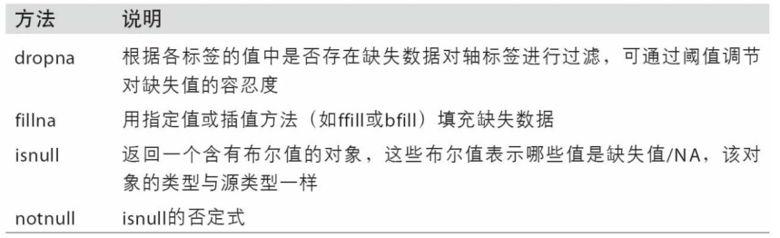
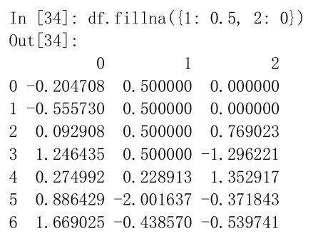
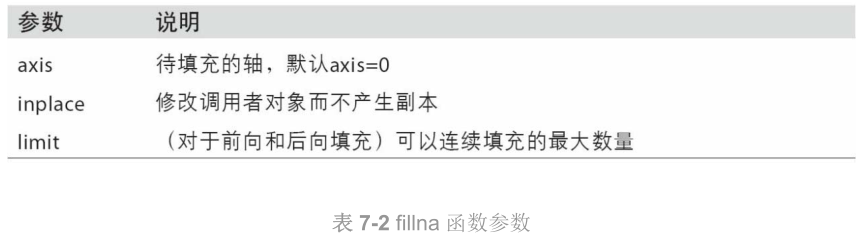

### 7 数据清洗和准备

​		在数据分析和建模的过程中，相当多的时间要用在数据准备上：加载、清理、转换以及重塑。本节主要讨论**处理缺失数据**、**重复数据**、**字符串操作**和**其他分析数据转换的工具**。

#### 7.1 处理缺失数据

​		在pandas中，对于数值数据，pandas使用浮点值NaN表示缺失数据，称为哨兵值，可以通过`A.isnull()`类似的方法检测出来。

		>在pandas中，缺失值NA表示不可用not available。
		>
		>在统计应用中，NA数据可能是不存在的数据或者虽然存在，但是没有观察到。
		>
		>当进行数据清洗以进行分析时，最好直接对缺失数据进行分析，以判断数据采集的问题或缺失数据可能导致的偏差。

​		**注意**：python内置的None值在对象数组中也可以作为NA。即，如果数组中含有None值，将被识别为NA。

​		

​		**关于缺失数据处理的函数**：（NA处理方法）

​		

------------------

##### 7.1.1 滤除缺失数据

​		对于一个**Series**，`dropna`返回一个仅含非空数据和索引值的Series。

```python
from numpy import nan as NA

data=pd.Series([1,NA,3.5,NA,7])
data.dropna()  #等价于data[data.notnull()]
```

​		输出结果：

```PYTHON
0    1.0
2    3.5
4    7.0
dtype: float64
```

​		

​		对于**DataFrame**对象，可能希望丢弃全NA或含有NA的行或列。dropna默认丢弃含有缺失值的行；用这种方式丢弃列，只需传入axis=1即可。

> 传入参数`how=‘all’`将只丢弃全为NA的那些行。

​		另外一个滤除DataFrame行的问题涉及时间序列数据。只想留下一部分观测数据，可以使用`thresh`参数实现此目的。(thresh=2表示删除含有2个NA值的数据)

------

##### 7.1.2 填充缺失数据

​		填补“空洞”，大多数情况下，`fillna`方法是最主要的函数。通过一个常数调用`fillna`就会将缺失值替换为那个常数值。如 A.fillna(0) 。

​		若是通过一个字典调用`fillna`，可以实现对不同的列填充不同的值。如 df.fillna({1:0.5 , 2:0}) 。

​		

​		对`reindexing`有效的那些插值方法也可用于`fillna`：

```
df.fillna(method='ffill') #填充
df.fillna(method='ffill',limit=2) #
```

​		

------------------

#### 7.2 数据转换

​		另一类重要操作是过滤、清理以及其他的转换工作。

##### 7.2.1 移除重复数据

​		DataFrame的`duplicated`方法返回一个布尔型**Series**，表示各行是否是重复行（前面出现过的行）。还有一个与此相关的`drop_duplicates`方法，它会返回一个**DataFrame**，重复的数组会标为False。【这两种方法默认会判断全部列，也可以指定部分列进行重复项判断。例如，只希望根据某一列过滤重复项，只需要传参到上面的方法中。】

> duplicated和drop_duplicates默认保留的是第一个出现的值组合。传入keep=‘last’则保留最后一个。

---

##### 7.2.2 利用函数或映射进行数据转换

​		希望根据数组、Series或DataFrame列中的值来实现转换工作。

​		Series的`map`方法可以**接受一个函数或含有映射关系的字典型对象**，但是如果碰到一些映射的对象中有些值的首字母大写了，而有些则没有，就需要使用`Series`的`str.lower`方法，将各个值转换为小写。

​		例如：

```python
lowercased=data['food'].str.lower()

data['animal']=lowercased.map(meat_to_animal)
```

​		使用map是一种实现**元素级转换**以及**其他数据清理工作**的便捷方式。

---

##### 7.2.3 替换值

使用`fillna`方法填充缺失数据可以看做值替换的一种特殊情况。

`replace`产生一个新的Series（除非传入inplace=True）

```python
data=pd.Series([1,-999,2.,-999,-1000,3.])
data.replace(-999,np.nan)
data.replace([-999,-1000],np.nan)  #一次替换多个值，可以传入一个由待替换值组成的列表以及一个替换值
data.replace([-999,-1000],[np.nan,0])  #让每个值有不同的替换值，传递一个替换列表

#传入的参数也可以是字典
data.replace({-999:np.nan,-1000:0})
```

==**注意**==：`data.replace`方法与`data.str.replace`不同，后者做的是字符串的元素级替换。

---

##### 7.2.4 重命名轴索引

​		将重命名的值赋给index，可以对DataFrame进行就地修改：

```python
data.index=data.index.map(transform)
```

​		如果想要创建数据集的转换版（不是修改原始数据），采用`rename`方法：rename可以集合字典型对象实现对部分轴标签的更新。

```python
data.rename(index=str.title,columns=str.upper)
```

​		rename可以实现复制DataFrame并对其索引和列标签进行赋值。如果希望就地修改某个数据集，传入inplace=True即可：

```
data.name(index={'ohho':'OHHO'},inplace=True)
```

----

##### 7.2.5 离散化和面元划分


