### 8 数据规整：聚合、合并和重塑

> 前提：数据分散在多个文件或数据库中，存储形式不利于分析。

​		重点：pandas的层次化索引；

#### 8.1 层次化索引

> 在**一个轴**上拥有多个（两个以上）**索引级别**。（即，以**低纬度形式**处理**高纬度数据**。）

​		例如：

```python
data=pd.Series(np.random.randn(9),index=[['a','a','a','b','b','c','c','d','d'],[1,2,3,1,3,1,2,2,3]])
```

 		输出结果：

```python
a  1   -0.314113
   2   -0.846484
   3   -1.739297
b  1   -1.717293
   3    0.231455
c  1    0.689554
   2   -0.366526
d  2    1.976658
   3   -0.241214
dtype: float64
    
#上面的结果是经过美化的带有MultiIndex索引的Series的格式
```

​		索引之间的“**间隔**”表示“**直接使用上面的标签**”。

​		对于一个层次化索引的对象，可以使用所谓的**部分索引**，即如下方式：

```python
data['b']
data['b':'c']
data.loc[['b','d']]
#在“内层”中进行选取
data.loc[:,2]
```

​		==**注意**==：层次化索引在**数据重塑**和**基于分组的操作**（如透视表生成）中十分重要。

		>层次化索引的Series数据可以通过`unstack`方法将其重新安排到一个`DataFrame`中。

​		如下所示：

​		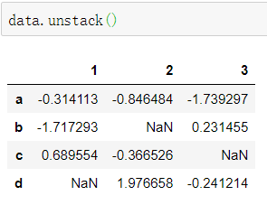

​		`unstack`的逆运算是`stack`。

​		

​		`DataFrame`的每条轴都可以有分层索引；

```python
frame=pd.DataFrame(np.arange(12).reshape((4,3)),
                   index=[['a','a','b','b'],[1,2,1,2]],
                   columns=[['ohio','ohio','color'],
                           ['green','red','green']])
```

​		输出结果：

​		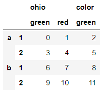

---

##### 8.1.1 重排与分级排序

		>重新调整某条轴上各级别的顺序，或根据指定级别上的值对数据进行排序。

​		`swaplevel` 接受**两个级别**编号或名称，并返回一个互换了级别的新对象（但**数据不会发生变化**）。

​		例如：

​		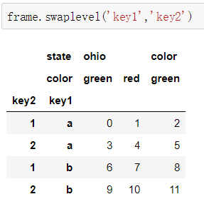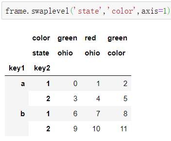

​		

​		`sort_index`：根据**单个级别**中的值对数据进行**排序**。

> 交换级别时，用`sort_index`，可以按照指定顺序进行字母排序。

​		例如：

```python
frame.sort_index(level=1)
#level=1，表示第一列
```

​		输出结果：

​		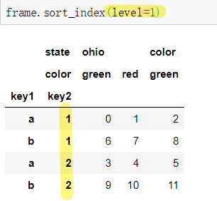

​		==**注意**==：如果输入frame.sort_index(**level=2**)，就会出错。如下提示：

​		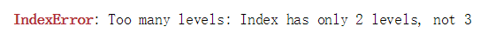

​		提示：只有两个索引，不是三个。

```python
frame.swaplevel(0,1).sort_index(level=0)
```

​		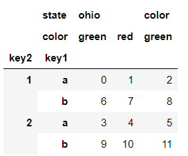

----

##### 8.1.2 根据级别汇总统计

​		对DataFrame和Series的描述和汇总统计都有一个level选项，用于指定在某条轴上求和的级别。

----

##### 8.1.3 使用DataFrame的列进行索引

​		DataFrame的`set_index`函数会将其**一个或多个列**转换为**行索引**，并创建一个新的DataFrame。

​		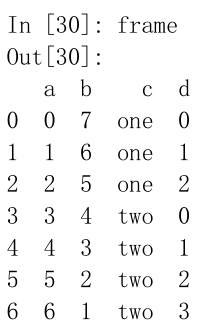		

```
frame2=frame.set_index(['c','d'])
```

​		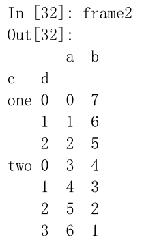

​		默认情况下，那些列会从DataFrame中移除，可以通过传入`drop=False`参数使其保留下来。

​		`reset_index`的功能跟`set_index`刚好相反，层次化索引的级别会被转移到列里面。

----

#### 8.2 合并数据集

​		pandas对象中的数据可以通过一些方式进行合并：

- `pandas.merge`根据一个或多个键将不同DataFrame中的行连接起来。（它实现的就是数据库的join操作）。
- `pandas.concat`可以沿着一条轴将多个对象堆叠到一起。
- `combine_first`可以将重复数据编接在一起，用一个对象中的值填充另一个对象中的缺失值。

----

##### 8.2.1 数据库风格的DataFrame合并

​		数据集的**合并**或**连接**运算是通过**一个或多个键**将行链接起来的。

​		pandas的`merge`函数是主要切入点。

​		`merge`函数，如果没有指定用哪个列进行连接，就会将**重叠列的列名**当作**键**。

```python
pd.merge(df1,df2,on='key')
```

​		如果两个对象的列名不同，可以分别指定。

```python
#使用left_on,right_on
pd.merge(df1,df2,left_on='data1',right_on='data2')
```

​		`merge`做的是“**内连接**”，结果中的键是**交集**。**外连接**求取的是键的并集，组合了左连接和右连接的效果。例如：

```python
pd.merge(df1,df2,how='outer')
```

​		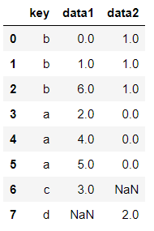

​		两个对象中缺失的值表示为NaN。

​		**how**的选项：

​		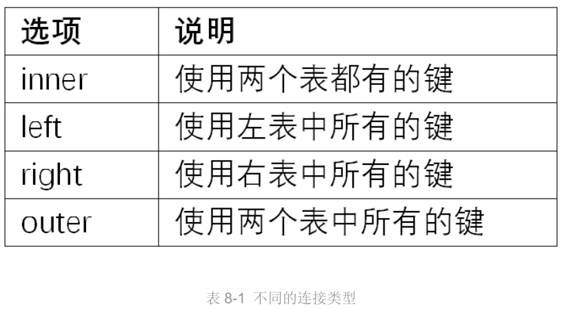

​		

​		上面是多对一的情况，多对多连接产生的是行的**笛卡尔积**。

​		对于合并运算需要考虑的一个问题是**对重复列名的处理**。`merge`有一个`suffixes`选项，用于指定附加到左右两个DataFrame对象的重叠列名上的字符串。

​		`merge`函数的参数：

​		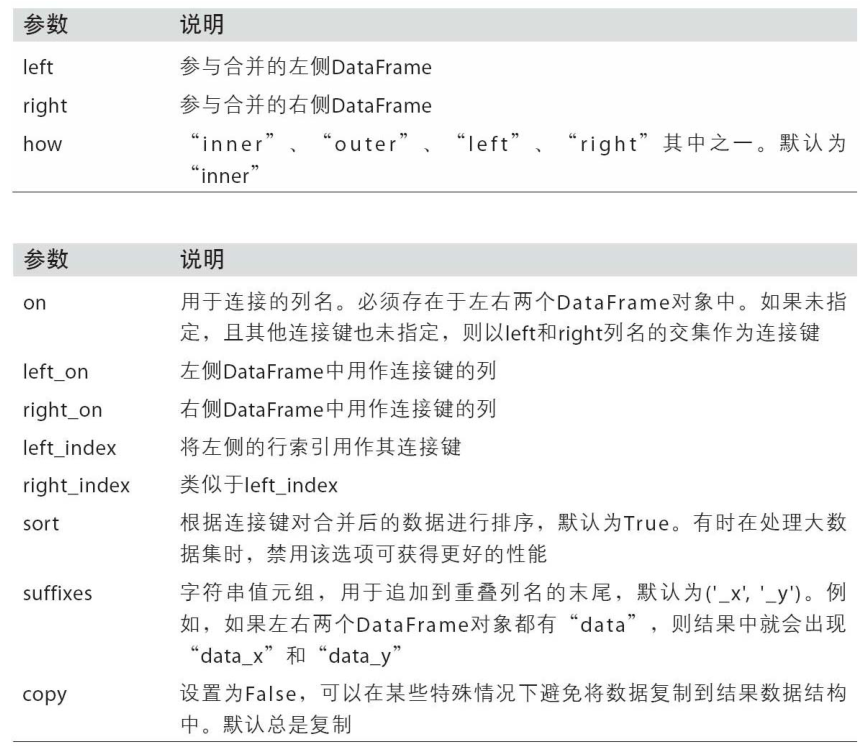

----

##### 8.2.2 索引上的合并

​		当DataFrame中的连接键位于其索引中，可以传入left_index=True或right_index=True(或两个都传)，以说明索引应该被用作**连接键**。

​		例如：

```python
pd.merge(left1,right1,left_on='key',right_index=True,how='outer')
```

​		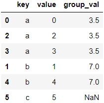

​		

​		对于层次化索引的数据，索引的合并默认是多键合并：

```python
lefth=pd.DataFrame({'key1':['ohio','ohio','ohio','nevada','nevada'],
                   'key2':[2000,2001,2002,2001,2002],
                   'data':np.arange(5.)})
righth=pd.DataFrame(np.arange(12).reshape((6,2)),index=[['nevada','nevada','ohio','ohio','ohio','ohio'],
[2001,2000,2000,2000,2001,2002]],
                   columns=['event1','event2'])         
```

​		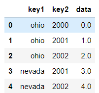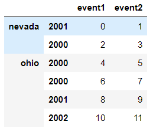

```python
pd.merge(lefth,righth,left_on=['key1','key2'],right_index=True,how='outer')
```

​		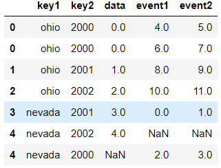

​		

​		`join`方法：实现按**索引**合并；可用于合并多个带有相同或相似索引的DataFrame对象，但**要求没有重叠的列**。DataFrame的join方法默认使用的是**左连接**，**保留左边表的行索引**。

```python
left1.join(right1,on='key')
```

---

##### 8.2.3 轴向连接

​		另一种数据合并运算，也被称作连接、绑定、堆叠。

​		1. NumPy的`concatenation`函数可以用NumPy数组实现。

​		例如：

```python
arr=np.arange(12).reshape((3,4))
#沿轴1连接
np.concatenate([arr,arr],axis=1)
```

​		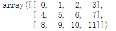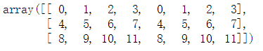

​		即，将两个矩阵沿轴进行连接。

​		

​		2. pandas的`concat`函数可以实现数组的连接运算。

​		`concat`是在axis=0上工作的，产生一个新的Series。如果传入axis=1，结果会变成一个DataFrame。

​		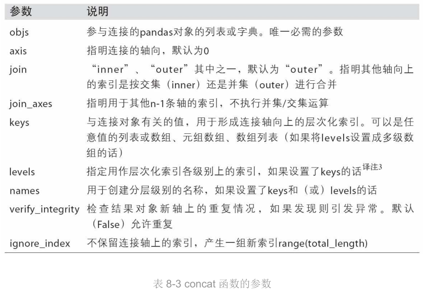

---

##### 8.2.4 合并堆叠数据

​		对于有索引全部或部分堆叠的两个数据集。

>用传递对象中的数据为调用对象的缺失数据”打补丁“。

----

#### 8.3 重塑和轴向旋转

>重新排列表格型数据

##### 8.3.1 重塑层次化索引

- stack：将数据的**列**”旋转“为**行**；

- unstack：将数据的**行**“旋转”为**列**。	

  例如：

```python
data=pd.DataFrame(np.arange(6).reshape((2,3)),
                 index=pd.Index(['ohio','colorado'],name='state'),
                 columns=pd.Index(['one','two','three'],name='number'))
```

​		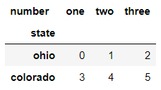

```python
#将列转换为行
data.stack()
```

​		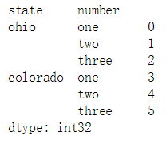

```python
#将行转换为列
data.stack().unstack()
#等价于
data.stack().unstack(1)
```

​		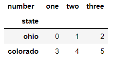

​		默认情况下，unstack操作的是**最内层**。传入分层级别的**编号**或**名称**即可对其它级别进行unstack操作。即，上面的unstack转换是转换的number这一层。

​		stack默认会滤除缺失数据，因此该运算是可逆的。

----

##### 8.3.2 将“长格式”旋转为“宽格式”

​		多个**时间序列数据**通常是以所谓的“**长格式**”（long）或“**堆叠格式**”（stacked）存储在数据库和CSV中。

---

##### 8.3.3 将“宽格式”旋转为“长格式”

​		旋转DataFrame的逆运算是`pandas.melt`。

​		合并多个列称为一个，产生一个比输入长的DataFrame。

​		当使用`pandas.melt`时，必须指明哪些列是分组指标。

​		例如：

```python
df=pd.DataFrame({'key':['foo','bar','baz'],
                'A':[1,2,3],
                'B':[4,5,6],
                'C':[7,8,9]})
```

​		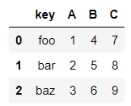

```python
melted=pd.melt(df,['key'])
```

​		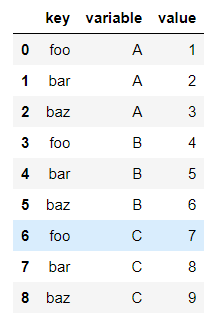

