### 9 绘图和可视化

​		`matplotlib`是一个用于创建出版质量图表的桌面绘图包（2D）。

​		支持导出常见的矢量（vector）和光栅（raster）图。

​		`matplotlib`的通常引入规定：

```python
import matplotlib.pyplot as plt
```

		>`matplotlib`的示例库和文档是学习高级特性的最好的资源。

#### 9.1 Matplotlib

##### 9.1.1 Figure和Subplot

​		`matplotlib`的图像都位于Figure对象中。

​		`plt.figure`：创建新的Figure。

​		figsize：确保图片保存到磁盘的大小和纵横比。

​		`fig.add_subplot`返回的对象是`AxesSubplot`对象。

​		`plt.subplorts`：创建一个新的Figure，返回一个含有已创建的subplot对象的NumPy数组。【可以轻松地对axes数组进行索引，类似于一个二维数组。可以通过sharex和sharey指定subplot应该具有相同的X轴和Y轴。

​		**pyplot.subplots的选项**

​		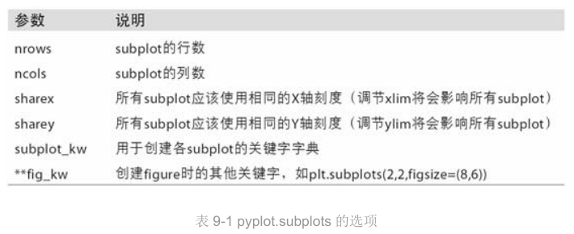

----

##### 9.1.2 调整subplot周围的间距

​		在subplot外围和subplot之间留下一定的间距，间距跟图像的高度和宽度有关。调整图像的大小，间距也会自动调整。Figure的`subplots_adjust`方法修改**间距**。这也是个顶级函数：

```python
subplots_adjust(left=None,bottom=None,right=None,top=None,wspace=None)
#wspace和hspace用于控制宽度和高度的百分比，可以用作subplot之间的间距
```

----

##### 9.1.3 颜色、标记和线型

​		matplotlib的`plot`函数接受一组**X和Y坐标**，还可接受一个表示**颜色和线型**的字符串缩写。

​		例如：

```python
ax.plot(x,y,'g--')
```

​		线图可以使用**标记**强调数据点。标记可以放到格式字符串中，但标记类型和线型必须放到颜色后面。

​		例如：

```python
plt.plot(randn(30).cumsum(),'ko--')
#更明确的形式
plot(randn(30).cumsum(),color='k',linestyle='dashed',marker='o')
```

​		注意：非实际数据点默认是按线性方式插值的，通过`drawstyle`选项修改。

```python
plt.plot(data,'k--',label='Default')
```

​		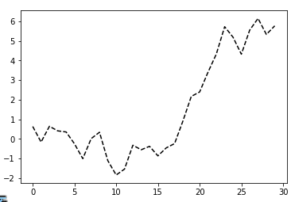

```python
plt.plot(data,'k--',drawstyle='steps-post',label='steps-post')
```

​		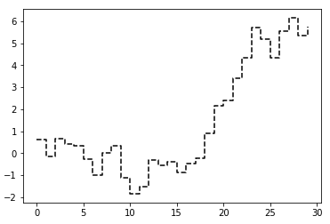

```python
plt.plot(data,'k--',label='Default')
plt.plot(data,'k--',drawstyle='steps-post',label='steps-post')
plt.legend(loc='best')
```

​		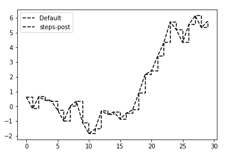

​		创建图例：`plt.legend`或`ax.legend`（如果引用了轴）

---

##### 9.1.4 刻度、标签和图例

>图表装饰：
>
>1. 使用过程型的pyplot接口（如matplotlib.pyplot）；
>2. 面向对象的原生matplotlib API。

  - `xlim`：图表的范围；

  - `xticks`：图表的刻度范围；

  - `xticklabels`：图表的刻度标签。

    使用方式：

    - 调用时不带参数，返回当前的参数值。
    - 调用时带参数，设置参数值。

---

##### 9.1.5 设置标题、轴标签、刻度以及刻度标签

​		**改变x轴刻度**：`set_xticks`和`set_xticklabels`;(前者告诉要将刻度放在数据范围中的哪些位置，默认情况下，这些位置也就是刻度标签；后者可以将任何值作为标签。)

​		`set_xticklabels`：`rotation`选项用于设定刻度标签旋转角度。

```python
fig=plt.figure()
ax=fig.add_subplot(1,1,1)
ax.plot(np.random.randn(1000).cumsum())
ticks=ax.set_xticks([0,250,500,750,1000])#设置刻度标签
ax.set_xlabel('Stages') #x轴名称
ax.set_title('No.PLOT')#图表名称
```

​		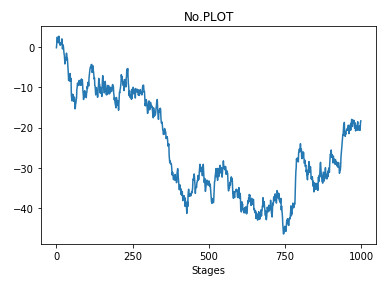

​		上述操作可以使用轴的类中的集合方法，批量设定绘图选项。

```python
props={'title':'No.PLOT',
		'xlabel':'Stages'}
ax.set(**props)
```

---

##### 9.1.6 添加图例

​		在添加subplot的时候传入label参数。

​		调用`ax.legend()`或`plt.legend()`自动创建图例。

​		`legend`方法中loc位置参数选项：

​		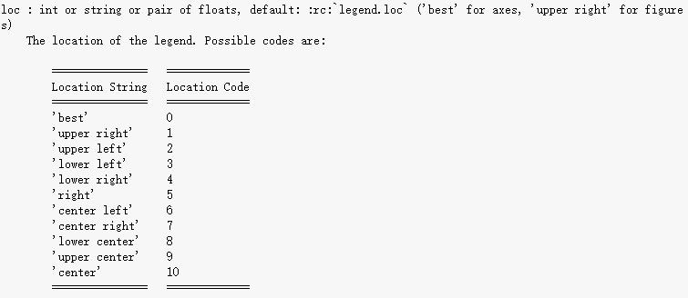

```python
#3种形式
legend()
legend(labels)
legend(handles, labels)
```

​		要从图例种去除一个或多个元素，不传入label或传入label=‘nolegend’即可。

---

##### 9.1.6 注解及在subplot上绘图

​		**注解和文字**：通过`text`,`arrow`,`annotate`函数添加；

​		`text`：可将文本绘制在图表的指定坐标（x,y），可以加上自定义格式。

​		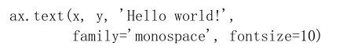

​		`ax.annotate`方法：在指定的x和y坐标轴绘制标签。

​											使用`set_xlim`和`set_ylim`设定起始和结束边界。

​		

​		**图形的绘制**

		1. 创建一个块对象shp；
  		2. 通过`ax.add_patch(shp)`将其添加到subplot中；

-----

##### 9.1.7 将图表保存到文件

​		当前图表保存到文件：`plt.savefig`

		> 该方法相当于Figure对象的实例方法`savefig`

```python
#将图表保存为SVG文件
plt.savefig('figpath.svg')
```

​		

​		导出图片时的两个重要的选项是：

  - `dpi`(控制”每英寸点数“分辨率)；

  - `bbox_inches`(可以剪除当前图表周围的空白部分)。

    例如：导出400dpi的png图片

```python
plt.savefig('figpath.png',dpi=400,bbox_inches='tight')
```

​		**Figure.savefig的**：

​		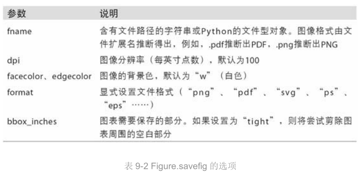

----

##### 9.1.8 matplotlib配置

​		一组全局参数进行自定义，可以管理**图像大小**、**subplot边距**、**配色方案**、**字体大小**、**网格类型**等。

​		python编程方式配置系统的方法是使用`rc`方法。

```python
#将全局图像默认大小设置为10*10
plt.rc('figure',figsize=(10,10))
#rc的第一个参数：希望自定义的对象；

#一个简单的方法，将这些选项写成一个字典：
font_options={'family':'monospace',
             'weight':'bold',
             'size':'small'}
plt.rc('font',**font_options)
```

​		

----

#### 9.2 pandas、seaborn绘图

		>引入seaborn会修改matplotlib默认的颜色方案和绘图类型，以提高可读性和美观度。

##### 9.2.1 线型图

		>Series和DataFrame都有一个用于生成各类图表的plot方法，生成的是线型图。

​		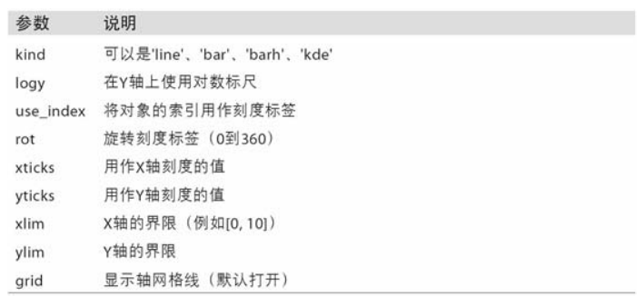

​		**Series**对象的索引会被传给matplotlib，并用以绘制X轴，可以通过use_index=False禁用此功能。

​		X轴的刻度和界限：`xticks`和`xlim`；

​		Y轴的刻度和界限：`yticks`和`ylim`。

​		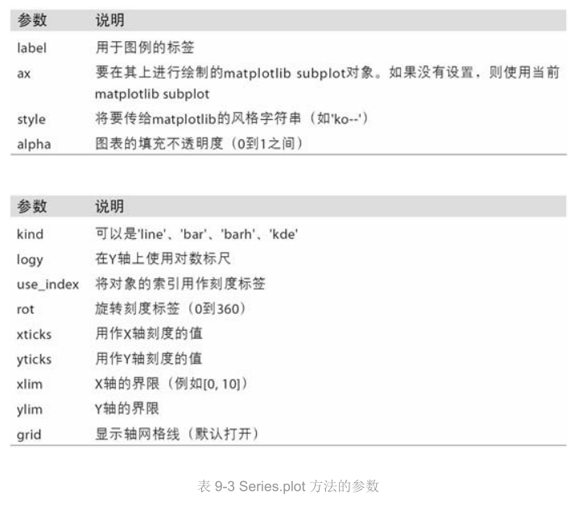

​		**DataFrame**对象的plot方法会在一个subplot中为**各列**绘制一条线，并自动创建图例。

​		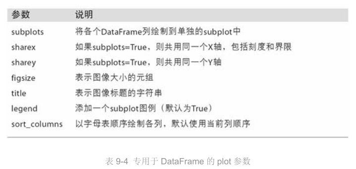

----

##### 9.2.2 柱状图

​		`plot.bar()`和`plot.barh()`分别绘制**水平**和**垂直**的柱状图。

​		Series和DataFrame的索引将会被用作X（bar）和Y（barh）刻度。

```python
fig,axes=plt.subplots(2,1)
data=pd.Series(np.random.rand(16),index=list('abcdefghijklmnop'))
data.plot.bar(ax=axes[0],color='k',alpha=0.7)
data.plot.barh(ax=axes[1],color='k',alpha=0.7)
```

​		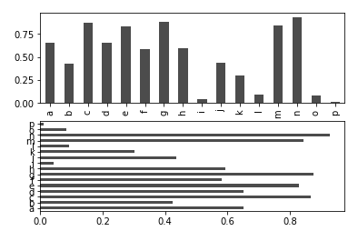

---

#####  9.2.3 直方图和密度图

​		直方图（histogram），一种可以对值频率进行离散化显示的柱状图。

​		`plot.hist`方法：直方图；

​		`plot.kde`方法：密度图。


​		seaborn的`distplot`方法可以同时画出直方图和连续密度估计图。

---

##### 9.2.4 散布图或点图

​		点图或散布图是观察两个一维数据序列之间的关系的有效手段。

​		seaborn的`regplot`方法，画出散布图+一条线性回归的线。

​		`pairplot`函数，支持在对角线上放置每个变量的直方图或密度估计。

------------------

##### 9.2.5 分面网格和类型数据

​		数据集有额外的分组维度，有多个分类变量的数据可视化的一种方法是使用小面网格。

​		seaborn的内置函数`factorplot`，绘制分面图。


