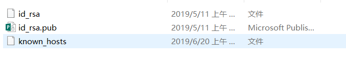
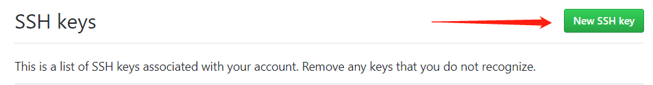
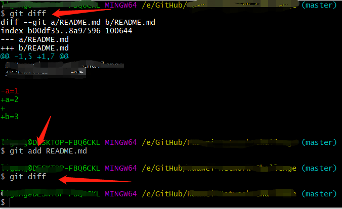
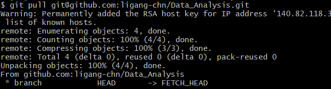
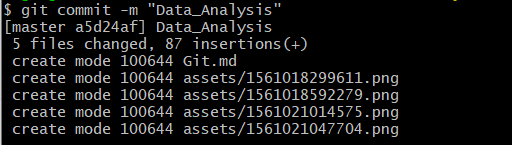
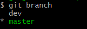
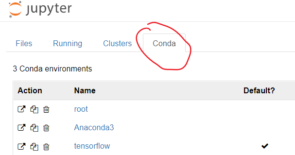

## Git

#### 1 基本概念

------------------------------------

​		**仓库（Repository）**

​		仓库用来存放项目代码，每个项目对应一个仓库，多个开源项目则有多个仓库。

​		**收藏（Star）**

​		**复制克隆项目（Fork）**

​		**发起请求（Pull Request）**

​		**关注（Watch）**

​		**事物卡片（Issue）**

​		发现代码BUG，但是目前没有成型代码，需要讨论时用；如下图：

​		

​		

#### 2 Git初始化

------------

​		安装git，自行百度，简单。

​		安装完成，我们使用Git Bash；此为命令行操作。

##### 2.1 配置Git

​		1、输入

```
ssh-keygen -t rsa -C "abcd@efgh.com"#邮箱
```

​		2、回车之后，出现一行，让你输入一个保存密钥的地方，括号里面是它默认的位置，可以在冒号后面自己写一个位置保存，建议按照默认的位置。

​		id_rsa：密钥要保存的文件名；（这个文件自动生成，后生成两个一个叫id_rsa，一个叫id_rsa.pub。

​		

​		

​		3、回车之后，会设置密码，可以不用设置，直接点两次回车，这样密钥就生效了，可以打开id_rsa.pub查看。里面的所有内容就是这个密钥，后面需要使用这个密钥。

​		4、现在到github网站上配置一下ssh key，点击箭头指示的图标New SSH key

​		

​		将刚刚的密钥输入，

​		

​		5、验证是否设置成功，输入以下命令：

```
ssh -T git@github.com
```

​		如果是第一次，会让输入yes或no，输入yes即可。应该显示如下内容，如果不是，有可能是显示权限问题什么的，可以查看生成密钥时是否操作正确，目录下是否有known_hosts这个文件。

​		

​		6、配置用户名和邮箱

```
1.设置用户名
git config --global user.name 'ligang-chn'

2.设置用户名邮箱
git config --global user.email '123456789@qq.com'

使用
git config uesr.name
git config user.email
查看配置情况

Note:该设置在GitHub仓库主页显示谁提交了该文件。
```

##### 2.2  初始化一个新的Git仓库

​		**1、在本地创建项目文件夹，如Data_Analysis；**

​		

​		也可以使用命令mkdir Data_Analysis。

​		**2、在文件内初始化git（创建git仓库）**

```
git init
```

​		可以在项目文件下看到.git文件夹，默认隐藏。

​		

​		**3、向仓库添加文件**

​		文件提交流程图：

​		

​		当有文件存在修改时，如下图：在文件中添加“a=1”,使用git status查看当前状态：

​		

​		此时为`modified`状态；

​		执行`add`操作，就到了`staged`状态；

​		

​		执行`commit`操作，就再次回到`unmodified`状态；

​		

​		查看更改的细节`diff`：

​		

​		**注意**：`diff`只能查看unstaged的状态与前一个commit的状态对比；

​		一旦执行了`add`操作，将文件变成staged状态，此时就不会有更改显示了。

​		

​		此时可以通过下面这条命令，查看更改的地方：

​		`git diff —cached`

​		

​		

​		**命令总结**：

```
git remote add origin git@github.com:ligang-chn/Data_Analysis.git
#在项目目录上进入git bash

git pull git@github.com:ligang-chn/Data_Analysis.git#在本地同步仓库的内容

git add . #添加到暂存区
git commit -m '版本提示符' #添加到仓库

git push git@github.com:ligang-chn/Data_Analysis.git #上传
```

​		

​		

​		

​		

​		

​		添加成功：

​		


#### 3 回到从前

------------

​		**修改已commit的版本**	

​		如果已经提交了 `commit` 却发现在这个 `commit` 中忘了附上另一个文件. 

​		使用如下命令：

```
git commit --amend --no-edit   # "--no-edit": 不编辑, 直接合并到上一个 commit
git log --oneline    # "--oneline": 每个 commit 内容显示在一行
```

​		

​		**reset**

​		**commit之前，add之后**：

```
git reset README.md   #从staged状态回到unstaged状态
```

​		commit之后：

```
git reset --hard HEAD  #回到当前的指针
git reset --hard HEAD^ #回到前一个版本
git reset --hard HEAD^^ #回到上上个版本  （等价于HEAD~2)

#也可以使用id号码代替HEAD

#回到未来
使用git reflog查看id号
```

​		

​		每个 `commit` 都有自己的 `id` 数字号, `HEAD` 是一个指针, 指引当前的状态是在哪个 `commit`. 最近的一次 `commit` 在最右边, 我们如果要回到过去, 就是让 `HEAD` 回到过去并 `reset` 此时的 `HEAD` 到过去的位置.

​		

​		


​		**checkout针对单个文件**

​		命令：

```
#有时候只想修改单个文件，就需要用到checkout命令 
git checkout 6a2408e -- README.md  #中间是id号
```

​		


#### 4 分支

------------

```
git log --oneline --graph
```

​		建立分支

```
git branch 分支名
git branch  #查看所有的分支名
git checkout dev  #切换分支
git branch -d dev  #注意不能在需要删除的分支下使用该命令

#使用checkout建立分支,同时移动到dev分支上去
git checkout -b dev

#将分支的内容推到master上
git merge --no-ff -m "keep merge info" dev

#推送分支到github上
git push -u origin dev
```

​		


#### 5 Github Pages搭建网站

------

​		**个人站点**

​		1、访问

​		https://用户名.github.io


​		**Project Pages项目站点**

​		https://用户名.github.io/仓库名

​		1）进入项目主页，点击settings

​		2）在settings页面，点击【Launch automatic page generator 】来自动生成主题页面
​		3）新建站点基础信息设置
​		4）选择主题
​		5）生成网页	


------------


## Jupyter NoteBook

#### 1 安装

------------

​		安装过程请见：<https://github.com/ligang-chn/Python_Learning/blob/master/python/Task1.md>


#### 2 Jupyter界面显示conda

------------------

​		如图：Conda原本没有显示

​		


​		原因：conda中创建地环境没有关联到notebook中。

​		使用如下命令：

```
conda install nb_conda  #对应conda中的环境，就知道这些环境对应conda中的环境列表
conda env list #列出创建的所有环境
```

​		就可以显示了。

​		

#### 3 代码自动补全

------------

​		使用Anaconda基本上都安装了代码自动补全功能，使用时，按下tab键，即可出现。

​		


#### 4 常用命令

------------

​		1、Cell中Code和Markdown的切换

```
在一个cell中（在command模式下）
1. 按下y, 进入Code;
2. 按下m, 进入Markdown;
```

​		2、 两种模式

```
Command mode 
Edit mode

在一个cell中，按下Enter，进入Edit模式；
按下Esc，进入Command模式；
```

​		3、 显示Cell中的函数

```
在cell中，command模式下，按下1；
```

​		4、删除Cell

```
在cell中，command模式下，按两次d；
```


####  5 魔法命令

------

##### 5.1  %run

​		加载自己写的脚本文件。

```python
%run test/test.py
```

​		

​		让一个文件夹称为一个模块的方式：添加`__init__.py`文件。


##### 5.2   测试代码性能

​		%timeit——测试单行代码；

​		%%timeit——测试一段代码；

​		%time——只运行一次loop

​		%%time

##### 5.3 其他魔法命令

​		通过%lsmagic查看。


