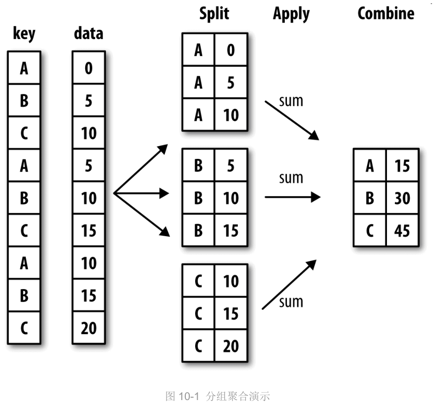
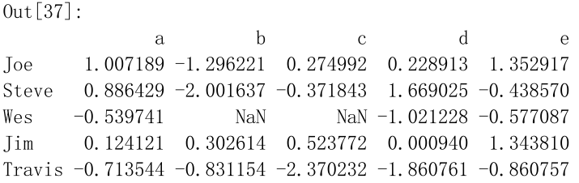
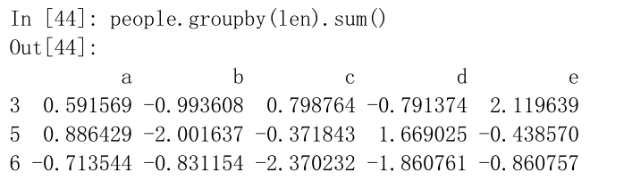
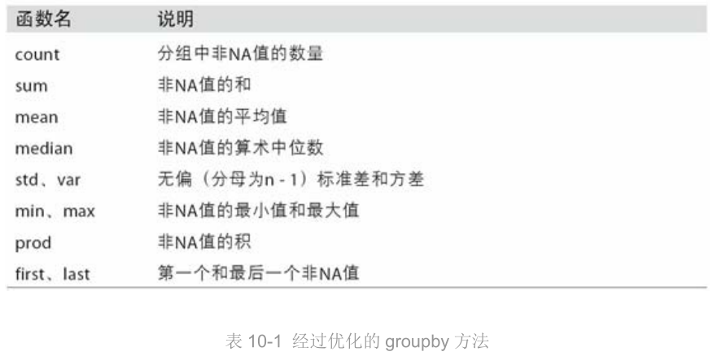

### 10数据聚合与分组运算

		>对数据集进行分组并对各组应用一个函数。
		>
		>在数据集加载、融合、准备好之后，执行计算分组统计或生成透视表。

​		`groupby`：对数据集进行切片，切块，摘要等操作。

> - 计算分组**摘要统计**，如计数、平均值、标准差，或用户自定义函数。
>
> - 计算分组**概述统计**，比如数量、平均值或标准差，或是自定义的函数。
> - 应用组内转换或其他运算，如规格化、线性回归、排名或选取子集等。
> - 计算透视表或交叉表。
> - 执行分位数分析以及其他统计分组分析。

#### 10.1 GroupBy机制

​		“split-apply-combine”（拆分-应用-合并）：用于表示分组运算。

		> 第一阶段，pandas对象中的数据会根据提供的一个或多个键被拆分为多组。拆分操作是在对象的特定轴上执行的。
		>
		> 然后，将一个函数应用到各个分组并产生一个新值。
		>
		> 最后，所有这些函数的执行结果会被合并到最终的结果对象中。结果对象的形式一般取决于数据上所执行的操作。

​		**一个分组聚合过程**：

​		

​		分组键有很多种形式，且类型不必相同：

  - 列表或数组，其长度与待分组的轴一样。

  - 表示DataFrame某个列名的值。

  - 字典或Series，给出待分组轴上的值与分组名之间的对应关系。

  - 函数，用于处理轴索引或索引种的各个标签。

    ==**注意**==：层次化索引与DataFrame之间的转换通过stack()和unstack()。

    **分组键**可以是任何**长度**适当的**数组**。	
    
    ”麻烦列“：不是数值数据的列。
    
    GroupBy的`size`方法：返回一个含有分组大小的Series。

-----

####  10.2 对分组进行迭代

​		GroupBy对象支持迭代，可以产生一组二元元组（由**分组名**和**数据块**组成）。

---

#### 10.3 通过函数进行分组

​		使用**字典、Series、函数**定义分组映射。

​		任何**被当做分组键的函数**都会在各个索引值上被调用一次，其返回值就会被用作**分组名称**。

​		例如，下面的DataFrame的索引值为人的名字；

​		

​		可以计算一个字符串长度的数组，比如传入len函数；

​		

​		现在的索引就是len函数的返回值，原来索引的长度大小。		

---

#### 10.4 数据聚合

​		**聚合**：任何能够从数组产生**标量值**的数据转换过程。

​		**经过优化的groupby方法**：

​		

----

#### 10.5 apply：一般性的“拆分-应用-合并”

​		apply：将待处理的对象拆分成多个片段，然后对各片段调用传入的函数，最后尝试将各片段组合到一起。

----

#### 10.6 分位数和桶分析

​		**桶（bucket）分析**

​		**分位数（quantile）分析**

----

#### 10.7 用于特定分组的值填充缺失值

​		假设需要对不同的分组填充不同的值。一种方法是将数据分组，并使用apply和一个能够对数据块调用fillna的函数即可。

----

#### 10.8 随机采样和排列

​		假设需要从一个大数据集中随机抽取（进行替换或不替换）样本以进行**蒙特卡罗模拟**或其他分析工作。抽取的方式，比如对Series使用sample方法。

---

#### 10.9 透视表和交叉表

​		透视表：一种常见的数据汇总工具。根据一个或多个键对数据进行聚，并根据行和列上的分组键将数据分配到各个矩形区域中。

​		交叉表：一种用于计算分组频率的特殊透视表。

