## Git

#### 1 基本概念

------------------------------------

​		**仓库（Repository）**

​		仓库用来存放项目代码，每个项目对应一个仓库，多个开源项目则有多个仓库。

​		**收藏（Star）**

​		**复制克隆项目（Fork）**

​		**发起请求（Pull Request）**

​		**关注（Watch）**

​		**事物卡片（Issue）**

​		发现代码BUG，但是目前没有成型代码，需要讨论时用；


#### 2 向仓库中添加文件流程

------------------

​		


#### 3 Git初始化

------------

​		安装git，自行百度，简单。

​		安装完成，我们使用Git Bash；此为命令行操作。

##### 3.1 配置Git

​		1、输入

```
ssh-keygen -t rsa -C "abcd@efgh.com"#邮箱
```

​		2、回车之后，出现一行，让你输入一个保存密钥的地方，括号里面是它默认的位置，可以在冒号后面自己写一个位置保存，建议按照默认的位置。

​		id_rsa：密钥要保存的文件名；（这个文件自动生成，后生成两个一个叫id_rsa，一个叫id_rsa.pub。

​		

​		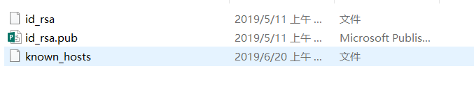

​		3、回车之后，会设置密码，可以不用设置，直接点两次回车，这样密钥就生效了，可以打开id_rsa.pub查看。里面的所有内容就是这个密钥，后面需要使用这个密钥。

​		4、现在到github网站上配置一下ssh key，点击箭头指示的图标New SSH key

​		

​		将刚刚的密钥输入，

​		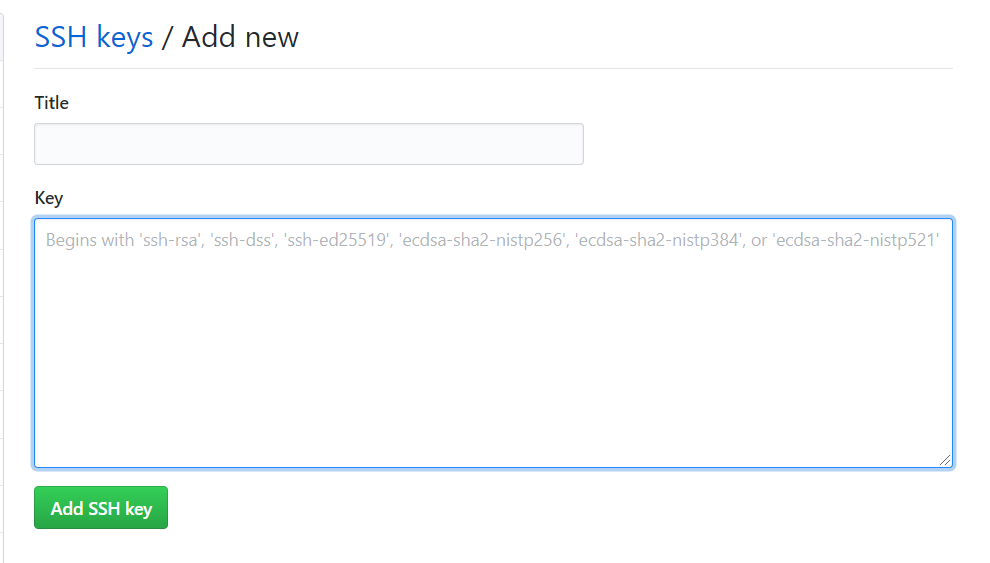

​		5、验证是否设置成功，输入以下命令：

```
ssh -T git@github.com
```

​		如果是第一次，会让输入yes或no，输入yes即可。应该显示如下内容，如果不是，有可能是显示权限问题什么的，可以查看生成密钥时是否操作正确，目录下是否有known_hosts这个文件。

​		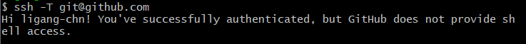

​		6、配置用户名和邮箱

```
1.设置用户名
git config --global user.name 'ligang-chn'

2.设置用户名邮箱
git config --global user.email '123456789@qq.com'

Note:该设置在GitHub仓库主页显示谁提交了该文件。
```

##### 3.2  初始化一个新的Git仓库

​		1、在本地创建项目文件夹，如Data_Analysis；

​		

​		也可以使用命令mkdir Data_Analysis。

​		2、在文件内初始化git（创建git仓库）

```
git init
```

​		可以在项目文件下看到.git文件夹，默认隐藏。

​		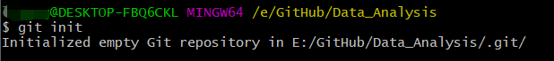

​		3、向仓库添加文件

```
git remote add origin git@github.com:ligang-chn/Data_Analysis.git#在项目目录上进入git bash

git pull git@github.com:ligang-chn/Data_Analysis.git#在本地同步仓库的内容

git add . #添加到暂存区
git commit -m '版本提示符' #添加到仓库

git push git@github.com:ligang-chn/Data_Analysis.git #上传
```

​		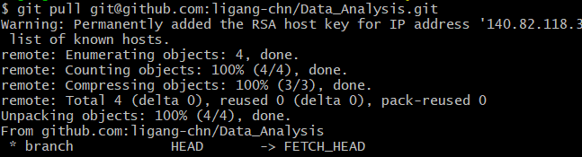

​		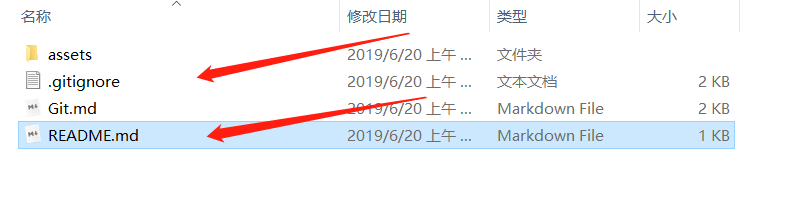

​		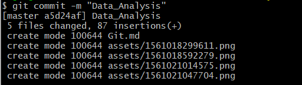

​		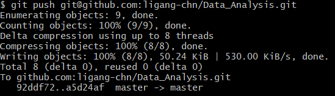

​		

​		添加成功：

​		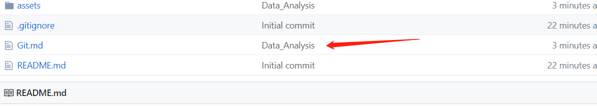


#### 4 Github Pages搭建网站

------

​		**个人站点**

​		1、访问

​		https://用户名.github.io


​		**Project Pages项目站点**

​		https://用户名.github.io/仓库名

​		1）进入项目主页，点击settings

​		2）在settings页面，点击【Launch automatic page generator 】来自动生成主题页面
​		3）新建站点基础信息设置
​		4）选择主题
​		5）生成网页	


------------


## Jupyter NoteBook

#### 1 安装

------------

​		安装过程请见：<https://github.com/ligang-chn/Python_Learning/blob/master/python/Task1.md>


#### 2 Jupyter界面显示conda

------------------

​		如图：Conda原本没有显示

​		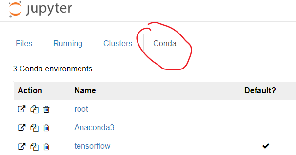


​		原因：conda中创建地环境没有关联到notebook中。

​		使用如下命令：

```
conda install nb_conda  #对应conda中的环境，就知道这些环境对应conda中的环境列表
conda env list #列出创建的所有环境
```

​		就可以显示了。

​		

#### 3 代码自动补全

------------

​		使用Anaconda基本上都安装了代码自动补全功能，使用时，按下tab键，即可出现。

​		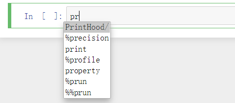

