### KNN

####  1 数据

​		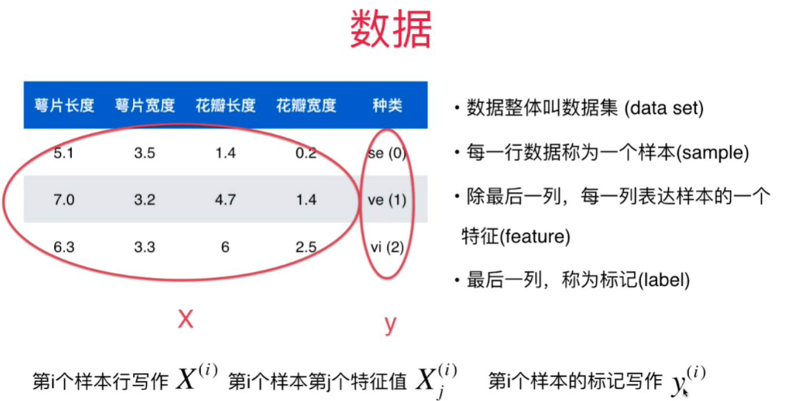

​		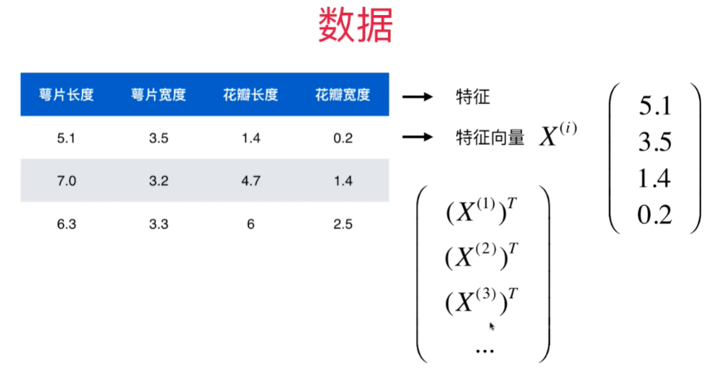

​		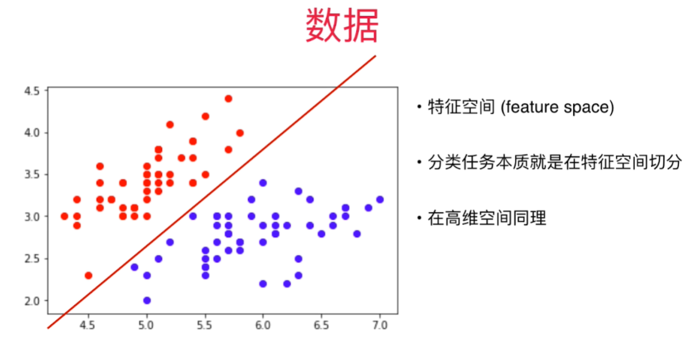

​		

​		机器学习的主要任务：

  - 分类

    		- 二分类
      - 多分类
        		- 数字识别
          		- 图像识别
              		- 风险评级
              		- 多标签任务

  - 回归

    ​	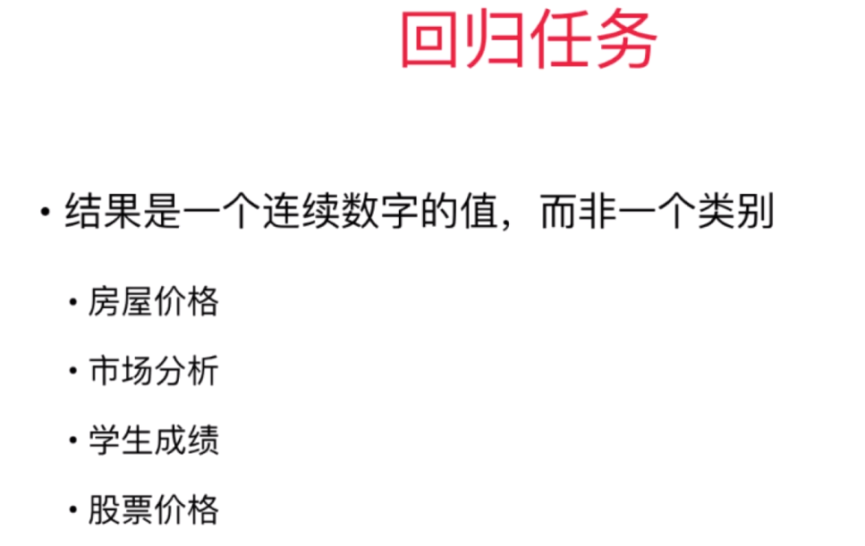

    ​	**回归任务在一些情况下，回归任务可以简化成分类任务。**

---

#### 2 机器学习方法的分类

##### 2.1 监督学习

​		给机器的训练数据拥有“标记”或者“答案”。

​		算法：

  - k近邻

  - 线性回归和多项式回归

  - 逻辑回归

  - SVM

  - 决策树和随机森林

    

##### 2.2 非监督学习

​		意义：

		1. 对没有“标记”的数据进行分类-**聚类分析**。
  		2. 对数据进行降维处理：特征提取、特征压缩——方便可视化
        		3. 异常检测

​		

##### 2.3 半监督学习

​		

##### 2.4 增强学习

​		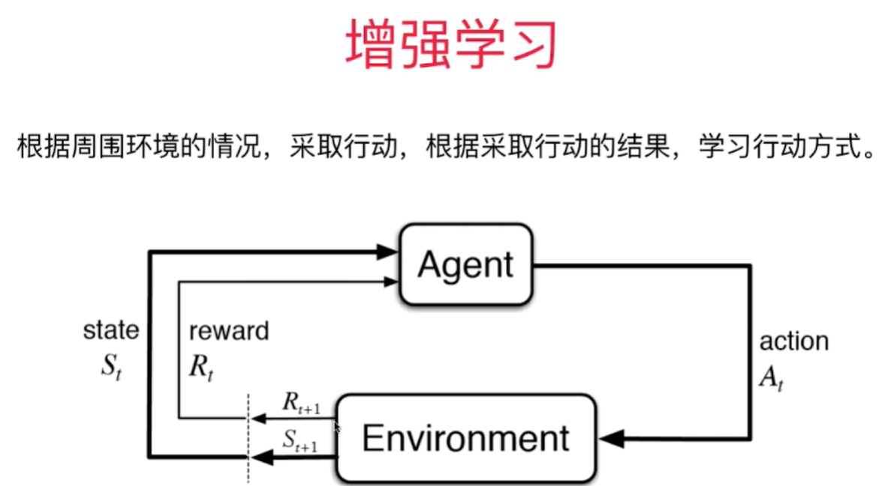

-----

#### 3 K近邻算法

​		K近邻算法示意图：

​		绿色点——需要预测的点；

​		蓝色点——患恶性肿瘤的病人；

​		红色点——良性肿瘤的病人；

​		对绿色的预测点进行识别，是良性还是恶性？那么对其进行投票（votes），比较绿色点周围红色点与蓝色点的比例，图中红：蓝=0：3，所以绿色点极有可能是恶性病人。

​		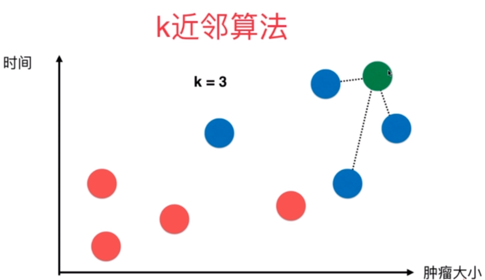

		>K近邻算法中需要用到欧拉距离公式：
		>$$
		>\sqrt{\left(x^{(a)}-x^{(b)}\right)^{2}+\left(y^{(a)}-y^{(b)}\right)^{2}}
		>$$
		>​	三维的欧拉公式：
		>$$
		>\sqrt{\left(x^{(a)}-x^{(b)}\right)^{2}+\left(y^{(a)}-y^{(b)}\right)^{2}+\left(z^{(a)}-z^{(b)}\right)^{2}}
		>$$
		>可以将欧拉公式看成是两个点（或三个点）之间对应纬度的差值的平方和的均根。
		>
		>因此，n维欧拉公式可以写成下面这样：
		>$$
		>\sqrt{\left(X_{1}^{(a)}-X_{1}^{(b)}\right)^{2}+\left(X_{2}^{(a)}-X_{2}^{(b)}\right)^{2}+\ldots+\left(X_{n}^{(a)}-X_{n}^{(b)}\right)^{2}}
		>$$
		>简写成：
		>$$
		>\sqrt{\sum_{i=1}^{n}\left(X_{i}^{(a)}-X_{i}^{(b)}\right)^{2}}
		>$$
		>

​		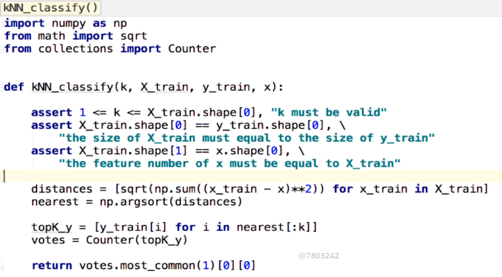

​		

​		封装KNN

​		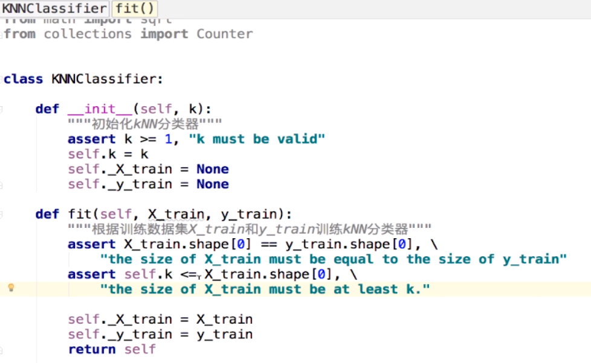

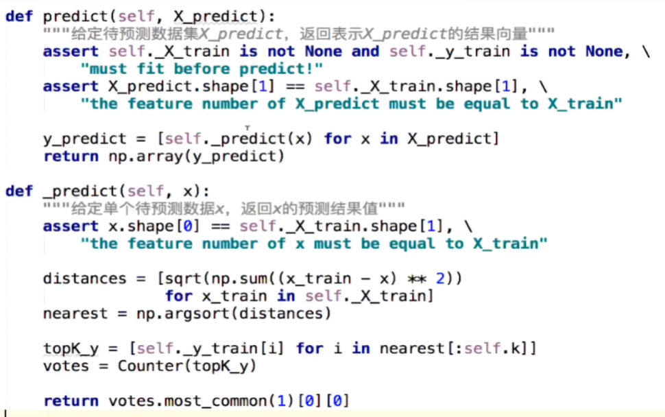

​		

数据集分割：

​	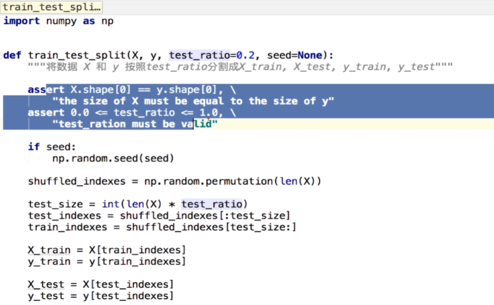

-----

#### 4 超参数

​		**超参数**：在算法运行前需要决定的参数；

​		**模型参数**：算法过程中学习的参数。

​		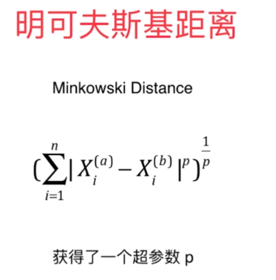

----

#### 5 网格搜索（Grid Search）

​		

----

#### 6 数据归一化

​		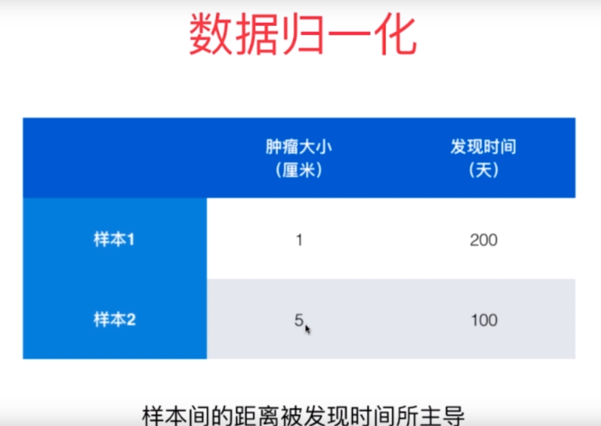

​		在对上面两个样本进行距离计算时，会发现样本间的距离由发现时间所主导。

​		如果不对样本数据进行处理，那么计算出来的距离很有可能是有偏差的，不能很好的反映样本中每一个特征的重要程度。

​		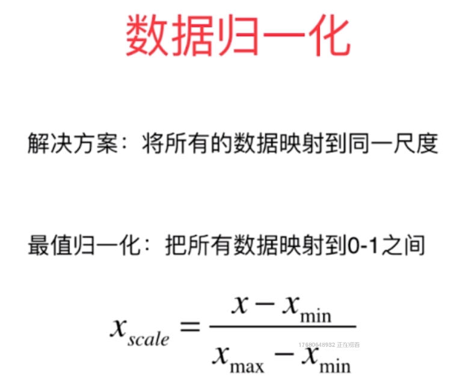

​		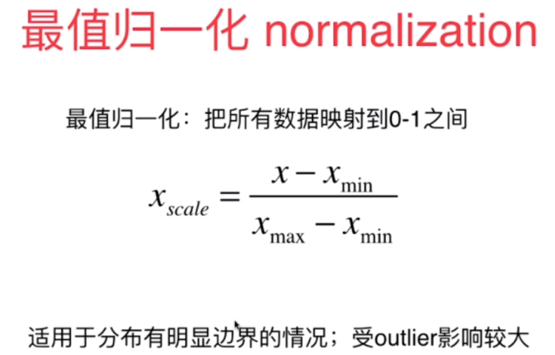

​		不适合，比如**收入**。

​		**常用函数**：

| 函数      | 功能   |
| --------- | ------ |
| np.min()  | 最小值 |
| np.max()  | 最大值 |
| np.mean() | 均值   |
| np.std()  | 方差   |

​		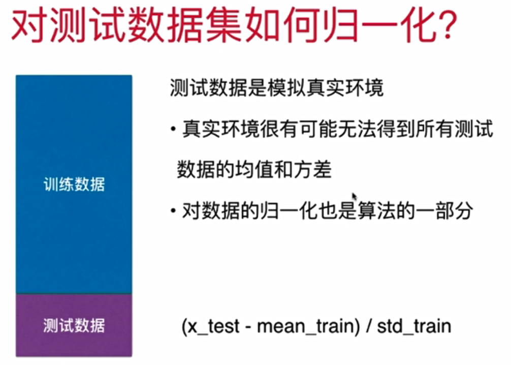

​		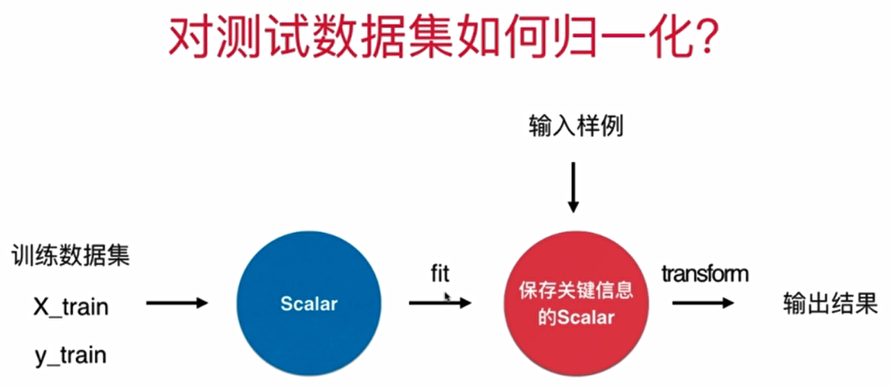

​		

​		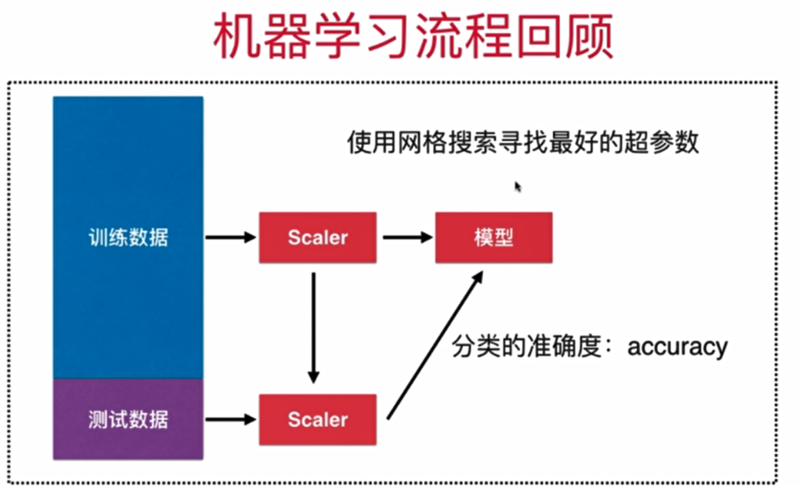

