### 线性回归算法

--------

#### 1 简单线性回归

​		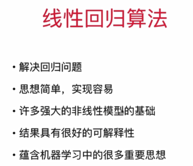

​		样本特征只有一个，称为：**简单线性回归**。

​		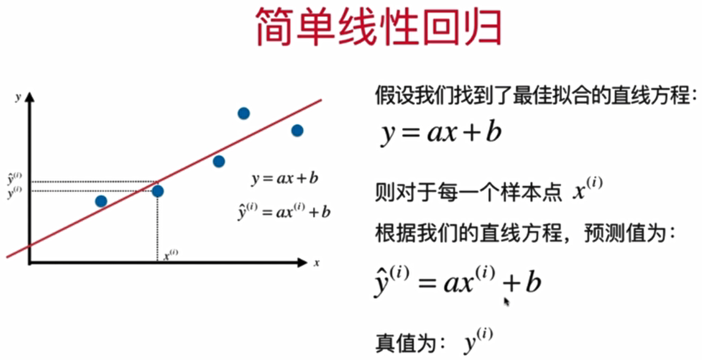

​		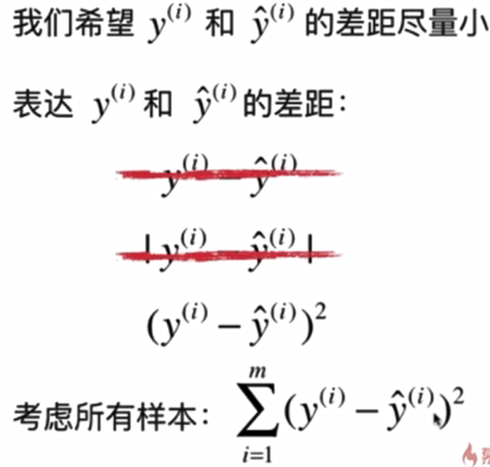

​		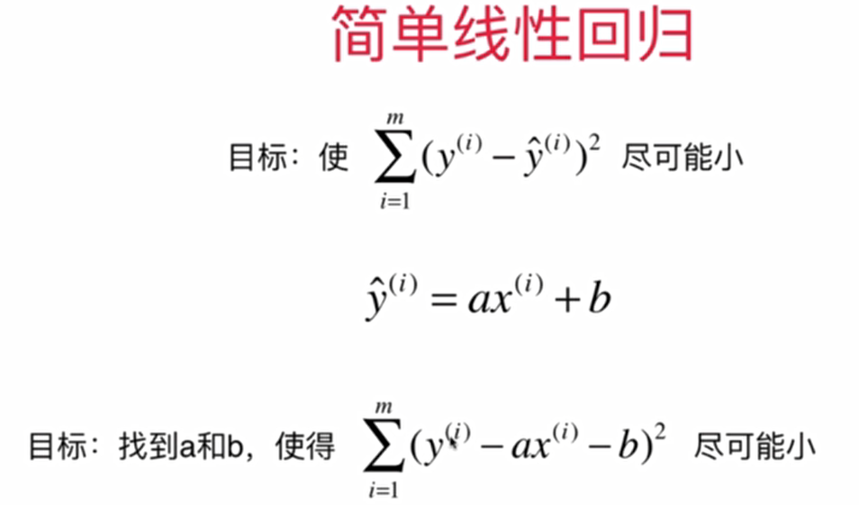

​			==**一类机器学习算法的基本思路**==：（参数学习算法）

​			上面的函数可以称为`损失函数（loss function)`或`效用函数（utility function）`。

​			通过分析问题，确定问题的损失函数或者效用函数；

​			通过最优化损失函数或者效用函数，获得机器学习的模型。

​		

​			对于损失函数，可以使用**最小二乘法**使其最小化。这里的未知数是a，b，即`J(a,b)`。那么**求其分别对a，b的偏导**，

​	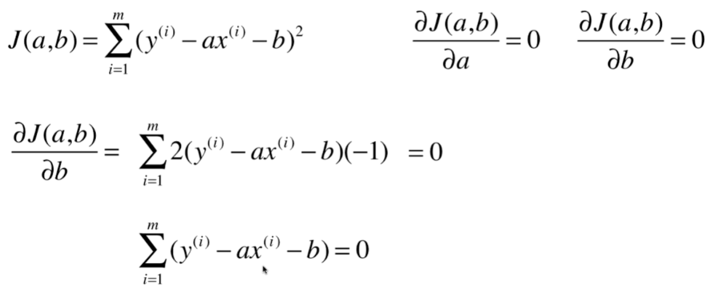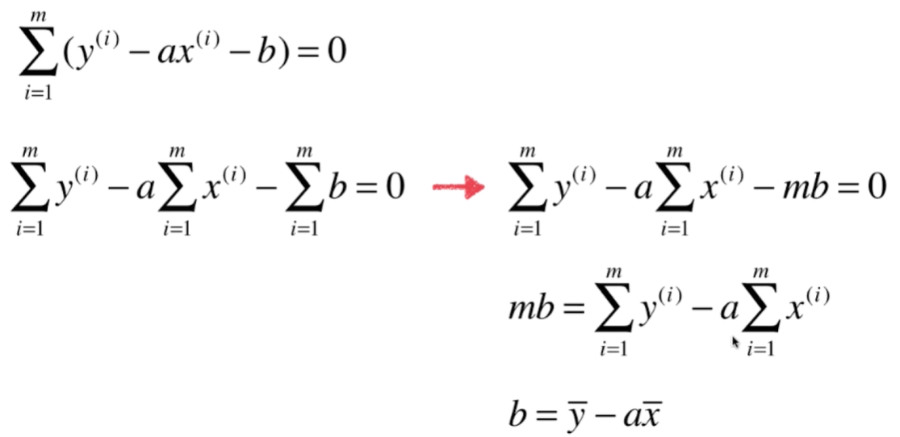

​	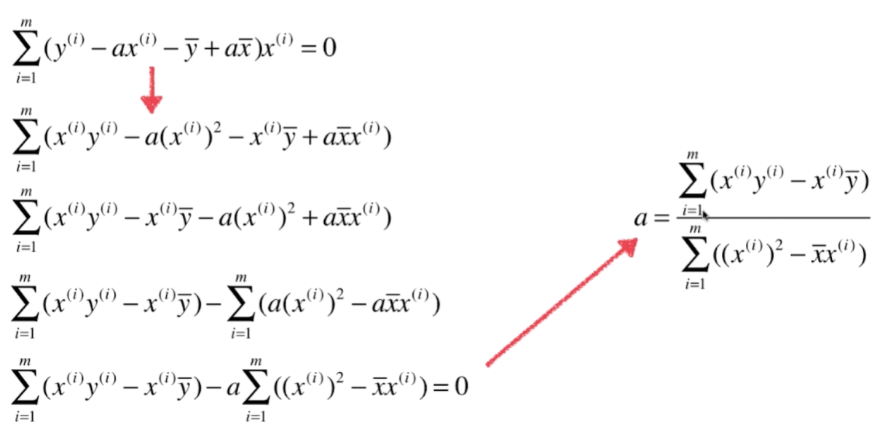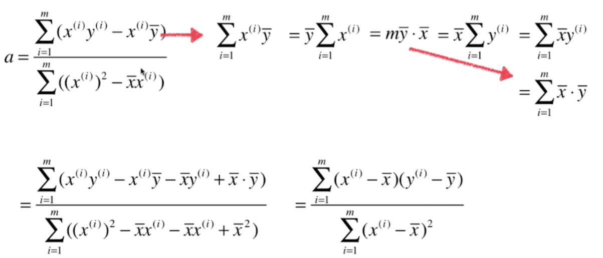


​			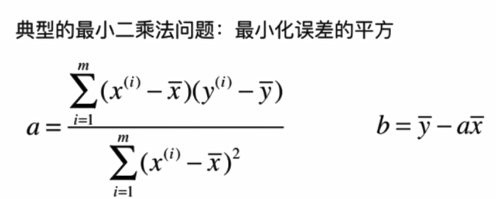

​		**简单线性回归的实现**：

```python
import numpy as np

class SimpleLinearRegression1:

    def __init__(self):
        """初始化Simple Linear Regression 模型"""
        self.a_=None
        self.b_=None

    def fit(self,x_train,y_train):
        """根据训练数据集x_train,y_train训练Simple Linear Regression 模型"""
        assert x_train.ndim==1,\
        "Simple Linear Regressor can only solve single feature training data"
        assert len(x_train)==len(y_train),\
        "the size of x_train must be equal to the size of y_train"

        x_mean=np.mean(x_train)
        y_mean=np.mean(y_train)

        num=0.0
        d=0.0
        for x_i,y_i in zip(x_train,y_train):
            num+=(x_i-x_mean)*(y_i-y_mean)
            d+=(x_i-x_mean)**2

        self.a_=num/d
        self.b_=y_mean-self.a_*x_mean

    def predict(self,x_predict):
        """给定待预测数据集x_predict,返回表示x_predict的结果向量"""
        assert x_predict.ndim==1,\
        "Simple Linear Regressor can only solve single feature training data"
        assert self.a_ is not None and self.b_ is not None,\
        "must fit before predict!"

        return np.array([self._predict(x) for x in x_predict])

    def _predict(self,x_signle):
        """给定单个待预测数据x_signle,返回x_signle的预测结果值"""
        return self.a_*x_signle+self.b_

    def __repr__(self):

        return "SimpleLinearRegression1()"
```


----

#### 2 向量化

​		向量化的运算速度高于for循环，性能优化；

​		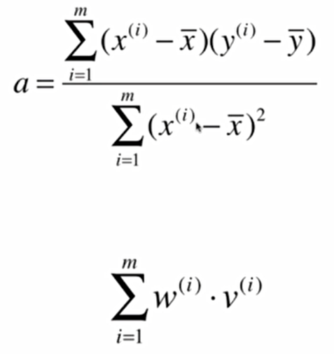

​		上面的公式需要注意**x^(i)^和x拔都是向量，不是单个数值**。

​		

​	

​		for循环：

```python
num=0.0
d=0.0
for x_i,y_i in zip(x_train,y_train):
	num+=(x_i-x_mean)*(y_i-y_mean)
    d+=(x_i-x_mean)**2
```

​		向量化：

```python
num=(x_i-x_mean).dot(y_i-y_mean)
d=(x_i-x_mean).dot(x_i-x_mean)
```

​		

---

#### 3 衡量线性回归法的指标

​		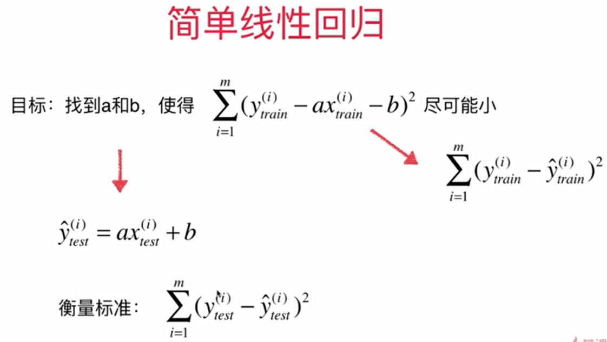

​		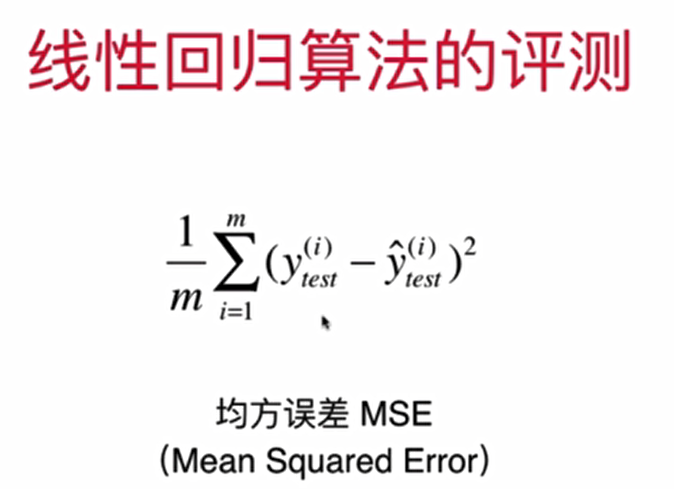

​		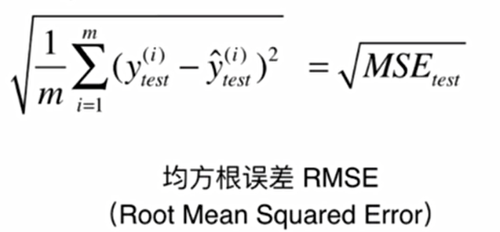

​			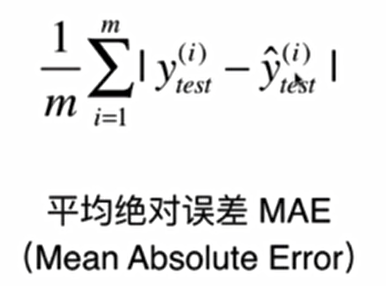


​		**最好的衡量线性回归法的指标**：

​		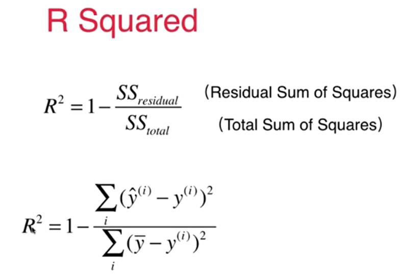

​		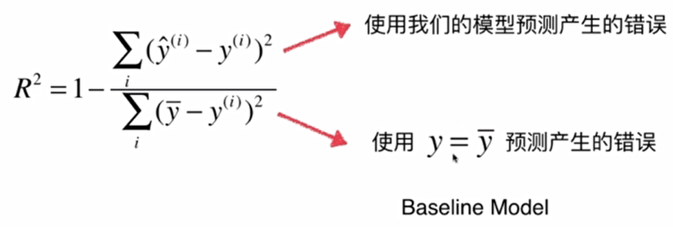

​		**R Squared**：

		- R^2^<=1;
		- R^2^越大越好。当我们的预测模型不犯任何错误时，R^2^得到最大值1；
		- 当我们的模型等于基准模型时，R^2^为0；
		- 如果R^2^<0，说明我们学习到的模型还不如基准模型。此时，很有可能我们的数据不存在任何线性关系。

​		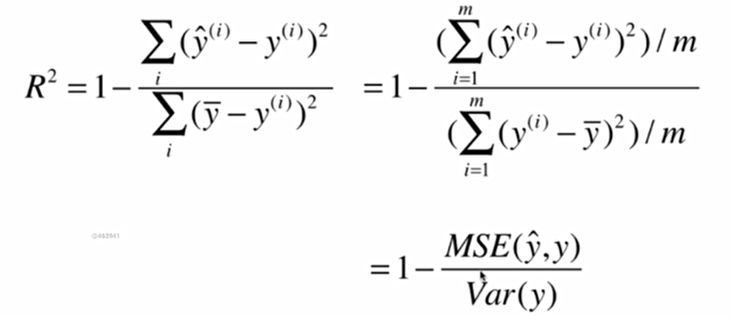

-----

#### 4 多元线性回归

​		针对样本具有多个特征值的情况：

​		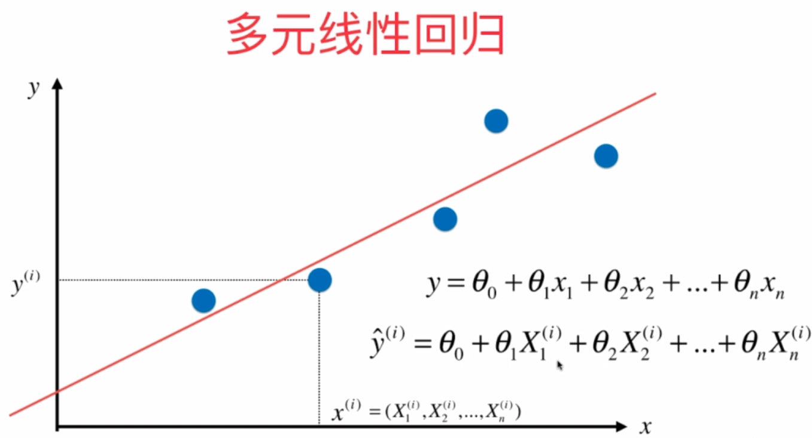

​		**目标函数**：

​		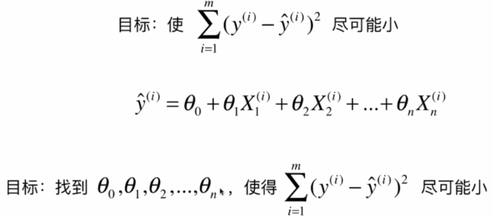

​		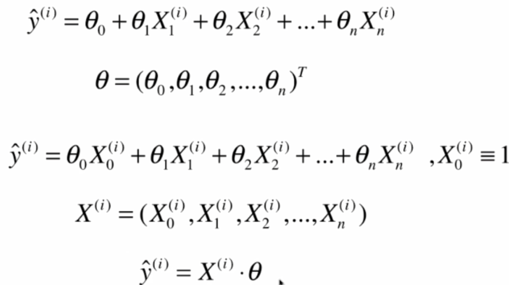

​		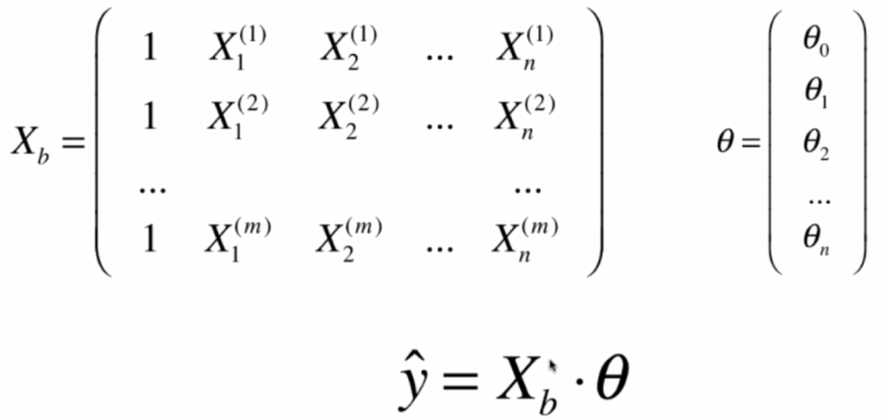

​		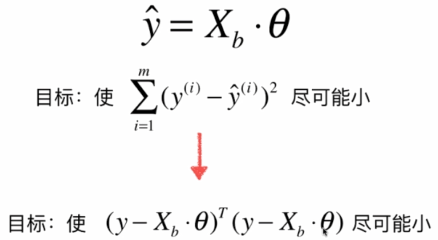


​		**多元线性回归的正规方程解（Normal Equation）**

​		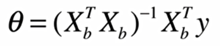

​		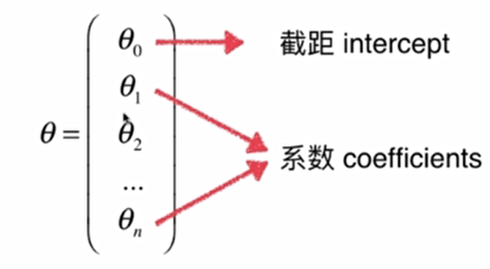

​		**多元线性回归算法**：

```python
import numpy as np
#from .metrics import r2_score

class LinearRegression:

    def __init__(self):
        """"初始化Linear Regression模型"""
        self.coef_=None
        self.interception_=None
        self._theta=None

    def fit_normal(self,X_train,y_train):
        """"根据训练数据集X_train,y_train训练Linear Regression模型"""
        assert X_train.shape[0]==y_train.shape[0],\
            "the size of X_train must be equal to the size of y_train"

        X_b=np.hstack([np.ones((len(X_train),1)),X_train])
        self._theta=np.linalg.inv(X_b.T.dot(X_b)).dot(X_b.T).dot(y_train)

        self.interception_=self._theta[0]
        self.coef_=self._theta[1:]

        return self

    def predict(self,X_predict):
        """给定待预测数据集X_predict，返回表示X——predict的结果向量"""
        assert self.interception_ is not None and self.coef_ is not None,\
            "must fit before predict!"
        assert  X_predict.shape[1]==len(self.coef_),\
            "the feature number of X_predict must be equal to X_train"

        X_b = np.hstack([np.ones((len(X_predict), 1)), X_predict])
        return X_b.dot(self._theta)

    def score(self,X_test,y_test):
        """根据测试数据集X_test和y_test确定当前模型的准确度"""

        y_predict=self.predict(X_test)
        #return r2_score(y_test,y_predict)

    def __repr__(self):
        return "LinearRegression()"
```


------------------

#### 5 梯度下降法

​		梯度下降法，是一种基于搜索的最优化方法；（不是一个机器学习算法）

​		作用：最小化一个损失函数；

​		梯度上升法：最大化一个效用函数。

​		


​		