### 线性回归算法

--------

#### 1 简单线性回归

​		

​		样本特征只有一个，称为：**简单线性回归**。

​		

​		

​		

​			==**一类机器学习算法的基本思路**==：（参数学习算法）

​			上面的函数可以称为`损失函数（loss function)`或`效用函数（utility function）`。

​			通过分析问题，确定问题的损失函数或者效用函数；

​			通过最优化损失函数或者效用函数，获得机器学习的模型。

​		

​			对于损失函数，可以使用**最小二乘法**使其最小化。这里的未知数是a，b，即`J(a,b)`。那么**求其分别对a，b的偏导**，

​	

​	


​			

​		**简单线性回归的实现**：

```python
import numpy as np

class SimpleLinearRegression1:

    def __init__(self):
        """初始化Simple Linear Regression 模型"""
        self.a_=None
        self.b_=None

    def fit(self,x_train,y_train):
        """根据训练数据集x_train,y_train训练Simple Linear Regression 模型"""
        assert x_train.ndim==1,\
        "Simple Linear Regressor can only solve single feature training data"
        assert len(x_train)==len(y_train),\
        "the size of x_train must be equal to the size of y_train"

        x_mean=np.mean(x_train)
        y_mean=np.mean(y_train)

        num=0.0
        d=0.0
        for x_i,y_i in zip(x_train,y_train):
            num+=(x_i-x_mean)*(y_i-y_mean)
            d+=(x_i-x_mean)**2

        self.a_=num/d
        self.b_=y_mean-self.a_*x_mean

    def predict(self,x_predict):
        """给定待预测数据集x_predict,返回表示x_predict的结果向量"""
        assert x_predict.ndim==1,\
        "Simple Linear Regressor can only solve single feature training data"
        assert self.a_ is not None and self.b_ is not None,\
        "must fit before predict!"

        return np.array([self._predict(x) for x in x_predict])

    def _predict(self,x_signle):
        """给定单个待预测数据x_signle,返回x_signle的预测结果值"""
        return self.a_*x_signle+self.b_

    def __repr__(self):

        return "SimpleLinearRegression1()"
```


----

#### 2 向量化

​		向量化的运算速度高于for循环，性能优化；

​		

​		上面的公式需要注意**x^(i)^和x拔都是向量，不是单个数值**。

​		

​	

​		for循环：

```python
num=0.0
d=0.0
for x_i,y_i in zip(x_train,y_train):
	num+=(x_i-x_mean)*(y_i-y_mean)
    d+=(x_i-x_mean)**2
```

​		向量化：

```python
num=(x_i-x_mean).dot(y_i-y_mean)
d=(x_i-x_mean).dot(x_i-x_mean)
```

​		

---

#### 3 衡量线性回归法的指标

​		

​		

​		

​			


​		**最好的衡量线性回归法的指标**：

​		

​		

​		**R Squared**：

		- R^2^<=1;
		- R^2^越大越好。当我们的预测模型不犯任何错误时，R^2^得到最大值1；
		- 当我们的模型等于基准模型时，R^2^为0；
		- 如果R^2^<0，说明我们学习到的模型还不如基准模型。此时，很有可能我们的数据不存在任何线性关系。

​		

-----

#### 4 多元线性回归

​		针对样本具有多个特征值的情况：

​		

​		**目标函数**：

​		

​		

​		

​		


​		**多元线性回归的正规方程解（Normal Equation）**

​		

​		

​		**多元线性回归算法**：

```python
import numpy as np
#from .metrics import r2_score

class LinearRegression:

    def __init__(self):
        """"初始化Linear Regression模型"""
        self.coef_=None
        self.interception_=None
        self._theta=None

    def fit_normal(self,X_train,y_train):
        """"根据训练数据集X_train,y_train训练Linear Regression模型"""
        assert X_train.shape[0]==y_train.shape[0],\
            "the size of X_train must be equal to the size of y_train"

        X_b=np.hstack([np.ones((len(X_train),1)),X_train])
        self._theta=np.linalg.inv(X_b.T.dot(X_b)).dot(X_b.T).dot(y_train)

        self.interception_=self._theta[0]
        self.coef_=self._theta[1:]

        return self

    def predict(self,X_predict):
        """给定待预测数据集X_predict，返回表示X——predict的结果向量"""
        assert self.interception_ is not None and self.coef_ is not None,\
            "must fit before predict!"
        assert  X_predict.shape[1]==len(self.coef_),\
            "the feature number of X_predict must be equal to X_train"

        X_b = np.hstack([np.ones((len(X_predict), 1)), X_predict])
        return X_b.dot(self._theta)

    def score(self,X_test,y_test):
        """根据测试数据集X_test和y_test确定当前模型的准确度"""

        y_predict=self.predict(X_test)
        #return r2_score(y_test,y_predict)

    def __repr__(self):
        return "LinearRegression()"
```


​		**线性回归算法总结**：

​		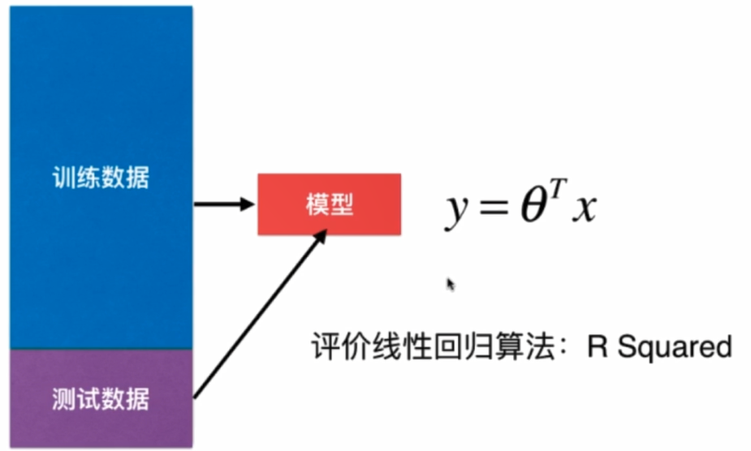

		1. 评价线性回归算法：R Squared
  		2. 典型的参数学习，对比KNN：非参数学习
        		3. 只能解决回归问题，对比KNN：既可以解决分类问题，又可以解决线性问题
            		4. 对数据有假设：线性，对比KNN对数据没有假设
                		5. 优点：对数据具有强解释性

​		

------------------

#### 5 梯度下降法

​		梯度就是分别对每个变量进行微分，然后用逗号分隔开，梯度是用<>包括起来的，说明梯度其实是一个向量。
$$
J(\Theta)=0.55-(5\theta_1+2\theta_2+12\theta_3)
$$

$$
\nabla J(\Theta)=<\frac {\partial J } {\partial \theta_1 },\frac {\partial J } {\partial \theta_2 },\frac {\partial J } {\partial \theta_3 }>
=<-5,-2,12>
$$

​		**梯度的意义**：

		- 在单变量的函数中，梯度其实就是函数的微分，代表函数在某个给定点的切线的斜率
		- 在多变量函数中，梯度就是一个向量，向量有方向，梯度的方向就指出了函数在给定点的上升最快的方向


​		**梯度下降法**，是一种基于搜索的最优化方法；（不是一个机器学习算法）

​		**作用**：最小化一个损失函数；

​		**梯度上升法**：最大化一个效用函数。


​		导数可以代表方向，对应J增大的方向。
$$
-\eta \frac{dJ}{d\theta}
$$
​		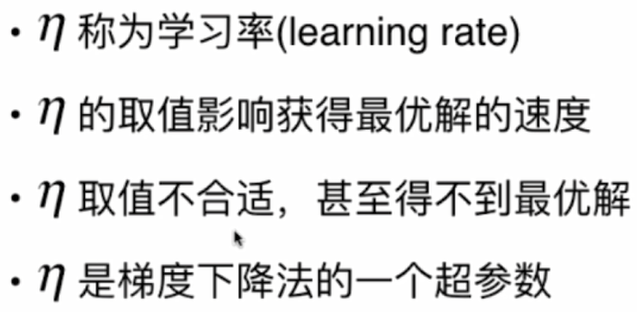

​		并不是所有函数都有唯一的极值点；

​		解决方案：

  - 多次运行，随机化初始点；

  - 梯度下降法的初始点也是一个超参数。

    
    
    **模拟实现梯度下降法**：

```python
def gradient_descent(initial_theta,eta,epsilon=1e-8):
    theta=initial_theta
    theta_history.append(initial_theta)
    
    while True:
        gradient=dJ(theta)
        last_theta=theta
        theta=theta-eta*gradient
        theta_history.append(theta)
        
        if(abs(J(theta)-J(last_theta))<epsilon):
            break
            
def plot_theta_history():
    plt.plot(plot_x,J(plot_x))
    plt.plot(np.array(theta_history),J(np.array(theta_history)),'ro-')
    
    
eta=0.9
theta_history=[]
gradient_descent(0.,eta)
plot_theta_history()    
    
```

​		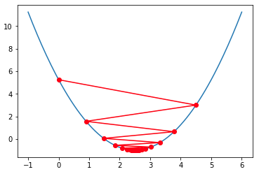


----

#### 6 线性回归中使用梯度下降法

​		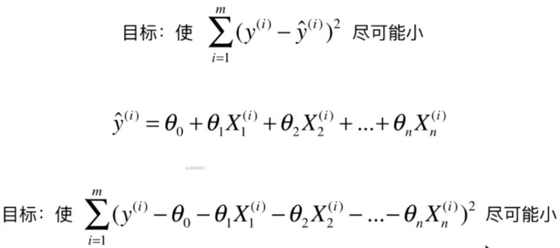

​		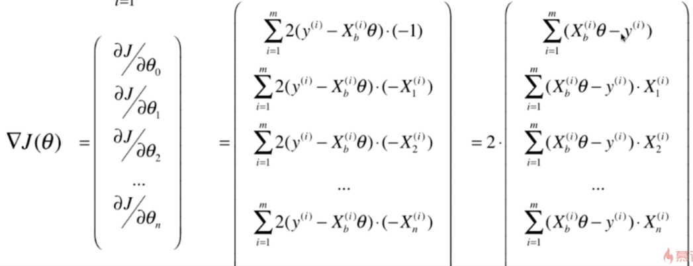

​		**实现梯度下降法**：

```python
def fit_gd(self,X_train,y_train,eta=0.01,n_iters=1e4):
    """根据训练数据集X_train,y_train,使用梯度下降法训练Linear Regression模型"""
    assert X_train.shape[0]==y_train.shape[0],\
        "the size of X_train must be euqal to the size of y_train"

    def J(theta,X_b,y):
        try:
            return np.sum((y - X_b.dot(theta)) ** 2) / len(X_b)
        except:
            return float('inf')

    def dJ(theta, X_b, y):
        res = np.empty(len(theta))
        res[0] = np.sum(X_b.dot(theta) - y)

        for i in range(1, len(theta)):
            res[i] = (X_b.dot(theta) - y).dot(X_b[:, i])
        return res * 2 / len(X_b)

    def gradient_descent(X_b, y, initial_theta, eta, n_iters=1e4, epsilon=1e-8):
        theta = initial_theta
        i_iter = 0

        while i_iter < n_iters:
            gradient = dJ(theta, X_b, y)
            last_theta = theta
            theta = theta - eta * gradient

            if (abs(J(theta, X_b, y) - J(last_theta, X_b, y)) < epsilon):
                break

            i_iter += 1

        return theta

    X_b = np.hstack([np.ones((len(X_train), 1)), X_train])
    initial_theta = np.zeros(X_b.shape[1])  # theta向量的行数=X_b向量的列数
    self._theta=gradient_descent(X_b,y_train,initial_theta,eta,n_iters)

    self.interception_=self._theta[0]
    self.coef_=self._theta[1:]

    return  self
```


----

#### 7 线性回归中梯度下降的向量化

​		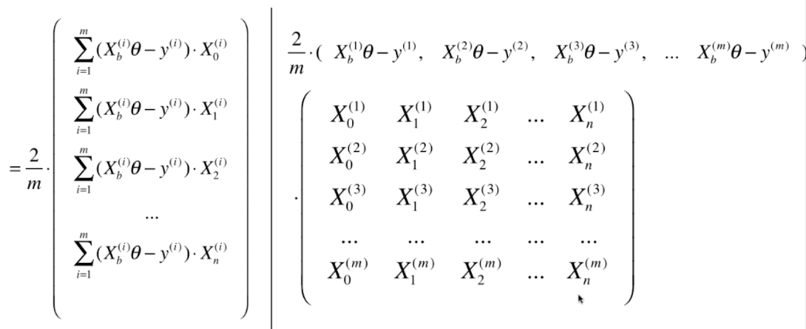

​		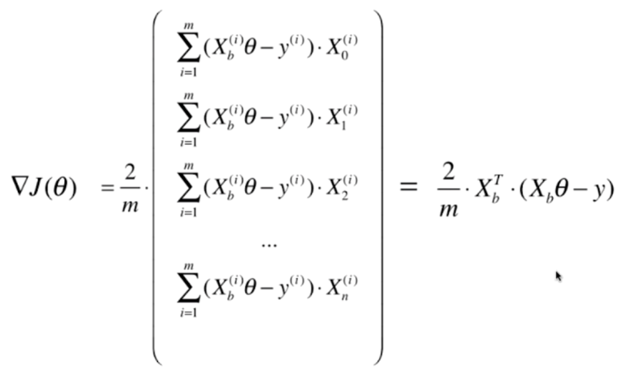

​		**梯度下降法与数据归一化**

​		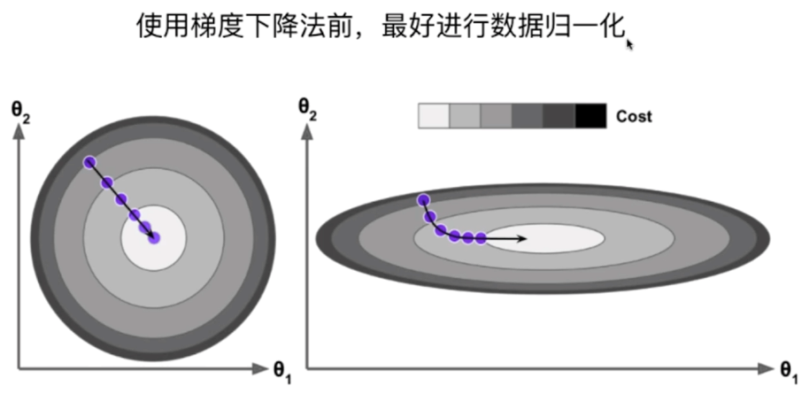

​		

----

#### 8 随机梯度下降法

​		**批量梯度下降法（Batch Gradient Descent）**

​		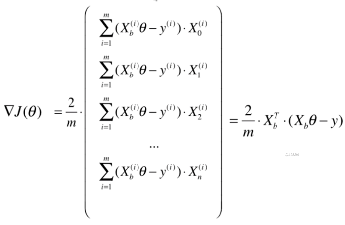

​			这是之前的向量化公式，我们在求解梯度时，每一项都要对**所有的样本**进行计算。

​		

​		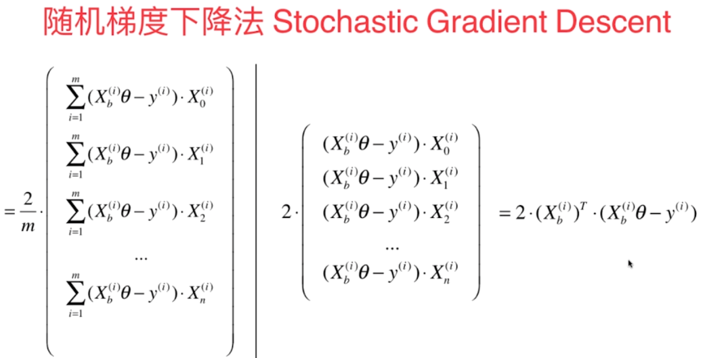

​		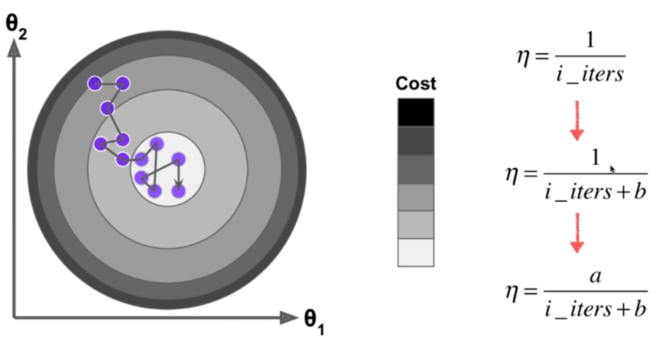

​		随机梯度下降法的学习率不能是一个固定值，需要是递减的。【**模拟退火的思想**】

​	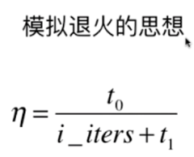

​			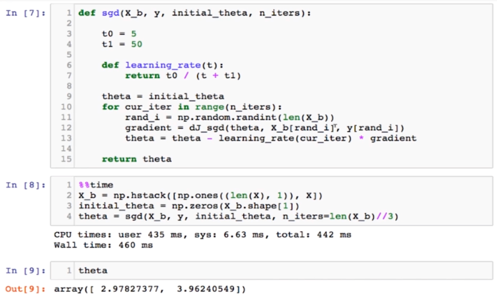

​		**SGD算法实现**：

```python
def fit_sgd(self,X_train,y_train,n_iters=5,t0=5,t1=50):
    """根据训练数据集X_train,y_train,使用随机梯度下降法训练Linear Regression模型"""
    assert X_train.shape[0]==y_train.shape[0],\
        "the size of X_train must be euqal to the size of y_train"
    assert n_iters>=1

    def dJ_sgd(theta, X_b_i, y_i):
        return X_b_i*(X_b_i.dot(theta)-y_i)*2.

    def sgd(X_b, y, initial_theta, n_iters, t0=5,t1=50):

        def learning_rate(t):
            return t0/(t+t1)

        theta=initial_theta
        m=len(X_b)

        for cur_iter in range(n_iters):
            indexes=np.random.permutation(m)
            X_b_new=X_b[indexes]
            y_new=y[indexes]
            for i in range(m):
                gradient = dJ_sgd(theta, X_b_new[i], y_new[i])
                theta = theta - learning_rate(cur_iter*m+i) * gradient

        return theta

    X_b = np.hstack([np.ones((len(X_train), 1)), X_train])
    initial_theta = np.zeros(X_b.shape[1])  # theta向量的行数=X_b向量的列数
    self._theta=sgd(X_b,y_train,initial_theta,n_iters,t0,t1)

    self.interception_=self._theta[0]
    self.coef_=self._theta[1:]

    return  self
```

---

#### 9 关于梯度的调试

​		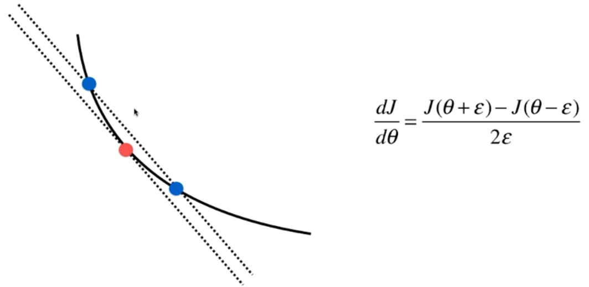

​		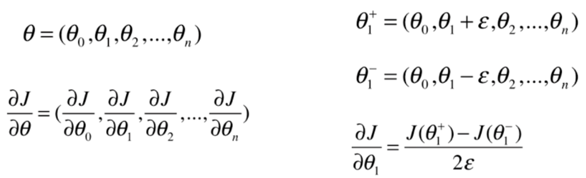


​		