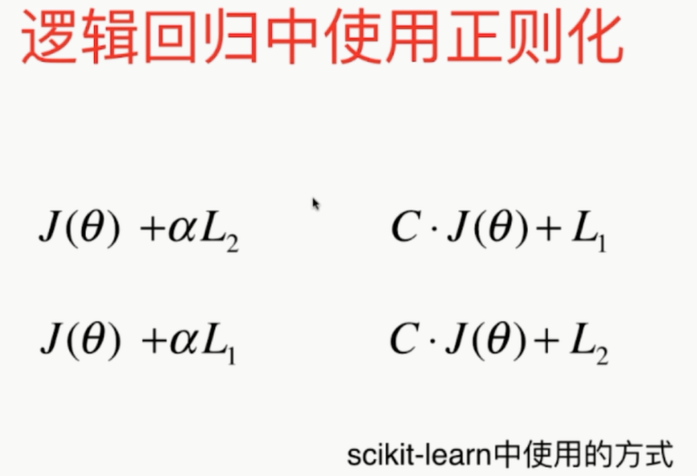

### 逻辑回归算法

1、逻辑回归与线性回归的联系与区别

2、逻辑回归的原理

3、逻辑回归损失函数推到及优化

4、正则化与模型评估指标

5、逻辑回归的优缺点

6、样本不均衡问题解决办法

7、sklearn参数

----

#### 1 逻辑回归

​		**解决分类问题**。

​		回归问题怎么解决分类问题？

​		将样本的特征和样本发生的概率联系起来，概率是一个数。

​		

​		如果对于计算出的概率进行判断，那么就可以进行分类操作，即分类算法。

----

#### 2 逻辑回归的损失函数

​		

​		

​		

​		

​		

​		

​		

​		

​		只能使用**梯度下降法**求解。

​		

---

#### 3 决策边界

​		

​		

​		

​		

​		

---

#### 4 在逻辑回归中使用多项式特征

​		

​		

​		

​		

​		

----

#### 5 分类准确度的评价

​		

​		

​		**精准率和召回率**：

​		

​		

​		

​		**权衡精准率和召回率**：

​		

​		

​		

​		

​		

​		

​		

​		

​		

​		

