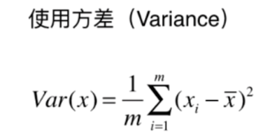
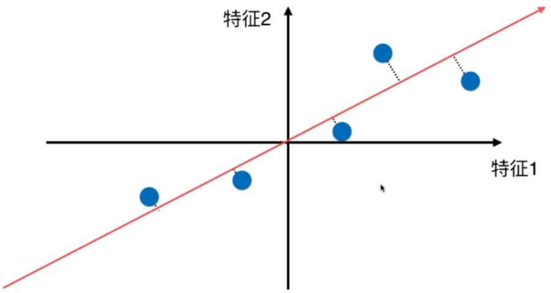
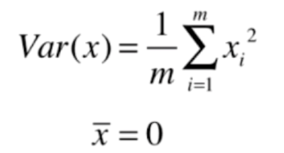
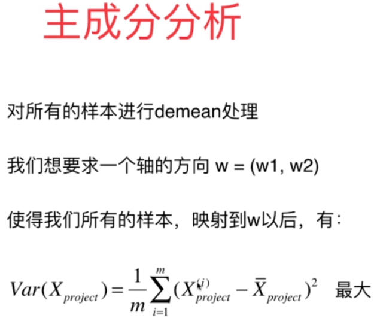
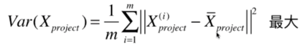
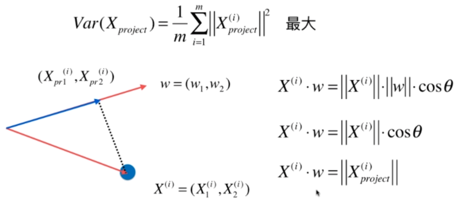
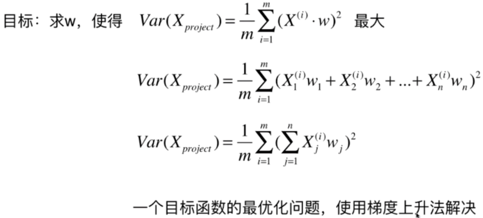
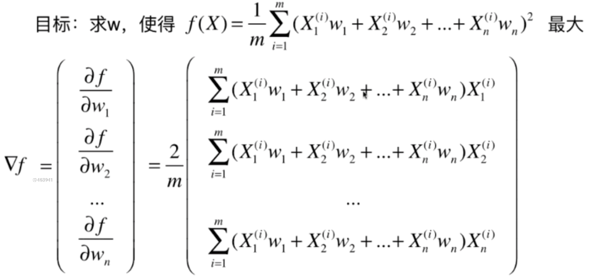
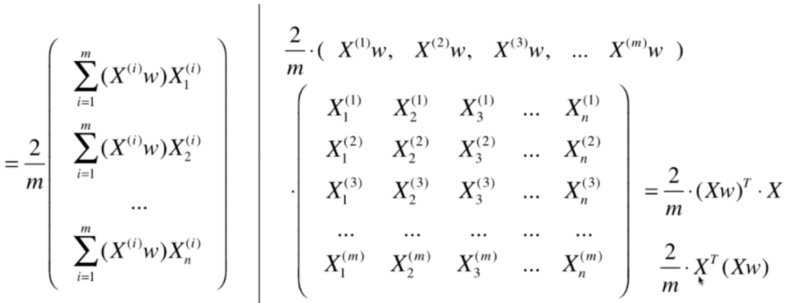
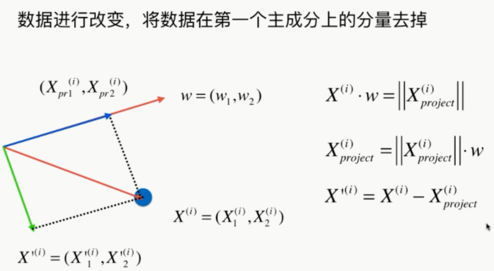

### 主成分分析

- 一个非监督的机器学习算法

- 主要用于数据的降维

- 通过降维，可以发现更便于人类理解的特征

- 其他应用：可视化，去噪

  ​	

------

#### 1 PCA主成分分析法

 		 **找到一个轴，使得样本空间的所有点映射到这个轴后，方差最大。**

- 第一步：将样例的**均值归为0**（demean）

  ​	
  
  ​	
  
  ​	
  
  ​	
  
  ​	
  
  ​	

-----

#### 2 使用梯度上升法求解PCA问题

​		

​		


----

#### 3 使用梯度上升法求解主成分

```python
def gradient_ascent(df,X,initial_w,eta,n_iters=1e4,epsilon=1e-8):
    
    w=direction(initial_w)
    cur_iter=0
    
    while cur_iter < n_iters:
        gradient=df(w,X)
        last_w=w
        w=w+eta*gradient
        w=direction(w)#注意：每次求一个单位方向
        if(abs(f(w,X)-f(last_w,X))<epsilon):
            break
        cur_iter+=1
        
    return w
```


-----

#### 4 求数据的前n个主成分


​		

