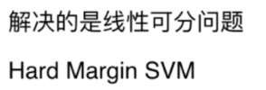
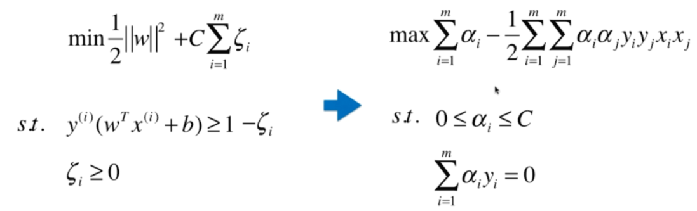
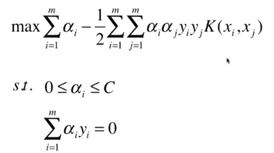
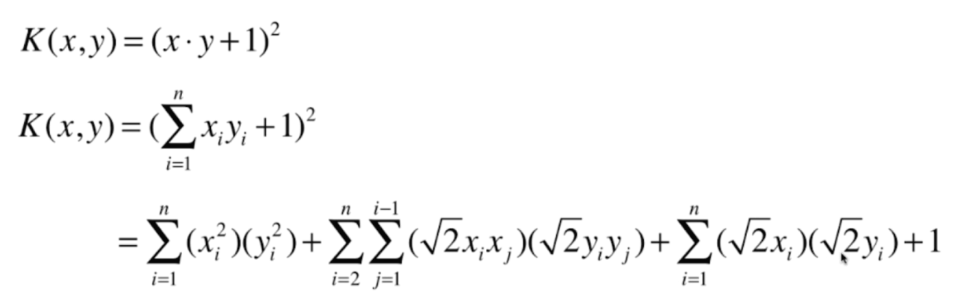
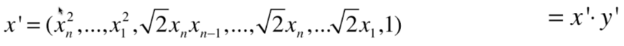

## 数据挖掘

### 1 概述

​		数据挖掘：

​		


-----

### 10 决策树

#### 10.1 基尼系数计算

$$
G=1- \sum_{k=1}^{k}{p_i}^2
$$

​		sklearn使用的是CART算法，该算法仅生成二叉树：非叶节点永远只有两个节点。但ID3生成的决策树，其节点可以拥有两个以上的子节点。


> **模型解释**：白盒子与黑盒子

​		**熵值**的减少通常被称为**信息增益**。		

​		

​		信息熵的计算：
$$
H_i=-\sum_{k=1}^{k}{p_i}*log(p_i)
$$


#### 10.2 估算类别概率

​		决策树可以估算某个实例属于特定类别k的概率：

​		首先，跟随决策树找到该实例的叶节点，然后返回该节点中类别k的训练实例占比。

​		

#### 10.3 CART训练算法

​		CART：Classification And Regression Tree，分类与回归树。

​		具体想法：首先，使用单个特征k和阈值$$t_k$$将训练集分成两个子集。

​		$$k$$和$$t_k$$的选择：产生最纯子集的$$k$$和$$t_k$$就是经算法搜索确定的$$（t，t_k）$$。

​		

​		CART算法是一种贪婪算法：从顶层开始搜索最优分裂，然后每层重复这个过程。


#### 10.4 正则化超参数

​		决策树极少对训练数据做出假设。如果不加以限制，树的结构将跟随训练集变化，严密拟合，并且很可能过度拟合。这种模型通常被称为非参数模型，即在训练之前没有确定参数的数量，导致模型结构自由而紧密地贴合数据。

​		为了避免过度拟合，需要在训练过程中降低决策树的自由度。这个过程即为正则化。

​		

#### 10.5 回归

​		


#### 10.6 决策树可视化

```python
from sklearn.datasets import load_iris
from sklearn.tree import DecisionTreeClassifier
from sklearn.tree import export_graphviz
import pydot
import pydotplus 
from IPython.display import Image
import graphviz

iris=load_iris()
X=iris.data[:,2:]
y=iris.target

tree_clf=DecisionTreeClassifier(max_depth=2)
tree_clf.fit(X,y)

dot_data = export_graphviz(tree_clf, out_file=None,  #tree_clf 是对应分类器
                         feature_names=iris.feature_names[2:],   #对应特征的名字
                         class_names=iris.target_names,    #对应类别的名字
                         filled=True, rounded=True,  
                         special_characters=True)  
graph = pydotplus.graph_from_dot_data(dot_data)  
graph.write_png('example.png')    #保存图像
Image(graph.create_png()) 
```


#### 10.7 决策树算法

​		

​		决策树在生长的过程中，从根节点到最后的叶节点，信息熵是下降的过程，每一步下降的量就称为**信息增益**。

​		如果需要基于其他事件计算某个事件的熵，就称为**条件熵**。【注意】：条件熵并不等同于条件概率，它是已知事件各取值下条件熵的期望。

​		对于已知事件X来说，事件Y的信息增益就是Y的信息熵与X事件下Y的条件熵之差，事件X对Y的影响越大，条件熵就会越小（在事件X的影响下，事件Y被划分的越”纯净“），体现在信息增益上就是差值越大，进而说明事件Y的信息熵下降得越多。在根节点或中间节点得变量选择中，就是挑选出各自变量下因变量得信息增益最大的。

​		

​		如何计算自变量为连续的数值型数据的信息熵，另外，如何将某个数值型变量作为根节点或中间节点的判断条件。对于数据值型自变量，**信息增益的计算过程**如下：

		1. 假设数值型变量x含有n个观测，首先对其做升序或降序操作，然后计算相邻两个数值之间的均值$$x_{mean}=(x_i+x_{i+1})/2$$，从而得到n-1个均值。
  		2. 以均值作为判断值，可以将数据集拆分成两部分。计算在该判断值下对应的信息增益。
                		3. 重复第2步，可以得到n-1个均值下的信息增益，并从中挑选出最大的作为变量x对因变量的信息增益。


​		

​		ID3算法使用信息增益指标实现根节点或中间节点的字段选择，但是明显的缺点是：信息增益会偏向于取值较多的字段。


​		


​		

#### 10.8 决策树的剪枝

​		决策树通常有两类方法：预剪枝和后剪枝。

​		**预剪枝**：在树的生长过程中，对其进行必要的剪枝；

​		**后剪枝**：指决策树在得到充分生长的前提下再对其返工修剪。

​		常用的剪枝方法：

​		`误差降低剪枝法`、`悲观剪枝法`、`代价复杂度剪枝法`等。


#### 10.9 哑变量处理

​		**one-hot编码**：将离散型特征的每一种取值都看成一种状态，若你的这一状态有N个不同的取值，那么我们就可以抽象成N种不同的状态，one-hot编码保证每一个取值只会使得一种状态处于“激活态”，也就是说这N种状态只有一个状态位为1，其他状态位均为0。

​		**dummy encoding**：就是任意的将一个状态位去除。4个状态位就可以反映5种状态。其中一种状态用全0表示。

​		

-----

### 11 SVM

​		支持向量机能够执行**线性或非线性分类**、**回归**，甚至是**异常检测任务**。

​		【算法思想】：利用某些支持向量所构成的“超平面”，将不同类别的样本点进行划分。

​		{不管样本点是线性可分的、近似线性可分的还是非线性可分，都可以利用“超平面”将样本点切割开来。}

​		【注意】：如果样本点是非线性可分，需要借助于核函数技术，实现样本在核空间下完成线性可分的操作。

 		


​		SVM分类器在类别之间拟合可能的最宽的街道， 即大间隔分类。在街道以外的地方增加更多训练实例，不会对决策边界产生影响：它完全由位于街道边缘的实例决定，这些实例被称为支持向量。

​		SVM对特征的缩放（如数据归一化）非常敏感。

​		


#### 11.1 线性SVM分类		

##### 11.1.1 硬间隔分类

​		如果严格地让所有实例都不在街道上，并且位于一边，这就是硬间隔分类。

​		

​		硬间隔分类有两个问题：

		1. 它只是在数据线性可分离的时候才有效；
  		2. 它对异常值非常敏感。


##### 11.1.2 软间隔分类

​		尽可能在保持街道宽阔和限制间隔违例（即位于街道之上，甚至在错误的一边的实例）之间找到良好的平衡，这就是软间隔分类。


#### 11.2 非线性SVM分类

​		处理非线性数据集的方法之一是添加更多特征。

​		解决非线性问题的另一种技术是添加相似特征。这些特征经过相似函数计算得出，相似函数可以测量每个实例与一个特定地标之间的相似度。


#### 11.3 SVM最大化

​		

​		

​		

​		

​		

​		上面的是限定条件。即有条件的最优化问题。

​		

#### 11.4 Soft Margin和SVM的正则化

​		

​		

​		

#### 11.5 核函数

​		

​		

​		**多项式核函数**

​		

​		


​		

​		

​		


