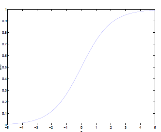
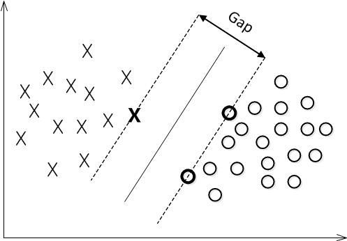
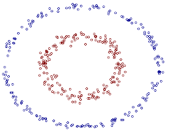
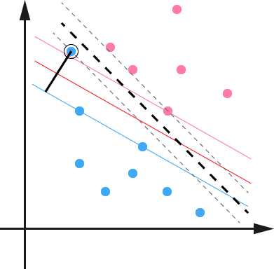
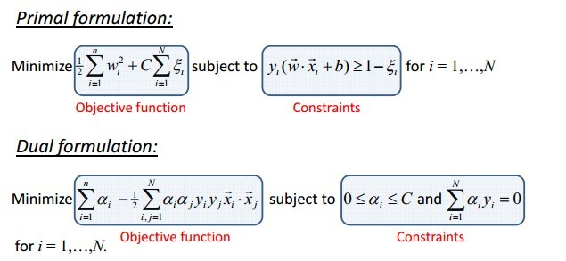
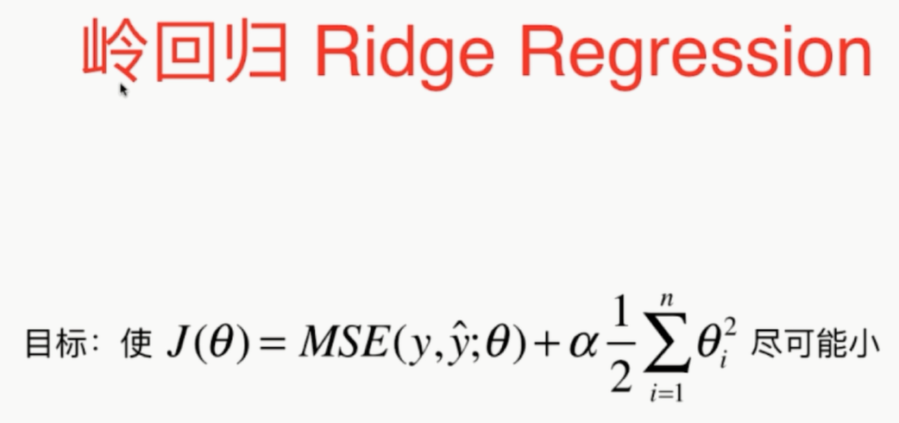
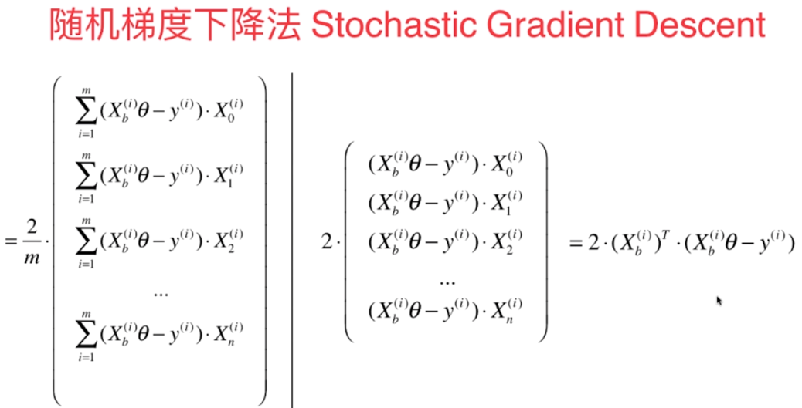
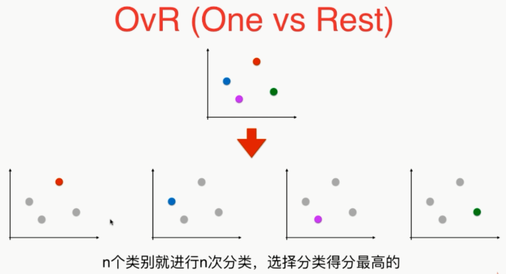

## 数据挖掘

### 1 概述

​		数据挖掘：

​		


#### 2 基础知识

​		在机器学习里，属性是一种数据类型（例如“里程”）；而特征取决于上下文，可能有多个含义，但是通常状况下，特征意味着一个属性加上其值（例如，“里程=1500”）。

​		监督式学习的算法：

		- K近邻算法
		- 线性回归
		- 逻辑回归
		- 支持向量机
		- 决策树和随机森林
		- 神经网络


​		无监督式学习的算法：

- k-平均算法

- 分层聚类分析

- 最大期望算法

  

  可视化和降维

- 主成分分析
- 核主成分分析
- 局部线性嵌入（LLE）
- t-分布随机近临嵌入（t-SNE）


​		关联规则学习

- Apriori
- Eclat


​		**可视化算法**是监督式学习算法的一种，提供大量复杂的、未标记的数据，得到轻松绘制而成的2D或3D的数据呈现作为输出。这些算法会尽其所能地保留尽量多的结构，以便于理解这些数据是怎么组织的，甚至识别出一些未知的模式。

​		**降维**，目的是在不丢失太多的信息的前提下简化数据。方法之一就是将多个相关特征合并为一个。这个过程叫作**特征提取**。

​		**关联规则学习**，<u>目的是挖掘大量数据，发现属性之间的有趣联系</u>。


​	


-----

### 10 决策树

#### 10.1 基尼系数计算

$$
G=1- \sum_{k=1}^{k}{p_i}^2
$$

​		sklearn使用的是CART算法，该算法仅生成二叉树：非叶节点永远只有两个节点。但ID3生成的决策树，其节点可以拥有两个以上的子节点。


> **模型解释**：白盒子与黑盒子

​		**熵值**的减少通常被称为**信息增益**。		

​		

​		信息熵的计算：
$$
H_i=-\sum_{k=1}^{k}{p_i}*log(p_i)
$$


#### 10.2 估算类别概率

​		决策树可以估算某个实例属于特定类别k的概率：

​		首先，跟随决策树找到该实例的叶节点，然后返回该节点中类别k的训练实例占比。

​		

#### 10.3 CART训练算法

​		CART：Classification And Regression Tree，分类与回归树。

​		具体想法：首先，使用单个特征k和阈值$$t_k$$将训练集分成两个子集。

​		$$k$$和$$t_k$$的选择：产生最纯子集的$$k$$和$$t_k$$就是经算法搜索确定的$$（t，t_k）$$。

​		

​		CART算法是一种贪婪算法：从顶层开始搜索最优分裂，然后每层重复这个过程。


#### 10.4 正则化超参数

​		决策树极少对训练数据做出假设。如果不加以限制，树的结构将跟随训练集变化，严密拟合，并且很可能过度拟合。这种模型通常被称为非参数模型，即在训练之前没有确定参数的数量，导致模型结构自由而紧密地贴合数据。

​		为了避免过度拟合，需要在训练过程中降低决策树的自由度。这个过程即为正则化。

​		

#### 10.5 回归

​		


#### 10.6 决策树可视化

```python
from sklearn.datasets import load_iris
from sklearn.tree import DecisionTreeClassifier
from sklearn.tree import export_graphviz
import pydot
import pydotplus 
from IPython.display import Image
import graphviz

iris=load_iris()
X=iris.data[:,2:]
y=iris.target

tree_clf=DecisionTreeClassifier(max_depth=2)
tree_clf.fit(X,y)

dot_data = export_graphviz(tree_clf, out_file=None,  #tree_clf 是对应分类器
                         feature_names=iris.feature_names[2:],   #对应特征的名字
                         class_names=iris.target_names,    #对应类别的名字
                         filled=True, rounded=True,  
                         special_characters=True)  
graph = pydotplus.graph_from_dot_data(dot_data)  
graph.write_png('example.png')    #保存图像
Image(graph.create_png()) 
```


#### 10.7 决策树算法

​		

​		决策树在生长的过程中，从根节点到最后的叶节点，信息熵是下降的过程，每一步下降的量就称为**信息增益**。

​		如果需要基于其他事件计算某个事件的熵，就称为**条件熵**。【注意】：条件熵并不等同于条件概率，它是已知事件各取值下条件熵的期望。

​		对于已知事件X来说，事件Y的信息增益就是Y的信息熵与X事件下Y的条件熵之差，事件X对Y的影响越大，条件熵就会越小（在事件X的影响下，事件Y被划分的越”纯净“），体现在信息增益上就是差值越大，进而说明事件Y的信息熵下降得越多。在根节点或中间节点得变量选择中，就是挑选出各自变量下因变量得信息增益最大的。

​		

​		如何计算自变量为连续的数值型数据的信息熵，另外，如何将某个数值型变量作为根节点或中间节点的判断条件。对于数据值型自变量，**信息增益的计算过程**如下：

		1. 假设数值型变量x含有n个观测，首先对其做升序或降序操作，然后计算相邻两个数值之间的均值$$x_{mean}=(x_i+x_{i+1})/2$$，从而得到n-1个均值。
  		2. 以均值作为判断值，可以将数据集拆分成两部分。计算在该判断值下对应的信息增益。
                		3. 重复第2步，可以得到n-1个均值下的信息增益，并从中挑选出最大的作为变量x对因变量的信息增益。


​		

​		ID3算法使用信息增益指标实现根节点或中间节点的字段选择，但是明显的缺点是：信息增益会偏向于取值较多的字段。


​		


​		

#### 10.8 决策树的剪枝

​		决策树通常有两类方法：预剪枝和后剪枝。

​		**预剪枝**：在树的生长过程中，对其进行必要的剪枝；

​		**后剪枝**：指决策树在得到充分生长的前提下再对其返工修剪。

​		常用的剪枝方法：

​		`误差降低剪枝法`、`悲观剪枝法`、`代价复杂度剪枝法`等。


#### 10.9 哑变量处理

​		**one-hot编码**：将离散型特征的每一种取值都看成一种状态，若你的这一状态有N个不同的取值，那么我们就可以抽象成N种不同的状态，one-hot编码保证每一个取值只会使得一种状态处于“激活态”，也就是说这N种状态只有一个状态位为1，其他状态位均为0。

​		**dummy encoding**：就是任意的将一个状态位去除。4个状态位就可以反映5种状态。其中一种状态用全0表示。

​		

-----

### 11 SVM

​		SVM简单点说就是一个**分类器**，并且是二分类器。(一种通用的**前馈网络类型**)

​		support vector machine：

  - vector：就是向量，即数据；

  - machine：就是分类器。

    

#### 11.1 SVM原理分析

​		【原理】：利用某些支持向量所构成的“超平面”，将不同类别的样本点进行划分。

​						   通俗点说，给定训练样本，支持向量机建立一个**超平面**作为**决策曲面**，使得正例和反例的隔离边界最大化。

​		【功能】：支持向量机能够执行**线性或非线性分类**、**回归**，甚至是**异常检测任务**。

 				

​		SVM基本模型定义为特征空间上的间隔最大的线性分类器，其学习策略便是间隔最大化，最终可转化为一个**凸二次规划问题的求解**。


##### 11.1.1 分类标准的起源：Logistic回归

​		线性分类器

​		一个线性分类器的学习目标便是要在n维的数据空间中找到一个超平面，这个超平面的方程可以表示为：$$w^Tx+b=0$$

​		给定一堆数据，它们分属于两个不同的类别，现在就是要找一个线性分类器把它们分开。如果用x表示数据点，用y表示类别（y可取值：1或-1，分别代表不同的两类）。

​		是不是对类别取1或-1有疑问？

​		事实上，这个取值1或-1的分类标准起源于Logistic回归。

​		**Logistic回归**的目的是从特征学习出一个**0/1分类模型**（不是回归吗？怎么是学习一个分类模型？不用着急，后面看了就明白了！\^\_^），而这个模型是将特征的线性组合作为自变量，由于自变量的取值范围是$$-\infty$$到$$+\infty$$。因此，使用logistic函数（或称作**sigmoid函数**）将自变量映射到（0,1）上，**映射后的值**就被认为是**属于y=1的概率**。

​		假设函数
$$
h_{\theta}(x)=g\left(\theta^{T} x\right)=\frac{1}{1+e^{-\theta^{T} x}}
$$
​		其中$$x$$是$$n$$维特征向量，函数$$g$$就是logistic函数。

​		而$$g(z)=\frac{1}{1+e^{-z}}$$的图像是

​		

​		此时判别一个数据属于哪个类，只需要求$$h_\theta(x)$$即可，若$$h_\theta(x)>0.5$$就是y=1的类，反之就是y=0的类。

​		另外，

​		当$$\begin{cases} \theta^Tx>>0 ， h_\theta(x)=1\\ \theta^Tx<<0 ，h_\theta(x)=0\end{cases}  $$，只从$$\theta_Tx出发$$，希望模型达到的目标就是让训练数据中y=1的特征$$\theta^Tx>>0$$，而y=0的特征$$\theta^Tx<<0$$。Logistic回归就是要学习得到$$\theta$$，使得正例的特征远大于0，负例的特征远小于0，而且要在全部实例上实现。

​		

##### 11.1.2 Logistic回归$$\rightarrow$$SVM

​		首先对Logistic回归做个变形。将结果标签$$\begin{cases} y=0 \\ y=1 \end{cases}  \rightarrow \begin{cases} y=-1 \\ y=1 \end{cases} $$；

​		然后，将$$\theta^{T} x=\theta_{0}+\theta_{1} x_{1}+\theta_{2} x_{2}+\cdots+\theta_{n} x_{n}\left(x_{0}=1\right)$$中的$$\theta_0$$替换为$$b$$；

​		最后，将后面的$$\theta_{1} x_{1}+\theta_{2} x_{2}+\cdots+\theta_{n} x_{n}$$替换为$$w^Tx$$。

​		这样，便有了$$\theta^{T} x=w^{T} x+b$$。

​		现在回过头看，除了将y=0变为y=-1之外，线性分类函数跟logistic回归的形式化表示$$h_{\theta}(\mathrm{x})=g\left(\theta^{T} x\right)=\mathrm{g}\left(w^{T} x+\mathrm{b}\right)$$没区别。

​		进一步，我们将假设函数$$h_{w, b}(\mathrm{x})=g\left(w^{T} x+b\right)$$的$$g(z)$$做一个简化，将其简单映射到y=-1和y=1上。映射关系如下：
$$
g(z)=\left\{\begin{aligned} 1, & z \geq 0 \\-1, & z<0 \end{aligned}\right.
$$

#### 11.2 从函数间隔到几何间隔

##### 11.2.1 函数间隔与几何间隔

​		在超平面$$w x+b=0$$确定的情况下，$$|wx+b|$$能够表示点x到超平面的距离，另外，**通过观察$$wx+b$$的符号与类标签y的符号是否一致可判断分类是否正确**。所以，可以用下式：
$$
y*(wx+b)
$$
​		通过上式的**正负性**来判定或表示分类的正确性。


​		下面引出**函数间隔（functional margin）**的概念：

​		定义函数间隔为：
$$
\hat{\gamma}=y\left(w^{T} x+b\right)=y f(x)
$$
​		利用如上的乘积公式可以得到线性可分的SVM所对应的**函数间隔满足$$\hat{\gamma}\geq1$$的条件**。

​		而超平面（w,b）中关于T中所有样本点（xi,yi）的函数间隔最小值（其中，x是特征，y是结果标签，i表示第i个样本），便为超平面（w,b）关于训练集T的函数间隔：
$$
\hat{\gamma}=min\hat{\gamma}_i(i=1,2……n)
$$
​		**存在的问题**：如果成比例的改变w和b（如将它们改成2w和2b），则函数间隔的值f却变成了原来的2倍（虽然此时超平面没有改变），因此，仅有函数间隔还远远不够。

​		为避免这样的问题，需要对函数间隔做约束，例如单位化处理。

​		

​		下面引出**几何间隔（geometrical margin）**的概念：

​		我们对法向量w加些条件，从而引出**真正定义点到平面的距离–-几何间隔**。

​		 假定对于一个点 x ，令其垂直投影到超平面上的对应点为 x0 ，w 是垂直于超平面的一个向量，$$\gamma$$为样本x到超平面的距离，如下图所示:

>
>

​		根据平面几何知识，有：
$$
x=x_{0}+\gamma \frac{w}{\|w\|}
$$
​		其中$$\|w\|$$为$$w$$的二阶范数，$$\frac{w}{\|w\|}$$是单位向量。

​		又由于$x_0$是超平面上的点，满足$f(x_0)=0$，代入超平面的方程$$w^{T} x+b=0$$，可得$$w^{T} x_0+b=0$$，即
$$
w^{T} x_0=-b
$$
​		现在我们对上式（7）两边同时乘以$w^T$，再根据$w^{T} x_0=-b$和$w^{T} w=\|w\|^2$，即可算出$\gamma$：
$$
\gamma=\frac{w^{T} x+b}{\|w\|}=\frac{f(x)}{\|w\|}
$$
​		为了得到$\gamma$的绝对值，令$\gamma$乘上对应的类别$y$，即可得出**几何间隔（用$\tilde{\gamma}$表示）**的定义：
$$
\tilde{\gamma}=y \gamma=\frac{\hat{\gamma}}{\|w\|}
$$


​		从上述**函数间隔**和**几何间隔**的定义可以看出：几何间隔就是函数间隔除以$\|w\|$，而且函数间隔$y*(wx+b)=y*f(x)$实际上就是$|f(x)|$，只是**人为定义的一个间隔度量**，而几何间隔$\frac{|f(x)|}{\|w\|}$才是**直观上的点到超平面的距离**。

​		

##### 11.2.2 最大间隔分类器的定义

​		 对一个数据点进行分类，当超平面离数据点的“间隔”越大，分类的确信度（confidence）也越大。所以，为了使得分类的确信度尽量高，需要让所选择的超平面能够最大化这个“间隔”值。这个间隔就是下图中的Gap的一半。



​		**通过由前面的分析可知**：函数间隔不适合用来最大化间隔值，因为在超平面固定以后，可以等比例地缩放w的长度和b的值，这样可以使得$f(x)=w^{T} x+b$的值任意大，亦即函数间隔$\hat{\gamma}$可以在超平面保持不变的情况下被取得任意大。但几何间隔因为除上了$\|w\|$，使得在缩放w和b的时候几何间隔$\hat{\gamma}$的值是不会改变的，它只随着超平面的变动而变动，因此，这是更加合适的一个间隔。换言之，这里要找的**最大间隔分类超平面中的“间隔”指的是几何间隔**。

​		于是，最大间隔分类器的目标函数可以定义为：
$$
\max \tilde{\gamma}
$$
​		同时需要满足一些条件，根据间隔的定义，有：
$$
y_{i}\left(w^{T} x_{i}+b\right)=\hat{\gamma}_{i} \geq \hat{\gamma}, \quad i=1, \ldots, n
$$
​		回顾下几何间隔的定义$\tilde{\gamma}=y \gamma=\frac{\hat{\gamma}}{\|w\|}$，可知：如果令函数间隔$\hat{\gamma}$等于1（之所以令$\hat{\gamma}=1$，是为了方便推到和优化，而且这样做对目标函数没有影响，为什么？？？），则有$\tilde{\gamma}=\frac{1 }{\|w\|}$且$y_{i}\left(w^{T} x_{i}+b\right) \geq 1, i=1, \ldots, n$，从而上述目标函数转化为
$$
\max \frac{1}{\|w\|},
\quad s . t ., y_{i}\left(w^{T} x_{i}+b\right) \geq 1, i=1, \ldots, n
$$


​		如上图所示，中间的实线便是寻找到的最优超平面（Optimal Hyper Plane）。

​		处于方便推导和优化的目的，我们可以令$\hat{\gamma}= 1$，而对于所有不是支持向量的点，则显然有$y\left(w^{T} x+b\right)>1$。


​	

​		

​		

​		


#### 11.3 从线性可分到线性不可分

​		**线性可分**：在二维空间可以理解为用一条直线（直线方程）把两个类型的样本隔开，被隔离开的两类样本即为线性可分样本。如果是在三维空间，此时用于隔离样本的就变成了一个平面，同理在高维平面，这个平面就称为超平面。

​		**线性不可分**：可以理解为自变量和因变量之间的关系不是线性的。

​	  【注意】：如果样本点是非线性可分，需要借助于**核函数技术**，实现样本在核空间下完成线性可分的操作。具体操作是：非线性样本通过高斯核函数将其**映射**到高维空间，在高维空间非线性的问题转化为线性可分的问题。如下图：

​		

​		在**二维空间**中，该样本无法通过一条直线将其分隔开。

​		

​		在**三维空间**中，该样本可以通过一个平面进行分割。

​		下图也是这样操作的：

​		

##### 11.3.1 从原始问题到对偶问题的求解

​		

​		上面的是限定条件。即有条件的最优化问题。

​		接着考虑之前得到的目标函数：
$$
\max \frac{1}{\|w\|},
\quad s . t ., y_{i}\left(w^{T} x_{i}+b\right) \geq 1, i=1, \ldots, n
$$
​		**最大值$\rightarrow$最小值**：

​		即转换为求：
$$
\min \frac{1}{2}\|w\|^{2} \quad s . t ., y_{i}\left(w^{T} x_{i}+b\right) \geq 1, i=1, \ldots, n
$$
​		现在的目标函数是二次的，约束条件是线性的，所以它是一个**凸二次规划问题**。即：在一定的约束条件下，目标最优，损失最小。关于这类凸二次规划问题的求解需要用到**拉格朗日乘子法**。

>通过拉格朗日对偶性（Lagrange Duality）变换到对偶变量 (dual variable) 的优化问题，即通过求解与原问题等价的对偶问题（dual problem）得到原始问题的最优解，这就是线性可分条件下支持向量机的对偶算法，这样做的优点在于：一者对偶问题往往更容易求解；二者可以自然的引入核函数，进而推广到非线性分类问题。

​		

​		**拉格朗日乘子法**：假设存在一个需要最小化的目标函数$f(x)$，并且该目标函数同时受到$g(x)\le0$的约束。如需得到最优解，则需要利用拉格朗日对偶性将原始的最优化问题转换为对偶问题，即：
$$
min(f(x))=min_xmax_\lambda(L(x,\lambda))
 =min_xmax_\lambda(f(x)+\sum_{i=1}^{k}{\lambda_ig_i(x)})
$$
​		其中，$f(x)+\sum_{i=1}^{k}{\lambda_ig_i(x)}$为拉格朗日函数，$\lambda_i$即为拉格朗日乘子，且$\lambda_i>0$。上式就称为广式拉格朗日函数的极小极大问题。

​		在求解极小值问题时，还需要利用对偶性将极小极大问题转换为极大较小问题，即：
$$
min(f(x))=max_\lambda min_x(L(x,\lambda))
 =max_\lambda min_x(f(x)+\sum_{i=1}^{k}{\lambda_ig_i(x)})
$$
​		利用对偶性将最优化问题做等价转换是有好处的：

  - 一方面在求极小值中无须对拉格朗日函数中的乘子$\lambda_i$求偏导；

  - 另一方面使计算过程变得易于理解。

​		所以，在计算目标函数的极值时，分两步求偏导即可，先对极小值部分做x的偏导，再对极大值部分做$\lambda_i$做偏导，通过两步运算，最终计算出目标函数所对应的参数值。

​		

​		根据上面介绍的数学知识，就可以将线性可分SVM模型的目标函数重新表示。

​		首先，我们通过定义拉格朗日函数，将约束条件融合到目标函数里，从而只用一个函数表达式便能清楚的表达出我们的问题：
$$
\mathcal{L}(w, b, \alpha)=\frac{1}{2}\|w\|^{2}-\sum_{i=1}^{n} \alpha_{i}\left(y_{i}\left(w^{T} x_{i}+b\right)-1\right)
$$
​		~~然后令~~
$$
\theta(w)=\max _{\alpha_{i} \geq 0} \mathcal{L}(w, b, \alpha)
$$
​		容易验证，当约束条件不满足时，例如$y_{i}\left(w^{T} x_{i}+b\right)<1$，那么$\theta(w)=\infty$(只要令$\alpha_{i}=\infty$即可)。只有当所有约束条件都满足时，最优值才为$\theta(w)=\frac{1}{2}\|w\|^{2}$。

​		目标函数变成：
$$
min \frac{1}{2} \|w\|^{2}=\min _{w, b} \max _{\alpha_{i} \geq 0} \mathcal{L}(w, b, \alpha)=p^{*}
$$
​		这里用$p^{*}$表示这个问题的最优值，且和最初的问题是等价的。如果直接求解，那么一上来便得面对w和b两个参数，而$\alpha_{i}$又是不等式约束，这个求解过程不好做。不妨把最小和最大的位置交换一下，变成：
$$
min \frac{1}{2} \|w\|^{2}=\max _{\alpha_{i} \geq 0} \min _{w, b} \mathcal{L}(w, b, \alpha)=d^{*}
$$
​		交换以后的新问题是原始问题的对偶问题，这个新问题的最优值用$d^{*}$来表示。而且有$d^{*}\le p^{*}$，在满足某些条件的情况下，这两者相等，这个时候就可以通过求解对偶问题来间接地求解原始问题。

​		

##### 11.3.2 Slater条件

​		前面提到“$d^{*}\le p^{*}$在满足某些条件的情况下，两者等价”，这所谓的“满足某些条件”就是要满足Slater条件。

>要让两者等价需满足strong duality （强对偶），而后有学者在强对偶下提出了KKT条件，且KKT条件的成立要满足constraint qualifications，而constraint qualifications之一就是Slater条件。**所谓Slater 条件**，即指：**凸优化问题，如果存在一个点x，使得所有等式约束都成立，并且所有不等式约束都严格成立（即取严格不等号，而非等号），则满足Slater 条件。**对于此处，Slater 条件成立，所以$d^{*}\le p^{*}$可以取等号。

​		

​		一般地，一个最优化数学模型能够表示成下列标准形式:
$$
\begin{array}{ll}{\min . f(\mathbf{x})} & {} \\ {\text { s.t. }} & {h_{j}(\mathbf{x})=0, j=1, \ldots, p} \\ {} & {g_{k}(\mathbf{x}) \leq 0, k=1, \ldots, q} \\ {} & {\mathbf{x} \in \mathbf{X} \subset \mathfrak{R}^{n}}\end{array}
$$
​		其中，f(x)是需要最小化的函数，h(x)是等式约束，g(x)是不等式约束，p和q分别为等式约束和不等式约束的数量。

​		同时明白一下两点：

- 凸优化的概念：$\mathcal{X} \subset \mathbb{R}^{n}$为一凸集，$f : \mathcal{X} \rightarrow \mathbb{R}$为一凸函数。凸优化就是要找出一点$x^{*} \in \mathcal{X}$，使得每一$x \in \mathcal{X}$满足

$f\left(x^{*}\right) \leq f(x)$。

- KKT条件的意义：它是一个非线性规划（Nonlinear Programming）问题能有最优化解法的必要和充分条件。

  KKT条件是指上面最优数学模型的标准形式中的最小点$x^{*}$必须满足下面的条件：
  $$
  \begin{array}{l}{\text { 1. } h_{j}\left(\mathbf{x}_{ .}\right)=0, j=1, \ldots, p, g_{k}\left(\mathbf{x}_{*}\right) \leq 0, k=1, \ldots, q} \\ \\ {\text { 2. } \nabla f\left(\mathbf{x}_{ .}\right)+\sum_{j=1}^{p} \lambda_{j} \nabla h_{j}\left(\mathbf{x}_{ .}\right)+\sum_{k=1}^{q} \mu_{k} \nabla g_{k}\left(\mathbf{x}_{ .}\right)=\mathbf{0}} \\ \\{\lambda_{j} \neq 0, \mu_{k} \geq 0, \mu_{k} g_{k}\left(\mathbf{x}_{*}\right)=0}\end{array}
  $$
  
  ​	经过论证，我们这里的问题是满足 KKT 条件的（首先已经满足Slater条件，再者f和gi也都是可微的，即L对w和b都可导），因此现在我们便转化为求解第二个问题。
  
  ​	也就是说，原始问题通过满足KKT条件，已经转化成了对偶问题。而求解这个对偶学习问题，分为3个步骤：首先要让L(w，b，a) 关于 w 和 b 最小化，然后求对的极大，最后利用SMO算法求解对偶问题中的拉格朗日乘子。


##### 11.3.3 对偶问题求解的3个步骤

$$
min \frac{1}{2} \|w\|^{2}=\max _{\alpha_{i} \geq 0} \min _{w, b} \mathcal{L}(w, b, \alpha)=d^{*}
$$


​		（1） 首先固定$\alpha$，要让L关于w和b最小化，我们分别对w，b求偏导数，即令：
$$
\begin{aligned} \frac{\partial \mathcal{L}}{\partial w} &=0 \Rightarrow w=\sum_{i=1}^{n} \alpha_{i} y_{i} x_{i} \\ \frac{\partial \mathcal{L}}{\partial b} &=0 \Rightarrow \sum_{i=1}^{n} \alpha_{i} y_{i}=0 \end{aligned}
$$
​					将结果代入之前的L：
$$
\mathcal{L}(w, b, \alpha)=\frac{1}{2}\|w\|^{2}-\sum_{i=1}^{n} \alpha_{i}\left(y_{i}\left(w^{T} x_{i}+b\right)-1\right)
$$
​					得到：
$$
\begin{aligned} \mathcal{L}(w, b, \alpha) &=\frac{1}{2} \sum_{i, j=1}^{n} \alpha_{i} \alpha_{j} y_{i} y_{j} x_{i}^{T} x_{j}-\sum_{i, j=1}^{n} \alpha_{i} \alpha_{j} y_{i} y_{j} x_{i}^{T} x_{j}-b \sum_{i=1}^{n} \alpha_{i} y_{i}+\sum_{i=1}^{n} \alpha_{i} \\ &=\sum_{i=1}^{n} \alpha_{i}-\frac{1}{2} \sum_{i, j=1}^{n} \alpha_{i} \alpha_{j} y_{i} y_{j} x_{i}^{T} x_{j} \end{aligned}
$$
​			（2） 求对$\alpha$的极大，即是关于对偶问题的最优化问题。经过上面第一个步骤的求w和b，得到的式子已经没有了变量w，b，只有$\alpha$。从上面的式子得到：
$$
\begin{array}{l}{\max _{\alpha} \sum_{i=1}^{n} \alpha_{i}-\frac{1}{2} \sum_{i, j=1}^{n} \alpha_{i} \alpha_{j} y y_{j} x_{i}^{T} x_{j}} \\   \\ {\text { s.t., } \alpha_{i} \geq 0, i=1, \ldots, n} \\ {\quad \sum_{i=1}^{n} \alpha_{i} y=0}\end{array}
$$
  					最后根据已知样本点（xi,yi）计算出上式的最大值，并利用拉格朗日乘子$\alpha$的值计算出参数w和b。最终得出分离超平面和分类决策函数。

​			~~（3）~~


##### 11.3.4 线性不可分的情况

​		

​		之前的假设都是在数据是线性可分的情况下，通常情况下，数据集正负标注不是线性可分的，如下图：

​		

​		对于新点 x的预测，只需要计算它与训练数据点的内积即可，这一点至关重要，是之后使用 Kernel 进行非线性推广的基本前提。此外，所谓 Supporting Vector 也在这里显示出来—事实上，所有非Supporting Vector 所对应的系数$\alpha$都是等于零的，因此对于新点的内积计算实际上只要针对少量的“支持向量”而不是所有的训练数据即可。

​		为什么非支持向量对应的$\alpha $等于零呢？直观上来理解的话，就是这些“后方”的点——正如我们之前分析过的一样，对超平面是没有影响的，由于分类完全有超平面决定，所以这些无关的点并不会参与分类问题的计算，因而也就不会产生任何影响了。

​		

#### 11.4 核函数Kernel

##### 11.4.1 特征空间的隐式映射：核函数

​		事实上，大部分时候数据并不是线性可分的，这个时候满足这样条件的超平面就根本不存在。在上文中，我们已经了解到了SVM处理线性可分的情况，那对于非线性的数据SVM咋处理呢？对于非线性的情况，SVM 的处理方法是选择一个核函数 κ(⋅,⋅) ，通过将数据映射到高维空间，来解决在原始空间中线性不可分的问题。

​		 具体来说，在线性不可分的情况下，支持向量机首先在低维空间中完成计算，然后通过核函数将输入空间映射到高维特征空间，最终在高维特征空间中构造出最优分离超平面，从而把平面上本身不好分的非线性数据分开。如图所示，一堆数据在二维空间无法划分，从而映射到三维空间里划分：


​		而在我们遇到核函数之前，如果用原始的方法，那么在用线性学习器学习一个非线性关系，需要选择一个非线性特征集，并且将数据写成新的表达形式，这等价于应用一个固定的非线性映射，将数据映射到特征空间，在特征空间中使用线性学习器，因此，考虑的假设集是这种类型的函数：
$$
f(x)=\sum_{i=1}^{N} w_{i}\phi_i(x)+b
$$
​		这里$\phi：X\rightarrow F$是从输入空间到某个特征空间的映射，这意味建立非线性学习器分为两步：

1. 首先使用一个非线性映射将**数据**变换到一个特征空间F；

2. 然后在**特征空间**使用线性学习器分类。


​		而由于对偶形式就是线性学习器的一个重要性质，这意味着假设可以表达为训练点的线性组合，因此决策规则可以用测试点和训练点的内积来表示：
$$
f(x)=\sum_{i=1}^{l} \alpha_iy_{i}<\phi(x_i) \cdot\phi(x)>+b
$$
​		如果有一种方式可以**在特征空间中直接计算内积〈φ(xi · φ(x)〉**，就像在原始输入点的函数中一样，就有可能将两个步骤融合到一起建立一个非线性的学习器，**这样直接计算法的方法称为核函数方法。**


##### 11.4.2 什么是核函数

​		假设原始空间中的两个样本点为$$(x_i,x_j)$$，在其扩展到高维空间后，它们的内积$$\phi(x_i)\cdot\phi(x_j)$$如果等于$$(x_i,x_j)$$在原始空间中某个函数的输出，那么该函数就称为**核函数**。


​		如下图所示的两类数据，分别分布为两个圆圈的形状，这样的数据本身就是线性不可分的，此时咱们该如何把这两类数据分开呢(下文将会有一个相应的三维空间图)？


​		核函数相当于把原来的分类函数：
$$
f(x)=\sum_{i=1}^{l} \alpha_iy_{i}<x_i \cdot x>+b
$$


​		映射成：
$$
f(x)=\sum_{i=1}^{l} \alpha_iy_{i}<\phi(x_i) \cdot\phi(x)>+b
$$
​		而其中的$\alpha$可以通过求解如下问题得到：
$$
\begin{array}{l}{\max _{\alpha} \sum_{i=1}^{n} \alpha_{i}-\frac{1}{2} \sum_{i, j=1}^{n} \alpha_{i} \alpha_{j} y y_{j} <\phi (x_{i})\cdot \phi (x_{j})>} 

\\   \\ {\text { s.t., } \alpha_{i} \geq 0, i=1, \ldots, n} 

\\ {\quad \sum_{i=1}^{n} \alpha_{i} y=0}\end{array}
$$

----

​		前面讲到遇到线性不可分的数据，怎么解决？

​		这时候有**两种思路**：

​		**第一种**：

​		

​		如果求L的最大值，此时如果有一些点使得条件不成立，即前提条件此时是小于1的。那么代入公式就会得到无穷大！！！

​		

​		**第二种：扩维**

​		构建非线性可分的SVM，该模型的**核心思想**就是把原始数据扩展到更高维的空间，然后基于高维空间实现样本的线性可分。

​		

​		那么扩到几维？扩到它所有能扩展的纬度，比如上面2维扩展到5维，最高次方为2次。【多项式特征】

​		3维扩展到19维。

​		那么这样扩维对于高维数据集会出现“**维数灾难**”。

​		


-----

​		所以，之前我们从2维扩展到5维，非线性问题貌似解决了。似乎是：拿到非线性数据，就找一个映射$\phi(\cdot)$，然后一股脑把原来的数据映射到新的高维空间中，再做线性SVM即可。不过看过上面3维扩展到19维发现并没有那么简单。

​		细想一下，刚才的方法是不是有问题？

- 在最初的例子里，我们对一个二维空间做映射，选择的新空间是原始空间的所有一阶和二阶的组合，得到了五个维度；
- 如果原始空间是三维（一阶、二阶和三阶的组合），那么我们会得到19维的新空间，这个数目是呈指数级爆炸性增长的，从而势必给$\phi(\cdot)$的计算带来非常大的困难，而且如果遇到无穷维的情况，就根本无法计算了。


​	是时候祭出`Kernel`了！！！

​	不妨还是从最开始的简单例子出发，设两个向量$x_1=(\eta_1,\eta_2)^T$和$x_=(\xi_1,\xi_2)^T$，而$\phi(\cdot)$即是前面说的五维空间的映射，因此映射过后的内积为：
$$
<\phi(x_1),\phi(x_2)>=\eta_1\xi_1+\eta{_1}{^2}\xi{_1}{^2}+\eta_2\xi_2+\eta{_2}{^2}\xi{_2}{^2}+\eta_1\eta_2\xi_1\xi_2
$$
​	另外，我们注意到：
$$
(<x_1,x_2>+1)^2=2\eta_1\xi_1+\eta{_1}{^2}\xi{_1}{^2}+2\eta_2\xi_2+\eta{_2}{^2}\xi{_2}{^2}+2\eta_1\eta_2\xi_1\xi_2+1
$$
​	 二者有很多相似的地方，实际上，我们只要把某几个维度线性缩放一下，然后再加上一个常数维度，具体来说，上面这个式子的计算结果实际上和映射：


​		（公式说明：上面之中，最后的两个式子，第一个算式，是带内积的完全平方式，可以拆开，然后，通过凑一个得到，第二个算式，也是根据第一个算式凑出来的）


​		之后的内积结果是相等的，**那么区别在于什么地方呢**？

		1. 一个是映射到高维空间中，然后再根据内积的公式进行计算；
  		2. 而另一个则**直接在原来的低维空间中进行计算，而不需要显式地写出映射后地结果**。


​		回忆刚才提到的映射的**维度爆炸**，在前一种方法已经无法计算的情况下，后一种方法却依旧能从容处理，甚至是无穷维度的情况也没有问题。

​		我们把这里**的计算两个向量在隐式映射过后的空间中的内积的函数叫做核函数** (Kernel Function) 。

​		核函数能**简化映射空间中的内积运算**——刚好“碰巧”的是，在我们的 **SVM 里需要计算的地方数据向量总是以内积的形式出现**的。对比刚才我们上面写出来的式子，现在我们的**分类函数**为：


​		这样一来计算的问题就算解决了，避开了直接在高维空间中进行计算，而结果却是等价的！


##### 11.4.3 几个核函数

​		通常人们会从一些常用的核函数中选择（根据问题和数据的不同，选择不同的参数，实际上就是得到了不同的核函数），例如：

​		

​		

​		参数d决定扩展到几维。


​		**高斯核函数**：

​		这个核就是最开始提到过的会**将原始空间映射为无穷维空间**的那个家伙。不过，如果$\sigma$选得很大的话，高次特征上的权重实际上衰减得非常快，所以实际上（数值上近似一下）相当于一个低维的子空间；反过来，如果$\sigma$选得很小，则可以将任意的数据映射为线性可分——当然，这并不一定是好事，因为随之而来的可能是非常严重的过拟合问题。不过，总的来说，通过调控参数$\sigma$，高斯核实际上具有相当高的灵活性，也是使用最广泛的核函数之一。下图所示的例子便是把低维线性不可分的数据通过高斯核函数映射到了高维空间：


​		**线性核**：

​		这实际上就是**原始空间中的内积**。这个核存在的主要目的是使得“映射后空间中的问题”和“映射前空间中的问题”两者在形式上统一起来了(意思是说，咱们有的时候，写代码，或写公式的时候，只要写个模板或通用表达式，然后再代入不同的核，便可以了，于此，便在形式上统一了起来，不用再分别写一个线性的，和一个非线性的)。

​		

##### 11.4.4 核函数的本质

​		上面说了这么一大堆，读者可能还是没明白核函数到底是个什么东西？我再简要概括下，即以下三点：

1. 实际中，我们会经常遇到线性不可分的样例，此时，我们的常用做法是把样例特征映射到高维空间中去(如上文2.2节最开始的那幅图所示，映射到高维空间后，相关特征便被分开了，也就达到了分类的目的)；
2. 但进一步，如果凡是遇到线性不可分的样例，一律映射到高维空间，那么这个维度大小是会高到可怕的(如上文中19维乃至无穷维的例子)。那咋办呢？
3. 此时，核函数就隆重登场了，核函数的价值在于它虽然也是将特征进行从低维到高维的转换，但核函数绝就绝在它事先在低维上进行计算，而将实质上的分类效果表现在了高维上，也就如上文所说的避免了直接在高维空间中的复杂计算。


​		最后引用这里的一个例子举例说明下核函数解决非线性问题的直观效果。

​		假设现在你是一个农场主，圈养了一批羊群，但为预防狼群袭击羊群，你需要搭建一个篱笆来把羊群围起来。但是篱笆应该建在哪里呢？你很可能需要依据牛群和狼群的位置建立一个“分类器”，比较下图这几种不同的分类器，我们可以看到SVM完成了一个很完美的解决方案。


#### 11.5 使用松弛变量处理outliers方法

​		在本文第一节最开始讨论支持向量机的时候，我们就假定，数据是线性可分的，亦即我们可以找到一个可行的超平面将数据完全分开。后来为了处理非线性数据，在上文2.2节使用 Kernel 方法对原来的线性 SVM 进行了推广，使得非线性的的情况也能处理。虽然通过映射$\phi(\cdot)$将原始数据映射到高维空间之后，能够线性分隔的概率大大增加，但是对于某些情况还是很难处理。

​		例如可能并不是因为数据本身是非线性结构的，而只是因为数据有噪音。对于这种偏离正常位置很远的数据点，我们称之为 outlier ，在我们原来的 SVM 模型里，outlier 的存在有可能造成很大的影响，因为超平面本身就是只有少数几个 support vector 组成的，如果这些 support vector 里又存在 outlier 的话，其影响就很大了。例如下图：



​		用黑圈圈起来的那个蓝点是一个 outlier ，它偏离了自己原本所应该在的那个半空间，如果直接忽略掉它的话，原来的分隔超平面还是挺好的，但是由于这个 outlier 的出现，导致分隔超平面不得不被挤歪了，变成途中黑色虚线所示（这只是一个示意图，并没有严格计算精确坐标），同时 margin 也相应变小了。当然，更严重的情况是，如果这个 outlier 再往右上移动一些距离的话，我们将无法构造出能将数据分开的超平面来。

​		为了处理这种情况，SVM 允许数据点在一定程度上偏离一下超平面。例如上图中，黑色实线所对应的距离，就是该 outlier 偏离的距离，如果把它移动回来，就刚好落在原来的 超平面 蓝色间隔边界上，而不会使得超平面发生变形了。

​		在有松弛的情况下outline点也属于支持向量SV，同时，对于不同的支持向量，拉格朗日参数的值也不同，如此篇论文《Large Scale Machine Learning》中的下图所示：


​		对于远离分类平面的点值为0；对于边缘上的点值在[0, 1/L]之间，其中，L为训练数据集个数，即数据集大小；对于outline数据和内部的数据值为1/L。

​		

​		现在我们的约束条件变为：


​		其中$\xi_i$称为松弛变量，对应数据点xi允许偏离的函数间隔的量。当然，如果我们运行$\xi_i$任意大的话，那任意的超平面都是符合条件的了。所以，我们在原来的目标函数后面加上一项，使得这些$\xi_i $的总和也要最小。

​		C是一个参数，用于控制目标函数中两项（”寻找margin最大的超平面“和”保证数据点偏差量最小“）之间的权重。注意，其中$\xi$是需要优化的变量之一，而C是一个事先确定好的常量。如下图：


	

​	

​	

​		

>行文至此，可以做个小结，不准确的说，SVM它本质上即是一个分类方法，用w^ T+b定义分类函数，于是求w、b，为寻最大间隔，引出1/2||w||^2，继而引入拉格朗日因子，化为对拉格朗日乘子a的求解（求解过程中会涉及到一系列最优化或凸二次规划等问题），如此，求w.b与求a等价，而a的求解可以用一种快速学习算法SMO，至于核函数，是为处理非线性情况，若直接映射到高维计算恐维度爆炸，故在低维计算，等效高维表现。


-----

### 12 KNN

>从K近邻算法、距离度量到KD树、SIFT+BBF算法

​		

> 一个人坚持自己的兴趣是比较难的，因为太多的人太容易为外界所动了，而尤其当年你无法从中得到多少实际的回报时。

​		

#### 12.1 最佳K值的选择

​		为了获得最佳的k值，可以考虑两种解决方案：

		1. **设置k近邻样本的投票权重**，假设你在使用KNN算法进行分类或预测时设置的k值较大，担心模型发生欠拟合的现象，一个简单有效的处理方法就是设置近邻样本的投票权重，如果已知样本距离未知样本比较远，则对应的权重就设置得低一些，否则权重就高一些，通过可以将权重设置为距离的倒数。
  		2. **采用多重交叉验证法**，其核心就是将k取不同的值，然后在每种值下执行m重的交叉验证，最后选出平均误差最小的k值。		


#### 12.2 相似度的度量方法

​		两种常用的距离公式：欧式距离、曼哈顿距离；

​		两种相似度的度量指标：余弦相似度、杰卡德相似系数。（这两种经常用于推荐算法，计算用户之间的相似性。）		

​		余弦相似度：计算两点所构成向量夹角的余弦值。

​		杰卡德相似系数：交集/并集。

​		

​		使用距离方法来度量样本间的相似性时，必须**注意两点**：

		1. **所有变量的数值化**。如果变量为离散的字符串，是无法计算距离的，需要对其做数值化处理，如构造哑变量或强制数值编码；
  		2. **防止数值变量的量纲影响**。在实际的项目中，不同变量的数值范围可能是不一样的，这样就会使计算的距离值收到影响，所以必须采用数据的标准化方法对其归一化，使得所有变量具有可比性。


#### 12.3 近邻样本的搜寻方法

##### 12.3.1 KD树搜寻法

​		一种二分支的树结构，与决策树类似。这里的K表示训练集中包含的变量个数，而非KNN模型中的K个近邻样本。

​		其最大的搜寻特点：先利用所有已知类别的样本点构造一棵树模型，然后将未知的测试集应用在树模型上，实现最终的预测功能。

​		KD树搜寻法包括两个重要的步骤：

		1. 如何构造一棵二叉树；
  		2. 如何实现最近邻的搜索。


​		**一、KD树的构造**

​		构造过程：

​		1）计算训练数据集中每个变量（即属性）的方差，将最大方差的变量x用作根节点的字段选择。

​		2）按照变量x对训练数据集做升序排序，并计算该变量对应的中位数$x^*$（这里的中位数选择为x[len(x)//2]），然后以$x^*$作为分割字段的分割点。此时，根节点可以被划分为两个子节点，左边的子节点存储所有$x\le x^*$的样本，右边的子节点存储所有$x>x^*$的样本，分割点$x^*$则保留在根节点中。

​		3）重复步骤1）和2），继续选择方差最大的变量和对应的中位数构造子树，直到满足停止生长的条件为止。


​		KD树实际上是按照K维的数轴对数据进行划分，最终将K维空间切割为一个个超矩形体。


​		**二、KD树的搜寻**

​		当一个未知类别的样本进入到KD树后，就会自顶向下地流淌到对应的叶节点中，并开始反向计算最近邻的样本。

​		


----

### 13 线性回归

​		线性回归——一种有监督的学习算法，即在建模过程中必须同时具备自变量x和因变量y。更为概括地说，线性模型就是对输入特征加权求和，再加上一个我们称为偏置项的常数。

​		**两种不同的训练模型的方法**：

- 通过“闭式”方程——直接计算出最适合训练集的模型参数（也就是使训练集上的成本函数最小化的模型参数）。
- 使用迭代优化的方法，即梯度下降法（GD）。逐渐调整模型参数直至训练集上的成本函数调至最低。包括梯度下降的几种变体：批量梯度下降、小批量梯度下降、随机梯度下降。


​		

#### 13.1 一元线性回归

##### 13.1.1 定义

​		又称为简单线性回归模型，是指模型中只有一个自变量和一个因变量，给模型的数学表达式可以表示成：
$$
y=ax+b+\xi
$$
​		类似于一次函数，其中$\xi$为模型的误差，$a$和$b$统称为回归系数。**误差项$\xi$的存在主要是为了平衡等号两边的值**，通常被称为模型无法解释的部分。如下图：


##### 13.1.2 确定目标函数

​		我们希望预测值和实际值的差距尽量小，那么如何表示该差距呢？


​		由于误差项$\xi$是y与ax+b的差，结果可能是正值或负值，因此误差项$\xi$达到最小的问题需转换为误差平方和最小的问题（**最小二乘法的思路**）。
$$
J(a,b)=\sum^{n} _{i=1} {\xi^2}=\sum^{n}_{i=1}{(y_i-ax_i-b)^2}
$$
​		上面的函数可以称为`损失函数（loss function)`或`效用函数（utility function）`。通过分析问题，确定问题的损失函数或者效用函数；通过最优化损失函数或者效用函数，获得机器学习的模型。

​		求解误差项最小就是求解$J(a,b)$的最小值。该目标函数其实就是一个二元二次函数，可以使用偏导数的方法求解出a和b进而得到目标函数的最小值。推到过程如下图：


> Python计算得到模型的回归参数，有第三方模块statsmodels，它是专门用于统计建模的第三方模块，可以调用子模块中的ols函数计算a和b。

​		

##### 13.1.3 简单线性回归的实现

```python
import numpy as np

class SimpleLinearRegression1:

    def __init__(self):
        """初始化Simple Linear Regression 模型"""
        self.a_=None
        self.b_=None

    def fit(self,x_train,y_train):
        """根据训练数据集x_train,y_train训练Simple Linear Regression 模型"""
        assert x_train.ndim==1,\
        "Simple Linear Regressor can only solve single feature training data"
        assert len(x_train)==len(y_train),\
        "the size of x_train must be equal to the size of y_train"

        x_mean=np.mean(x_train)#计算均值
        y_mean=np.mean(y_train)#计算均值

        num=0.0
        d=0.0
        for x_i,y_i in zip(x_train,y_train):
            num+=(x_i-x_mean)*(y_i-y_mean)#计算a的分子
            d+=(x_i-x_mean)**2#计算a的分母

        self.a_=num/d#得到a
        self.b_=y_mean-self.a_*x_mean#得到b

    def predict(self,x_predict):
        """给定待预测数据集x_predict,返回表示x_predict的结果向量"""
        assert x_predict.ndim==1,\
        "Simple Linear Regressor can only solve single feature training data"
        assert self.a_ is not None and self.b_ is not None,\
        "must fit before predict!"

        return np.array([self._predict(x) for x in x_predict])

    def _predict(self,x_signle):
        """给定单个待预测数据x_signle,返回x_signle的预测结果值"""
        return self.a_*x_signle+self.b_#根据上面计算的a和b，构建线性模型

    def __repr__(self):

        return "SimpleLinearRegression1()"
```


##### 13.1.4 向量化

​		从上面的简单线性回归实现中，我们可以看到，对于回归系数的计算，我们是通过for循环+数学公式计算得到的，在这里我再次贴出那段实现代码：

```python
#for循环计算
for x_i,y_i in zip(x_train,y_train):
    num+=(x_i-x_mean)*(y_i-y_mean)#计算a的分子
    d+=(x_i-x_mean)**2#计算a的分母
```

​		如果数据量比较大，那么这个过程是很缓慢的，所以需要优化。

​		首先，从数学表达式上来看，


​		a的分子和分母都可以用下面的向量的点乘表示。向量的运算速度高于for循环。


​		通过numpy的向量运算可以提高性能。那么我们将上面的for循环的代码修改一下：

```python
num=(x_i-x_mean).dot(y_i-y_mean)
d=(x_i-x_mean).dot(x_i-x_mean)
```


#### 13.2 多元线性回归

##### 13.2.1 定义

​		上面讨论的是一元线性回归模型，相对来说比较简单。实际上，我们的数据集的属性（即自变量）不止一个。对于含有多个属性的数据构建线性回归模型就是多元线性回归模型。如下图：


​		从上图可以看出，X是一组向量，具有多个特征。

​		**线性回归模型预测**：
$$
\hat y^{(i)}=\theta_0+\theta_1X_1^{(1)}+\theta_2X_2^{(2)}+…\theta_nX_n^{(n)}
$$
​		**线性回归模型预测（向量化）**：
$$
\hat y=X_b\cdot {\theta}
$$
​		


##### 13.2.2 目标函数

​		对于多元线性回归模型，目标函数和一元线性回归模型基本一致：


​		上面我们添加X_0参数，使其恒等于1，这样我们就可以使用向量的方式表示预测模型了。


​		所以，目标函数的求解变成了：


​		闭式解法——就是一个直接得出结果的数学方程（即多元线性回归的正规方程解）：
$$
\theta =(X_b^TX_b)^{-1}X_b^Ty
$$
​		求解出来的$\theta$如下：


##### 13.2.3 多元线性回归的实现

```python
import numpy as np
#from .metrics import r2_score

class LinearRegression:

    def __init__(self):
        """"初始化Linear Regression模型"""
        self.coef_=None
        self.interception_=None
        self._theta=None

    def fit_normal(self,X_train,y_train):
        """"根据训练数据集X_train,y_train训练Linear Regression模型"""
        assert X_train.shape[0]==y_train.shape[0],\
            "the size of X_train must be equal to the size of y_train"

        X_b=np.hstack([np.ones((len(X_train),1)),X_train])
        self._theta=np.linalg.inv(X_b.T.dot(X_b)).dot(X_b.T).dot(y_train)

        self.interception_=self._theta[0]
        self.coef_=self._theta[1:]

        return self

    def predict(self,X_predict):
        """给定待预测数据集X_predict，返回表示X——predict的结果向量"""
        assert self.interception_ is not None and self.coef_ is not None,\
            "must fit before predict!"
        assert  X_predict.shape[1]==len(self.coef_),\
            "the feature number of X_predict must be equal to X_train"

        X_b = np.hstack([np.ones((len(X_predict), 1)), X_predict])
        return X_b.dot(self._theta)

    def score(self,X_test,y_test):
        """根据测试数据集X_test和y_test确定当前模型的准确度"""

        y_predict=self.predict(X_test)
        #return r2_score(y_test,y_predict)

    def __repr__(self):
        return "LinearRegression()"
```


##### 13.2.4 计算复杂度

​		标准方程求逆的矩阵$X^T\cdot X$，是一个$n*n$的矩阵（n是特征数量）。对这种矩阵求逆的计算复杂度通常为$O(n^{2.4})到O(n^{3})$之间（取决于实现）。因此当特征数量特别大时，标准方程的计算是很缓慢的。好的一面，线性模型一经训练完成，预测就非常迅速。


#### 13.3 多项式回归

##### 13.3.1 定义

​		其实可以用线性模型拟合**非线性数据**。一个简单的方法就是将每个特征的幂次方添加为一个新特征，然后在这个拓展过的特征集上训练线性模型。这种方法被称为**多项式回归**。


​		将$X^2$和$X$分别看作两个特征，那么这个多项式回归依然可以看成线性回归。只不过对于x来说，是一个2次方程。

​		【注意】：当存在多个特征时，多项式回归能够发现特征和特征之间的关系（纯线性模型做不到这一点）。这是因为PolynomialFeatures会在给定的多项式阶数下，**添加所有特征组合**。如下：


​		要小心特征组合的数量爆炸！！！


##### 13.3.2 验证数据集与交叉验证


​		测试数据集不参与模型的创建。

​		仍然存在一个问题：**随机**？

​		由于我们的验证数据集都是随机的从数据集中切出来的，那么训练出来的模型可能对于这份验证数据集过拟合，但是我们只有这一份数据集，一旦这个数据集中相应的有比较极端的数据，就可能导致这个模型不准确。于是就有了**交叉验证**。


##### 13.3.3 过拟合和欠拟合


​		我们由已知的训练数据得到的曲线，在面对新的数据的能力非常弱，即**泛化能力差**。例如，我们在训练数据集上模型的准确率很好，但是在测试数据集上模型准确率却很差。


​		因此，我们需要寻找泛化能力最好的地方。

​	

​		使用交叉验证来评估模型的泛化性能，如果模型在训练集上表现良好，但是交叉验证的泛化表现非常糟糕，那么模型就是**过拟合**。如果在二者上的表现都不佳，那就是**欠拟合**。这就是判读模型太简单还是太复杂的一种方法。如下图：分别是欠拟合和过拟合。


​		高阶多项式回归模型就可能过度拟合训练数据，而线性模型则是拟合不足。


##### 13.3.4 学习曲线

​		另外一种方法是观察学习曲线：这个曲线绘制的是模型在训练集和验证集上，关于”训练集大小“的性能函数。要生成这个曲线，只要在不同大小的训练子集上多次训练模型即可。随着训练样本的逐渐增多，算法训练出的模型的表现能力的变化。

​		

#### 13.4 偏差方差权衡

$$
模型误差=偏差+方差+不可避免的误差
$$


​		偏差——原因在于错误的假设。比如假设数据是线性的，而实际上是二次的。高偏差模型最有可能对训练数据拟合不足。


​		方差——原因在于模型对于训练数据的微小变化过度敏感。具有高自由度的模型很可能有高方差，所以很容易对训练数据过拟合。


​		不可避免的误差——因为数据本身的噪声。清理数据，减少这部分误差。


​		


#### 13.5 正则线性模型

​		减少过拟合的一个好办法就是**对模型正则化**：它拥有的自由度越低，就越不容易过度拟合数据。


##### 13.5.1 岭回归

​		岭回归是线性回归的正则化版：在成本函数中添加一个等于$a\sum_{i=1}^{n}\theta_i^2$的正则项。

​		【注意】：正则项只能在**训练**的时候添加到成本函数中，一旦训练完成，你需要使用**未正则化的性能指标**来评估模型性能。

​		训练阶段使用的成本函数与测试时使用的成本函数不同是非常常见的现象。除了正则化以外，还有一个导致这种不同的原因是，训练时的成本函数通常都可以使用优化过的衍生函数，而测试用的性能指标需要尽可能接近最终目标。



​		在执行岭回归之前，必须对数据进行缩放，因为它对输入特征的大小非常敏感。


#####  13.5.2 LASSO回归

​		与岭回归一样，它也是向成本函数添加一个正则项，但是它增加的是权重向量的L1范数，而不是L2范数的平方的一半。


​		LASSO回归的一个重要特点是它倾向于完全消除掉最不重要特征的权重（也就是将它们设置为0）。换句话说，LASSO回归会自动执行特征选择并输出一个稀疏模型（即只有很少的特征有非零权重）。


##### 13.5.3 弹性网络

​		弹性网络是岭回归与LASSO回归之间的中间地带。其正则项就是岭回归和LASSO回归的正则项的混合，混合比例通过r来控制。


##### 13.5.4 L1正则，L2正则


#### 13.6  梯度下降法

##### 13.6.1 定义

​		前面我们求解目标函数都是通过”闭式“方程解，第二种方法是使用优化迭代的方法，即梯度下降。

​		梯度下降是一种通用的优化算法，其核心思想就是**迭代调整参数，从而使成本函数最小化**。


​		梯度就是**分别对每个变量进行微分**，然后用逗号分隔开，梯度是用<>包括起来的，说明梯度其实是一个**向量**。
$$
J(\Theta)=0.55-(5\theta_1+2\theta_2+12\theta_3)
$$

$$
\nabla J(\Theta)=<\frac {\partial J } {\partial \theta_1 },\frac {\partial J } {\partial \theta_2 },\frac {\partial J } {\partial \theta_3 }>
=<-5,-2,12>
$$

​		**梯度的意义**：

		- 在单变量的函数中，梯度其实就是函数的微分，代表函数在某个给定点的切线的斜率；
	
		- 在多变量函数中，梯度就是一个向量，向量有方向，梯度的方向就指出了函数在给定点的上升最快的方向。


​		**梯度下降法**，是一种基于搜索的最优化方法；（不是一个机器学习算法）

​		**作用**：最小化一个损失函数；

​		**梯度上升法**：最大化一个效用函数。


​		导数可以代表方向，对应J增大的方向。
$$
-\eta \frac{dJ}{d\theta}
$$


​		并不是所有函数都有唯一的极值点；

​		**解决方案**：

- 多次运行，随机化初始点；

- 梯度下降法的初始点也是一个超参数。

  

  

##### 13.6.2 模拟实现梯度下降法

```python
def gradient_descent(initial_theta,eta,epsilon=1e-8):
    theta=initial_theta
    theta_history.append(initial_theta)
    
    while True:
        gradient=dJ(theta)
        last_theta=theta
        theta=theta-eta*gradient
        theta_history.append(theta)
        
        if(abs(J(theta)-J(last_theta))<epsilon):
            break
            
def plot_theta_history():
    plt.plot(plot_x,J(plot_x))
    plt.plot(np.array(theta_history),J(np.array(theta_history)),'ro-')
    
    
eta=0.9
theta_history=[]
gradient_descent(0.,eta)
plot_theta_history()     
```

​		


##### 13.6.3 线性回归中使用梯度下降法

​		应用梯度下降法，需要保证所有特征值的大小比例都差不多，否则收敛时间会长很多。


​		在线性回归中，我们需要求解目标函数最小，现在使用梯度下降法试试：


​		求解梯度：


​		**实现梯度下降法**：

```python
def fit_gd(self,X_train,y_train,eta=0.01,n_iters=1e4):
    """根据训练数据集X_train,y_train,使用梯度下降法训练Linear Regression模型"""
    assert X_train.shape[0]==y_train.shape[0],\
        "the size of X_train must be euqal to the size of y_train"

    def J(theta,X_b,y):#目标函数
        try:
            return np.sum((y - X_b.dot(theta)) ** 2) / len(X_b)
        except:
            return float('inf')

    def dJ(theta, X_b, y):#求解偏导数
        res = np.empty(len(theta))
        res[0] = np.sum(X_b.dot(theta) - y)

        for i in range(1, len(theta)):
            res[i] = (X_b.dot(theta) - y).dot(X_b[:, i])
        return res * 2 / len(X_b)

    def gradient_descent(X_b, y, initial_theta, eta, n_iters=1e4, epsilon=1e-8):
        theta = initial_theta
        i_iter = 0

        while i_iter < n_iters:
            gradient = dJ(theta, X_b, y)
            last_theta = theta
            theta = theta - eta * gradient

            if (abs(J(theta, X_b, y) - J(last_theta, X_b, y)) < epsilon):
                break

            i_iter += 1

        return theta

    X_b = np.hstack([np.ones((len(X_train), 1)), X_train])
    initial_theta = np.zeros(X_b.shape[1])  # theta向量的行数=X_b向量的列数
    self._theta=gradient_descent(X_b,y_train,initial_theta,eta,n_iters)

    self.interception_=self._theta[0]
    self.coef_=self._theta[1:]

    return  self
```


​		之前我们在目标函数中使用向量化对求解过程进行优化，这里我们也可以使用向量化。


​		通过向量化的方式，我们程序在求解计算时就会快很多。


##### 13.6.4 随机梯度下降法

​		**批量梯度下降法（Batch Gradient Descent）**


​		这是之前的向量化公式，我们在求解梯度时，每一项都要对**所有的样本**进行计算。每一步都使用整批训练数据。因此面对非常庞大的训练集时，算法变得极慢。但是梯度下降法随特征数量扩展的表现比较好：如果要训练的线性模型拥有几十万个特征，使用梯度下降法比标准方程快得多。

​		




​		随机梯度下降法的学习率不能是一个固定值，需要是递减的。随机性的好处在于可以逃离局部最优，但缺点是永远定位不出最小值。要解决这个困境，有一个办法是逐步降低学习率。【**模拟退火的思想**】


​		

​		**SGD算法实现**：

```python
def fit_sgd(self,X_train,y_train,n_iters=5,t0=5,t1=50):
    """根据训练数据集X_train,y_train,使用随机梯度下降法训练Linear Regression模型"""
    assert X_train.shape[0]==y_train.shape[0],\
        "the size of X_train must be euqal to the size of y_train"
    assert n_iters>=1

    def dJ_sgd(theta, X_b_i, y_i):
        return X_b_i*(X_b_i.dot(theta)-y_i)*2.

    def sgd(X_b, y, initial_theta, n_iters, t0=5,t1=50):

        def learning_rate(t):
            return t0/(t+t1)

        theta=initial_theta
        m=len(X_b)

        for cur_iter in range(n_iters):
            indexes=np.random.permutation(m)
            X_b_new=X_b[indexes]
            y_new=y[indexes]
            for i in range(m):
                gradient = dJ_sgd(theta, X_b_new[i], y_new[i])
                theta = theta - learning_rate(cur_iter*m+i) * gradient

        return theta

    X_b = np.hstack([np.ones((len(X_train), 1)), X_train])
    initial_theta = np.zeros(X_b.shape[1])  # theta向量的行数=X_b向量的列数
    self._theta=sgd(X_b,y_train,initial_theta,n_iters,t0,t1)

    self.interception_=self._theta[0]
    self.coef_=self._theta[1:]

    return  self
```


##### 13.6.5 关于梯度的调试


#### 13.7 衡量线性回归的指标


​		**最好的衡量线性回归法的指标**：


​		**R Squared**：

- R^2^<=1;
- R^2^越大越好。当我们的预测模型不犯任何错误时，R^2^得到最大值1；
- 当我们的模型等于基准模型时，R^2^为0；
- 如果R^2^<0，说明我们学习到的模型还不如基准模型。此时，很有可能我们的数据不存在任何线性关系。


#### 13.8 线性回归算法总结

​		1、评价线性回归算法：R Squared

​		2、典型的参数学习，对比KNN：非参数学习

​		3、只能解决回归问题，对比KNN：既可以解决分类问题，又可以解决线性问题	

​		4、对数据有假设：线性，对比KNN对数据没有假设

​		5、优点：对数据具有强解释性


-----

### 14 逻辑回归

> 一个人最好的生活状态： 该看书时看书，该玩时尽情玩； 看见优秀的人欣赏，看见落魄的人也不轻视； 有自己的小生活和小情趣， 不用去想改变世界，努力去活出自己； 没有人爱时专注自己，有人爱时有能力拥抱彼此。

> 线性模型LR(没有考虑特征间的关联)——>LR +多项式模型（特征组合，不适用于特征稀疏场景，泛化能力弱）——>FM（适用于稀疏特征场景*，泛化能力强）——>FFM【省去零值特征，提高FFM模型训练和预测的速度，这也是稀疏样本采用FFM的显著优势】

 

#### 14.1 what‘s Logistic Regression

​		逻辑回归是一种用于解决**二分类问题**的机器学习方法，用于估计某种事物的可能性。逻辑回归（LR,Logistic Regression）是传统机器学习中的一种分类模型，由于LR算法具有简单、高效、易于并行且在线学习（动态扩展）的特点，在工业界具有非常广泛的应用。

> 在线学习算法：LR属于一种在线学习算法，可以利用新的数据对各个特征的权重进行更新，而不需要重新利用历史数据训练。

​		LR适用于各项广义上的分类任务，例如：评论信息正负情感分析（二分类）、用户点击率（二分类）、用户违约信息预测（二分类）、用户等级分类（多分类 ）等场景。


##### 14.1.1 逻辑回归怎么**解决分类问题**

​		逻辑回归既可以看做是回归算法，也可以看做是分类算法。通常作为分类算法用，只可以解决二分类问题。


##### 14.1.2 线性回归与逻辑回归的区别

​		线性回归模型既可以用于回归，也可以用于分类。

- 解决回归问题，可以用于连续目标值的预测。
- 但是针对分类问题，该方法则有点不适应，应为线性回归的输出值是不确定范围的，无法很好的一一对应到我们的若干分类中。即便是一个二分类，线性回归+阈值的方式，已经很难完成一个鲁棒性很好的分类器了。


​		逻辑回归（Logistic Regression）与线性回归（Linear Regression）都是一种广义线性模型（generalized linear model）。逻辑回归假设因变量 y 服从伯努利分布，属于参数模型，而线性回归假设因变量 y 服从高斯分布。 因此与线性回归有很多相同之处，去除Sigmoid映射函数的话，逻辑回归算法就是一个线性回归。可以说，逻辑回归是以线性回归为理论支持的，但是逻辑回归通过Sigmoid函数引入了非线性因素，因此可以轻松处理0/1分类问题。


​		从上面两张图可以看出，逻辑回归只是在线性回归的基础上添加了一个sigmoid函数，该函数可以将前面的结果映射到0~1之间的任何数值。

​		跟线性回归模型一样，逻辑回归模型也是计算输入特征的加权和（加上偏置项），但是不同于线性回归模型直接输出结果，它输出的是结果的数理逻辑。


##### 14.1.3 Sigmoid函数

​		前面提到使用sigmoid函数，那么**1）为什么需要使用sigmoid函数？** **2）使用sigmoid函数怎么就可以将回归算法转变成分类算法？**

​		**1）为什么需要使用sigmoid函数？**

​		我们可以回顾一下线性回归中的预测函数：
$$
\hat y=f(x)
$$
​		预测值$\hat y$是一个连续值。

​		逻辑回归是用于估算一个实例属于某个特定类别的概率。我们在这里**用$\hat p$表示概率值**。那么通过上面对比线性模型和逻辑模型，可以知道两种模型的前部分是一致的。故，有以下公式：
$$
\hat p=f(x)
$$
​		最后的**输出预测我们依然使用$\hat y$表示**，在逻辑回归种，如果估算的概率超过50%，则模型预测为该实例属于该类别，反之，则预测不是。公式表示：
$$
\hat p=f(x) 
$$

$$
\hat y=\begin{cases} {1}，\hat p \geq 0.5\\ {0}，\hat p \leq 0.5\end{cases}
$$

​		这里很明显是对于计算出的概率进行判断，那么这样就可以进行分类操作，即分类算法。

​		

​		继续回想一下线性回归中预测模型：
$$
\hat y=f(x) \rightarrow \hat y=\theta^T\cdot x_b
\\ 我们知道此处的值域为（-\infty,\infty)\\
概率的值域为[0,1]
$$
​		因此，需要一个映射，将值域从无穷变换到0到1之间，即：
$$
\hat p=\sigma(\theta^T \cdot x_b)
$$
​		这个映射就是**Sigmoid函数**。
$$
\sigma(t)=\frac {1}{1+e^{-t}}
$$
​		如下图是Sigmoid函数的图像曲线：


​		所以，**sigmoid函数的作用就是将值域从无穷变换到0-1之间的一个映射，成为一个概率预测问题。**sigmoid函数也称逻辑函数，也许这就是逻辑回归名称的由来吧！（我猜的  \^__^   ）

>可以把LR看作单层的神经网络。


​		 **2）使用sigmoid函数怎么就可以将回归算法转变成分类算法？**

​		由1）中可知逻辑回归的概率估算公式：
$$
\hat p=\sigma(\theta^T\cdot x_b)=\frac{1}{1+e^{-\theta^T\cdot x_b}}
$$
​		逻辑回归模型预测：
$$
\hat y=\begin{cases} {1}，\hat p \geq 0.5\\ {0}，\hat p \leq 0.5\end{cases}
$$
​		**注意此时的分类是由$\theta^T \cdot x_b$决定的，如果$\theta^T \cdot x_b$是正类，逻辑回归模型预测结果是1，如果是负类，则预测为0。**

​		自然，回归算法转变成分类算法就比较容易理解了。


#### 14.2 训练和成本函数（目标函数）

​		现在你知道逻辑回归模型是如何估算概率并做出预测了。但是要怎么训练呢？**训练的目的就是设置参数向量$\theta$，使模型对正类实列做出高概率估算（y=1），对负类实例做出低概率估算（y=0）**。


​		首先确定一下**单个训练实例的成本函数**（**损失函数cost**）：

​		前面我们已经知道了逻辑回归模型的预测公式，也得到分类的标准是由$\theta^T \cdot x_b$决定的。如果实际值y分类为1，但是预测出的概率值p越小，则逻辑回归模型越有可能将其分类为0，这样我们模型预测的损失越大。反之亦然。
$$
cost=\begin{cases} 如果y=1，p越小，cost越大 \\ 如果y=0，p越大，cost越大\end{cases}
$$
​		我们需要将上面的文字逻辑转换为数学表达，这里借助`log函数`的特性：


​		将上面的分式用一个公式表示，即：这个公式也称为**log损失函数**。
$$
cost=-ylog(\hat p)-(1-y)log(1-\hat p)
$$
​		**整个训练集的成本函数即为所有训练实例的平均成本**。

​		**逻辑回归成本函数（log损失函数）(目标函数）**：
$$
J(\theta)=-\frac{1}{m} \sum_{i=1}^{m}[y^{(i)}log(\hat p^{(i)})+(1-y^{(i)})log(1-\hat p^{(i)})]
\\
\hat p^{(i)}=\sigma(X_b^{(i)}\theta)=\frac{1}{1+e^{-X_b^{(i)}\theta}}
$$
​		很遗憾，这个函数没有已知的闭式方程（不存在一个标准方程的等价方程）来计算出最小化成本函数的$\theta$值。但是好消息是，这是个凸函数，所以可以通过**梯度下降法**保证能够找出全局最小值。下面给出**成本函数关于第j个模型参数$\theta_j$的偏导数方程（及向量化）**：
$$
\frac {\partial J(\theta) } {\partial \theta_j }=-\frac{1}{m} \sum_{i=1}^{m}(\sigma(\theta^T\cdot X^{(i)})-y^{(i)})x_j^{(i)}\\
=\frac{1}{m}X_b^T(\sigma(X_b^	T\theta)-y^{(i)})
$$
​		

#### 14.3 决策边界

​		模型估算概率为50%的点，即模型的决策边界。


#### 14.4 模型优化—引入正则化

​		与其他线性模型一样，当模型的参数过多时，很容易遇到过拟合的问题。这时就需要有一种方法来控制模型的复杂度，典型的做法在优化目标中加入正则项，通过惩罚过大的参数来防止过拟合。逻辑回归模型可以用L1或L2惩罚函数来正则化。但是逻辑回归模型中的超参数不是$\alpha$，而是它的逆反：C，C的值越高，模型的正则化程度越高。


#### 14.5 多分类问题

​		逻辑回归模型是一个解决二分类的算法，不过也可以用于解决多分类问题：

​		`OvR`

​		`OvO`	




#### 14.6 分类准确度的评价

​		